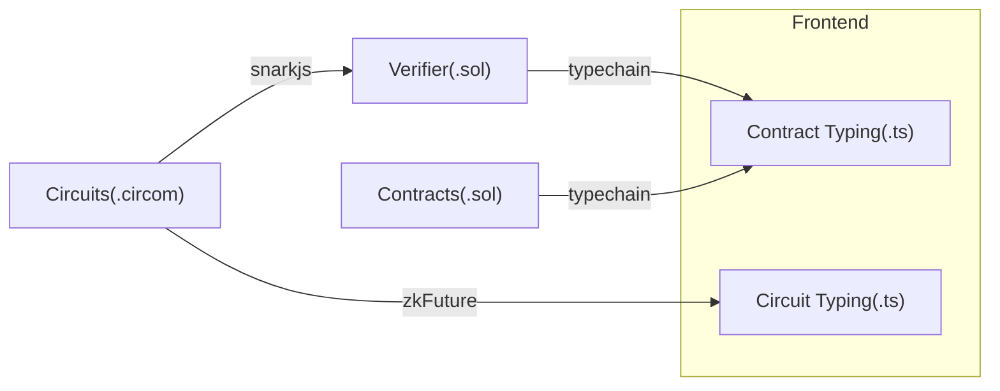

# Dark Factory

**Dark Factory** merges the strategic depth of _Dark Forest_ with the automation and resource management of _Factorio_. While staying true to the essence of both games, we have focused on a core gameplay feature that is currently missing in _Dark Forest_. This is the primary enhancement that _Dark Factory_ brings.

Our game draws inspiration from _Factorio's_ intricate systems but introduces a unique twist by leveraging blockchain technology, specifically through zero-knowledge proofs (ZKP), to power key game mechanics. This ensures transparency, security, and a decentralized experience while maintaining the privacy of the complexity of resource generation and management.

## Introduction

- Project Name: Dark Factory
- Project Creation Date: 2024 Oct 20
- Project Background: Brand new project

## Problem to solve

_Dark Forest_ relies heavily on random data generation for its planetary systems, which limits player agency. In _Dark Factory_, we address this by encouraging players to be more involved in the design and layout of their plants(we call islands in our game).
Players will be rewarded for their creativity and strategy in resource management, providing a more engaging experience with greater control over outcomes. Our system incentivizes thoughtful planning, offering a layer of depth missing in _Dark Forest_.

## Features planned for the Hackathon

- [x] Layout designer
  - [x] Basic game UI
  - [x] Layout designer with visual feedback
  - [x] Debug witness for proof generation
- [x] Proof generation
  - [x] Prove placement
  - [x] Prove accumulation
  - [x] Prove production rate
  - [x] Prove storage amount
  - [ ] Prove road connectivity
- [ ] Onchain competition
  - [x] Basic Constract
  - [ ] Submit proof on-chain

## Architect

- `ui/` Code related to the UI, including zk proofs and contract interaction code.
- `circuits/` Circuit code.
- `contracts/` Contract code.

## Getting Started

1. Prepare $\tau$: `yarn setup:ptau`
2. Setup whole project: `yarn`
3. Install circom and snarkjs before proceeding
4. Compile the zero-knowledge circuits: `build:circuits`
5. Recompile the strongly typed files when the contracts change: `build:contracts`
6. Deploy the contracts: `deploy:contracts` (Not finished in this hackathon)
7. Fire up the UI: `yarn dev`

## Credits

Some image materials are credit to [Factory Idle](https://factoryidle.com/).

## Team info

- [Icer](https://github.com/wizicer) - Full-Stack Developer [@icerdesign](https://x.com/icerdesign)
