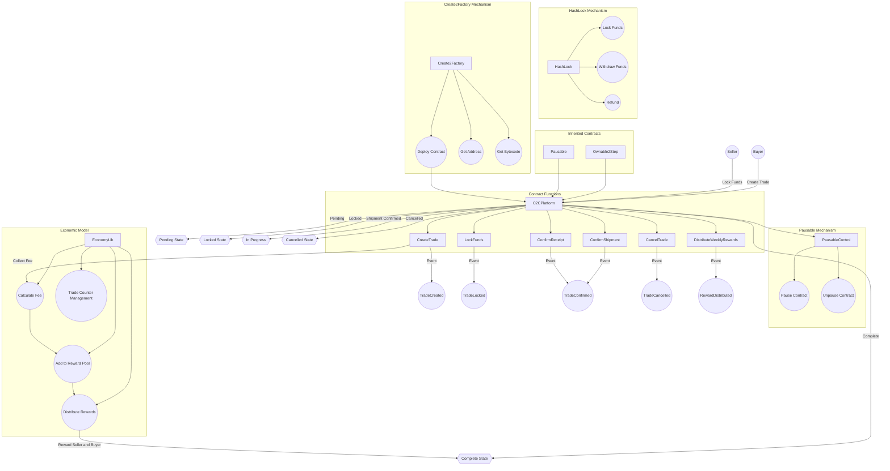
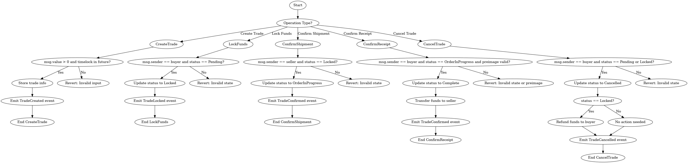
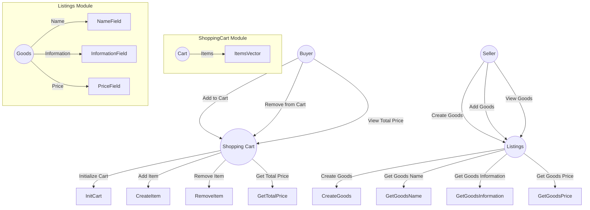

# LibMarket

## Introduction

LibMarket aims to explore the possibility of decentralized e-commerce platforms, uses Polkadot's relay chain and parachain architecture to achieve interoperability between different blockchains, support cross-chain asset transactions and data exchange, and through this feature of Polkadot, realize a Defi platform with free transactions based on C2C mode, aiming to provide a free trade market system.
Relying on the shared security mechanism of Polkadot's relay chain, using homomorphic encryption algorithm to ensure the security of information, buyers and sellers can communicate directly and securely. Different from the current traditional transaction model of "sellers set prices and buyers seek to purchase NFTs", we have targeted all items under the chain, including entities, and negotiated on the off-chain platform-guaranteed transactions on the chain without the need for third-party trust. This has realized a new market model in which buyers and sellers can communicate and set prices.

## Features planned for the Hackathon

- [x] Use hash locks to ensure the time validity of transaction orders, and introduce a tree-like mapping relationship between a single seller and multiple buyers.

- [ ] Added a market master switch to set the market's opening and closing trading hours. Make it more flexible

- [x] After the buyer requests the seller's consent, the buyer requests a signature, without the need for off-chain trust

- [x] Adopt zk-proof-homomorphic encryption algorithm to ensure the security of signature confirmation between buyers and sellers

- [ ] The economic model is introduced, and 100% of the transaction fees are paid to active buyers and sellers. A points system is also introduced, which can be used to exchange for physical objects.

- [x] Introducing other ecosystems through Polkadot's parallel chain architecture, shopping cart and other functions are implemented using sui

- [ ] Implement the product listing/removal function, and the on-chain status relationship after the transaction is completed to make it logical and prevent abuse

- [ ] Item reviews, buyers rate sellers on the chain and introduce a points model

## Architect

#### Overall architecture

#### Smart Contract Architecture

## Schedule

| Phase                  | Description |
| ---------------------  | ----------- |
| Order message validity | Use hash locks to limit the order validity date and add mapping status to match it |
| Market Mode | The market adopts the CToC model, and any user can be a buyer or a seller |
| Fully on-chain trust notes | It provides a communication platform for buyers and sellers but without off-chain trust relationship, giving buyers on-chain bargaining power as the only proof. |
| Economic and Integral Models | An incentive system is used to build an economic and points model, and the handling fees are added to the total reward pool and distributed to buyers and sellers. |
| ZK-Proof Verification | Use homomorphic encryption algorithm to ensure the security of message transmission and consistency between buyers and sellers |
| Supply and demand | There is a situation where there is a single seller and multiple buyers. The seller decides the final price. After the decision is made, the buyer signs and initiates the order. |

## Team info
| Name    | Role              | GitHub/X    |
| ------- | ----------------- | ----------- |
| S7iter  | PM&Full stack dev | S7iter      |
| Ch1hiro | backend dev       | Ch1hiro4002 |
| Azhan   | CD&Code Auditor   | Azhan1431   |
|LittleNewbie| Front Dev      | XiaoLiisnotwritingbugs |
| UPON | Blockchain architecture and cryptography expert | UPON-2021 |

## Material for Demo
1. Demo Video [link to Youtube]
2. PPT [link to google doc]

