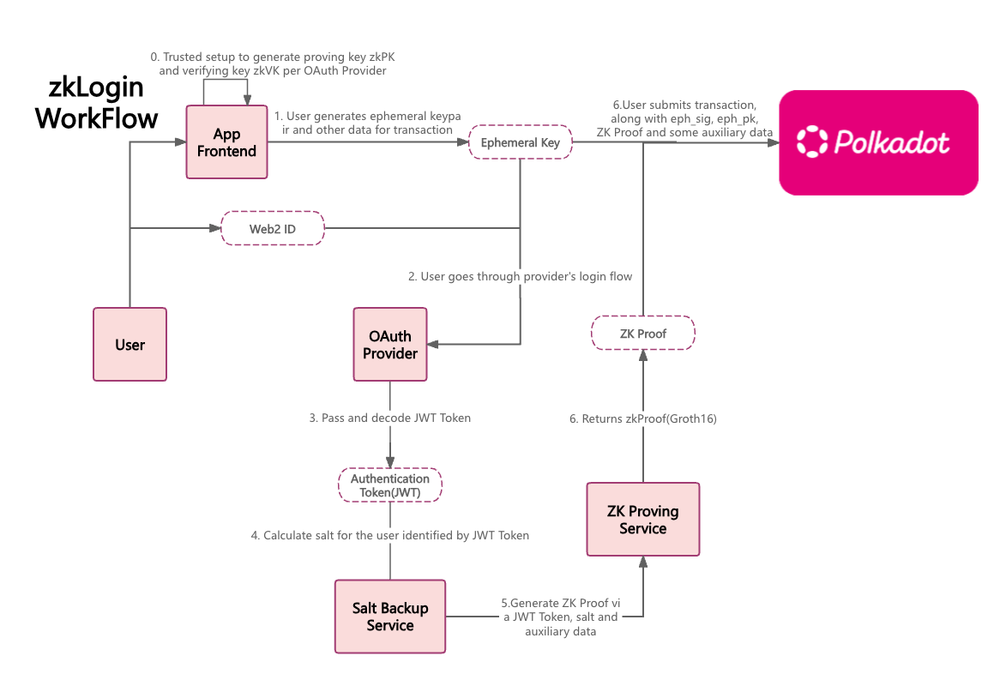

# Project zkLogin
## Introduction
> For more detailed introduction please check the [zkLogin_zh_CN](./doc/zkLogin_zh_CN.md)

The zkLogin project aims to simplify the user interact experience, enable large-scale onboarding of Web2 users, create a decentralized and privacy-preserving authentication system using zero-knowledge proofs (zk). Traditional authentication systems often require users to remember complex private keys or mnemonic phrases. zkLogin leverages zero-knowledge tools to enable users to prove their identity without revealing any sensitive information, ensuring both security and privacy.

zkLogin provides the ability for Users to send transactions from a Polkadot address using an OAuth credential, without publicly linking the two.

This is one of the simplest ways to onboard Users onto the blockchain. zkLogin allows users to log in to Web3 applications using existing Web2 Authentication Providers like `Google` and `Twitch`, eliminating the need for users to remember or record private keys.

zkLogin provides great convenience for end users without compromising security. It connects the responses from Web2 Authentication Providers to specific Polkadot accounts using ephemeral keypairs and zero-knowledge cryptography. When using zkLogin, the only data submitted to the blockchain is the zero-knowledge proof, a temporary signature and some auxiliary data, eliminating the need to submit any user information to the blockchain. Additionally, Web2 Authentication Providers are unaware that users are using the blockchain, ensuring privacy.

## Features planned for the Hackathon

- [ ] Streamlined onboarding: zkLogin enables you to transact on Polkadot using the familiar OAuth login flow, eliminating the friction of handling cryptographic keys or remembering mnemonics.
- [ ] Self-custody: A zkLogin transaction requires user approval via the standard OAuth login process -- the OAuth provider cannot transact on the user's behalf.
- [ ] Zero-Knowledge Proof-Based Authentication: Implement a system where users can authenticate themselves using zero-knowledge, ensuring no sensitive information is exposed.
- [ ] Decentralized Identity Management: Manage user identities securely and privately.
- [ ] Seamless User Experience: Create an intuitive user interface that simplifies the authentication process without compromising security.
- [ ] Integration with Existing Platform: Develop extentions or APIs to integrate zkLogin with Existing Polkadot Platform and Dapp Services.
- [ ] Substrate Pallet for zkLogin: It will operate as a zkLogin Verifier and zkLogin TX handler, which can handler TXs seamlessly and be easily integrated into other DApps.

## Architect

## Schedule
- [ ] Extension wallet enables zkLogin
    - [ ]  Secure Polkadot Account Generation
    > The frontend will incorporate cryptographic algorithms, ensuring robust key generation. This process involves implementing sophisticated cryptographic techniques to create and manage secure user accounts within the Polkadot ecosystem.
    - [ ]  Authentication Platform Integration
    > The frontend will possess the capability to seamlessly integrate with authentication platforms, facilitating a smooth user login experience. By interfacing with these platforms, such asGoogle, the application ensures users can authenticate themselves effortlessly, leveraging industry-standard OAuth protocols.
    - [ ]  zkLogin Transaction Integration
    > The frontend will be empowered with the ability to initiate transactions through zkLogin. Leveraging zero-knowledge proofs, the application can authenticate users and authorize transactions without exposing sensitive information. This privacy-preserving feature enhances the overall security and trustworthiness of user interactions.
- [ ] Zero-Knowledge Proof Generation
> The Wallet Extension should be embedded with a ZK Proof Generation Service, enabling the local generation of zk proofs, utilizing the groth16 proof system. This is an attestation (proof) over the ephemeral key pair that proves the ephemeral key pair is valid.
- [ ] Zero-Knowledge Proof Verification
> Based on the Zero-Knowledge algorithms and digital circuits utilized during the frontend's zkproof generation phase, efficient verification modes which prioritizes efficiency and accuracy are needed for implementation in the backend. The backend ensures a robust and streamlined verification process, contributing to the overall efficiency and reliability of the zkLogin system.
- [ ] zkLogin TXs handler
> To integrate with zkLogin-compatible transaction, we need to build a general zkLogin transaction handler, which is designed for universal use within the entire Polkadot ecosystem.
## Team info
| name         | role         | GitHub |
| ----------- | ----------- | -----------  |
| JonathanXu  | ZK & BlockChain Engineer  | @jonathanxuu   |
| Zak       | UI Designer   |        |

## Material for Demo
1. Docs(Chinese Version: [zkLogin_zh_CN](./doc/zkLogin_zh_CN.md))
2. Demo Video [link to Youtube]
3. PPT [link to google doc]

