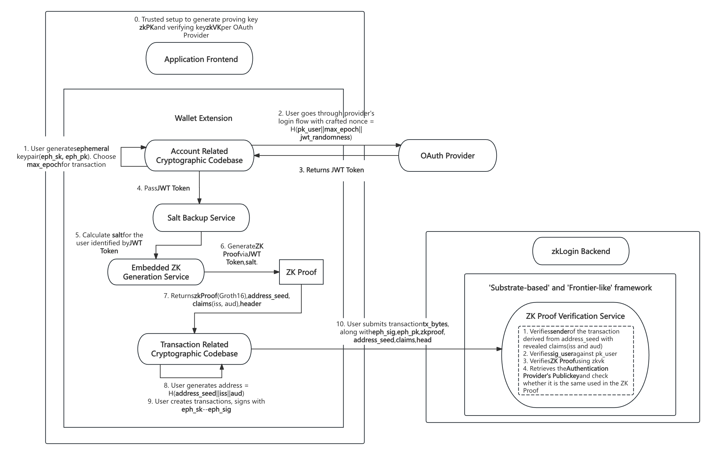

# zkLogin Tech Spec

## 1. What is zkLogin? -- bring simpler & safer AA to Polkadot

The `zkLogin`  is built on `WebAuthn` technology and exists as a **Runtime Pallet**, eliminating the need for any modifications to Polkadot's existing architecture. Any project can integrate `zkLogin` by simply adding the Runtime Pallet.
> `WebAuthn` is a modern authentication standard offering robust identity verification. Integrating such identity verification features within the Polkadot ecosystem would enhance security and provide users with more authentication options. 

Specifically, it allows users to bypass the traditional login process associated with externally owned accounts (EOAs), freeing them entirely from the reliance on seed phrases. Instead, zkLogin utilizes `Google` accounts as the medium for user authentication, proving ownership of the `Google` account as a way to demonstrate ownership of the corresponding on-chain address.


The complexity of wallets has long been a barrier for new users entering the blockchain space, and `zkLogin` is the perfect solution to this problem. By utilizing cutting-edge cryptography and technology, `zkLogin` offers a seamless and secure approach.

When creating a traditional blockchain address, the address is associated with a permanent public-private key pair, and the address is derived from the public key. In contrast, with `zkLogin`, the address is derived from a combination of the `Google JWT` and the user’s unique `user_salt`, making the user unaware of any private key throughout the transaction process. The user’s identity is verified via `Google`’s OAuth service.

In short, the `zkLogin` process can be broken down into the following key steps:


Step 1: Generate a Temporary(Ephemeral) Key:
When the user opens the application, a temporary key pair is generated for them. This key pair has an expiration time, which determines how often the user will need to log in(when the expiration time is reached, the key pair becomes invalid).

Step 2: Request a JWT from Google:
The application prompts the user to authenticate themselves via an OAuth provider (such as `Google`), generating a JSON Web Token (JWT) that serves as a payload of the provider’s digitally signed data. In `zkLogin`, the JWT includes a `nonce` field containing the `public key` and the `expiration time`. The JWT embeds `key claims`, which are later used to generate a Polkadot address.

Step 3: Request the User's Unique Salt:
The salt (a common cryptographic term for random data) is an arbitrary numeric string. It is used in conjunction with the `JWT` and the `temporary key pair` to associate the OAuth credentials with the Polkadot address.

Step 4: Generate a Zero-Knowledge Proof:
Using the `JWT`, `salt`, and `public key`, user can generate a zero-knowledge (zk) proof from a zk-proof service. This proof verifies that the user's identity has been authenticated by `Google` and confirms the validity of the user's temporary key.

Step 5: Identify the User's Polkadot Address and Build a Transaction:
The application identifies the user’s Polkadot address based on the `salt` and `key claims` extracted from the JWT. During submission, the app adds the `temporary signature`, `zk proof`, and some other auxiliary data.

Step 6: Verify the Transaction:
Once on the blockchain, the `zkLogin` Runtime Pallet thoroughly verifies the `zk proof` and `temporary signature` for authentication, seamlessly completing the entire process.


**From privacy perspective**
- There is **no public link** between the Google Account and the zkLogin Address.
- **No one knows the user's zkLogin Address** except the user themselves, including Google.(This is due to the requirement of a unique salt during the transition from a Google account to a zkLogin account. This salt is private and held by the user, meaning that even Google cannot determine the user's on-chain address.)

**From security perspective**
- Users no longer need to worry about losing access to their wallets due to the loss of a private key, as is the case with externally owned accounts (EOAs). 
- The only scenario in which a user could potentially lose access to their funds is if, before the expiration time, they simultaneously lose their temporary private key, JWT, and salt.


The integration of zkLogin could be a promising direction for the future development of the Polkadot ecosystem, which helps elevate the security and convenience of users' digital identities, eliminating reliance on passwords reduces the risks of phishing, brute force attacks, and replay attacks, providing a simpler and faster login process for both Web2 & Web3 Users.


## 2. Details of zkLogin Solution 

zkLogin provides the ability for Users to send transactions from a Polkadot `zkLogin address` using an `OAuth` credential, without publicly linking the two.


This is one of the simplest ways to onboard Users onto the blockchain. zkLogin allows users to log in to Web3 applications using existing Web2 Authentication Providers like `Google`, eliminating the need for users to remember or record private keys.

`zkLogin` provides great convenience for end users without compromising security. It connects the responses from Web2 Authentication Providers to specific Polkadot accounts using ephemeral keypairs and zero-knowledge cryptography. When using `zkLogin`, the only data submitted to the blockchain is the zero-knowledge proof, a temporary signature and some auxiliary data, eliminating the need to submit any user information to the blockchain. Additionally, Web2 Authentication Providers are unaware that users are using the blockchain, ensuring privacy.

### Why using zk?
The use of zero-knowledge proofs (ZKPs) is aimed at ensuring that users do **not expose any private data**. The following tasks are accomplished within the framework of zero-knowledge proofs:

1. Verifying that `the nonce` provided to `Google` for authentication complies with zkLogin rules, specifically:
```js=
jwt_token.payload.nonce = H(eph_pk, max_epoch, jwt_randomness).
```
2. Validating the user's JWT token: to prove that the JWT Token was indeed signed by `Google`.
3. Confirming that the user's `zkLogin Address` adheres to the generation rules, which is calculated as:
```js=
address = H(jwt_token.payload.iss, H(user_salt, jwt_token.payload.aud, jwt_token.payload.sub)).
```
These calculations involve the user's private data and are performed locally on the user's device. Only the zero-knowledge proof is submitted to the blockchain for verification, effectively preventing malicious impersonation attacks. 

The zero-knowledge proof represents that only a specific temporary key has the right to manipulate a given `zkLogin address` within a designated timeframe(before the `expirationTime`). Subsequently, when the user trys to execute a transaction, they need to provide the 'signature signed by the temporary key' along with the 'zero-knowledge proof'.


In the endeavor to integrate the zkLogin framework into the Polkadot ecosystem, some pivotal aspects are as follows(including both the `Frontend` and `Backend`):

### Detailed WorkFlow



(Step 0) We plan to use Groth16 for our protocol's zkSNARK instantiation, requiring a singular generation of a structured common reference string (CRS) linked to the circuit. A ceremony is conducted to generate the CRS, which is used to produce the proving key in the ZK Proving Service, the verifying key in Project Authority. 

(Step 1-3) The user begins by logging into an OpenID Provider (OP) to obtain a JWT token containing a defined nonce. In particular, the user generates an ephemeral KeyPair (`eph_sk`, `eph_pk`), along with expiry times (`max_epoch`) and randomness (`jwt_randomness`). Through these three parameters, the Wallet Extension can thus compute the `nonce`. After the user completes the OAuth login flow, an JWT token can be retrieved.

(Step 4-5) The Account Related Module then sends the JWT token to a Salt Backup Service. The Salt Backup Service returns the unique `user_salt` based on `iss`, `aud`, `sub` upon validation of the JWT token.

(Step 6-7) The Wallet Extension sends the ZK Generation Service with the JWT token, `user_salt`, `eph_pk`, `jwt_randomness`,and some other inputs. The proving service generates a Zero-Knowledge Proof that takes these as private inputs and does the following: a) Checks the nonce is derived correctly as defined b) Checks that key claim value matches the corresponding field in the JWT, c) Verifies the RSA signature from OP on the JWT, and d) the address is consistent with the key claim value and user salt.

(Step 8): The Wallet Extension computes the user address based on iss, aud, sub, aud. This step can be done independently as long as the Wallet Extension has a valid JWT token.

(Step 9-10) A transaction is signed using the ephemeral private key to generate an ephemeral signature. Finally, the user submits the transaction along with the ephemeral signature, ZK proof and other inputs to Chain.

(After Step 10) After submitted on chain, Our 'Substrate-based' and 'Frontier-like' framework verifies the ZK proof against the provider JWKs from storage (agreed upon in consensus) and also the ephemeral signature.


### Frontend Implementation

In the pursuit of creating a user-friendly and frictionless application interface, the frontend implementation plays a pivotal role. The frontend design places a strong emphasis on creating a user interaction-unaware environment, especially for wallet applications. Users will experience a seamless and intuitive interface without the burden of actively managing cryptographic keys or remembering complex authentication procedures.


#### 1. Secure Polkadot Account Generation

To bolster the security of Polkadot accounts, the frontend will incorporate cryptographic algorithms, ensuring robust key generation. This process involves implementing sophisticated cryptographic techniques to create and manage secure user accounts within the Polkadot ecosystem. 

**Solution:**

During the Generation Phase, the Wallet Extension should be able to accomplish the following things(within the SDK):

1. Generate and store an ephemeral KeyPair(`eph_sk`, `eph_pk`). Follow the same process as you would generating a KeyPair in a traditional wallet. 
2. Set the expiration time for the ephemeral KeyPair. The wallet decides whether the maximum epoch is the current epoch or later. The wallet also determines whether this is adjustable by the user.
3. Generate the JWT randomness(jwt_randomness) for current session.

```ts
// Example Code for demonstration
onst maxBlocknumber = Number(now) + 2000; // this means the ephemeral key will be active for 2000 blocknumber from now.
const ephemeralKeyPair = new Ed25519Keypair();
const jwt_randomness = generateRandomness();
const nonce = generateNonce(ephemeralKeyPair.getPublicKey(), maxBlocknumber, jwt_randomness);
```


#### 2. Authentication Platform Integration

The frontend will possess the capability to seamlessly integrate with authentication platforms, facilitating a smooth user login experience. By interfacing with these platforms, such as`Google`, the application ensures users can authenticate themselves effortlessly, leveraging industry-standard OAuth protocols.

**Solution**: 

1. Signing in, Fetching and Decoding JWT Token:

 When user use zkLogin to sign in with Authentication Provider such as `Google`, Authentication Provider will attach the `JWT token` as a URL parameter with the following construction:

```ts
const decodedJwt = jwt_decode(encodedJWT) as JwtPayload;

export interface JwtPayload {
   iss?: string;
   sub?: string;  //Subject ID
   aud?: string[] | string;
   exp?: number;
   nbf?: number;
   iat?: number;
   jti?: string;
}
```
2. Generating or restoring `user_salt`:

 After obtaining the `JWT Token`, the Wallet Extension locally generates a random number called `user_salt` (or determined by user).


3. Constructing User's Account Address:

```ts

// jwtToAddress logic: address = H(iss, H(user_salt, aud, sub))
const zkLoginUserAddress = jwtToAddress(jwt, userSalt);

```

For a user, (`iss`, `aud`, `sub`) is fixed; thus, the address is essentially determined by `user_salt`. Different `user_salt` values result in different addresses.

During this process, the storage of the `user_salt` is crucial. We can backup it via our `Salt Backup Service` using the following optional method(which is wait to be determined):
- Client Side:
    - Option 1: Request user input for the salt during wallet access, transferring the responsibility to the user, who must then remember it.
    - Option 2: Browser or Mobile Storage: Ensure proper workflows to prevent users from losing wallet access during device or browser changes. One approach is to email the salt during new wallet setup.
- Backend service that exposes an endpoint that returns a unique salt for each user consistently.
    - Option 3: Store a mapping from user identifier (e.g. sub) to user salt in a conventional database (e.g. user or password table). The salt is unique per user.
    - Option 4: Implement a service that keeps a master seed value, and derive a user salt with key derivation by validating and parsing the JWT token. For example, use HKDF(ikm = seed, salt = iss || aud, info = sub) defined here. Note that this option does not allow any rotation on master seed or change in client ID (i.e. aud), otherwise a different user address will be derived and will result in loss of funds.


#### 3. Zero-Knowledge Proof Generation

The implementation includes the capability to handle authentication provider-provided JWT (JSON Web Token) data and perform zero-knowledge proofs on this information and some user's secret information. This advanced cryptographic functionality ensures the privacy and integrity of user data during authentication processes, offering a secure layer for user accounts and interactions.

**Solution**

The Wallet Extension should be **embedded** with a **ZK Proof Generation Service**, enabling the local generation of zk proofs, utilizing the groth16 proof system. This is an attestation (proof) over the ephemeral key pair that proves the ephemeral key pair is valid.


#### 4. zkLogin Transaction Integration

The frontend will be empowered with the ability to initiate transactions through zkLogin. Leveraging zero-knowledge proofs, the application can authenticate users and authorize transactions without exposing sensitive information. This privacy-preserving feature enhances the overall security and trustworthiness of user interactions.


**Solution**

1. Signing txs via `Ephemeral Key`:

First, sign the transaction bytes with the ephemeral private key using the key pair generated previously. This is the same as traditional KeyPair signing. Make sure that the transaction sender is also defined.

```ts
const ephemeralKeyPair = new Ed25519Keypair();

// ....
const unsigned = methods.abcd({...}, {...}, {...});
const signingPayload = createSigningPayload(unsigned, { registry });

const userSignature = await signWithEphemeralKey(signingPayload, ephemeralKeyPair);
```

2. Combining ZK Proof With the previous Sig:

During this process, we combine the previously obtained **zero-knowledge proof** with the **signature** of the transaction made by the user using the ephemeral keypair, resulting in the final signature(**zkLoginSignature**) for the transaction.

```ts
const addressSeed : string = genAddressSeed(BigInt(userSalt!), "sub", decodedJwt.sub, decodedJwt.aud).toString();

const zkLoginSignature : SerializedSignature = getZkAuthignature({
   inputs: {
      ...ZKProofSig,
      addressSeed
   },
   maxEpoch,
   userSignature,
});
```

3. Submiting the tx:

```ts
client.executeTransactionBlock({
    tx: unsigned,
    signature: zkLoginSignature,
});
```

### Backend Implementation

#### 1. Integrating with 'Substrate-based' Framework

- "substrate-based" Framework

The backend needs to be developed based on the "Substrate-based" framework to ensure compatibility with `zkLogin`. This involves adjusting existing components and functionalities to implement `zkLogin` as a **runtime Pallet** which is compatible with various parachains and the relay chain, without requiring any modifications to the original structure of the chain.

- High Portability Code
This project is designed for universal use within the entire Polkadot ecosystem. We prioritize the robustness and portability of the backend, and in the future, we aim to extend this ecosystem-friendly solution to various relaychains and parachains.

#### 2. Zero-Knowledge Proof Verification

Based on the Zero-Knowledge algorithms and digital circuits utilized during the frontend's zkproof generation phase, efficient verification modes which prioritizes efficiency and accuracy are needed for implementation in the backend. The backend ensures a robust and streamlined verification process, contributing to the overall efficiency and reliability of the zkLogin system.

