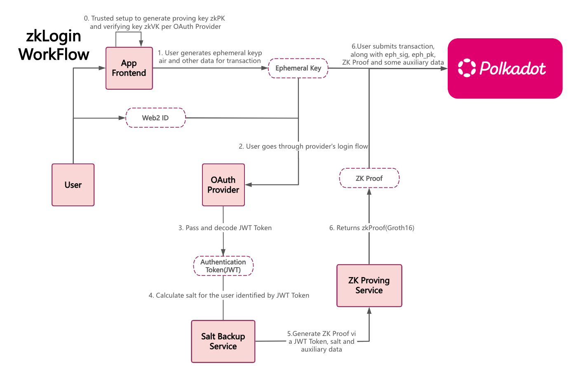

# zkLogin  - A ZkLogin Framework
zkLogin is a Substrate-based framework that facilitates transaction initiation on the blockchain using zkLogin mechnism, which any substrate-based can easily integrate with.

## Features

### Simplified Onboarding
Users can initiate the onboarding process with a single click by choosing to "Login with Google," after that, users can easily start to submit transactions.

### On-Demand Key Replacement:
zkLogin introduces a revolutionary approach to key management, empowering users to seamlessly change their local temporary private keys at their convenience while providing the option to set expiration times for each key. This innovative feature ensures that even in the event of a compromised or lost private key used in the past, the security of the current account remains uncompromised.

### Maximum Security Assurance
zkLogin prioritizes maximum security, requiring a combination of multiple sensitive elements for any potential threat to account security. Users must **simultaneously** compromise the temporary private key, the JWT from Google, and the address salt to pose a credible risk to the safety of their accounts.

### Multiple JWT provider
Users can login with Google, Twitch, Kakao, Facebook, Apple, Slack.

## zkLogin mechnism



(Step 0) We plan to use Groth16 for our protocol’s zkSNARK instantiation, requiring a singular generation of a structured common reference string (CRS) linked to the circuit. A ceremony is conducted to generate the CRS, which is used to produce the proving key in the ZK Proving Service, the verifying key in Project Authority.

(Step 1-3) The user begins by logging into an OpenID Provider (OP) to obtain a JWT token containing a defined nonce. In particular, the user generates an ephemeral KeyPair (eph_sk, eph_pk), along with expiry times (max_epoch) and randomness (jwt_randomness). Through these three parameters, the Wallet Extension can thus compute the nonce. After the user completes the OAuth login flow with the nonce, an JWT token can be retrieved.

(Step 4-5) The Account Related Module then sends the JWT token to a Salt Backup Service which returns the unique user_salt based on the JWT token.

(Step 6) The Wallet Extension sends the ZK Generation Service with the JWT token and some auxiliary inputs. The proving service generates a Zero-Knowledge Proof that takes these as private inputs and does the following: a) Checks the nonce is derived correctly as defined b) Checks that key claim value matches the corresponding field in the JWT, c) Verifies the RSA signature from OP on the JWT, and d) the address is consistent with the key claim value and user salt.

(Step 7) A transaction is signed using the ephemeral private key to generate an ephemeral signature. Finally, the user submits the transaction along with the ephemeral signature, ZK proof and other inputs to Chain.

(After Step 7) After submitted on chain, the zkLogin framework verifies the ZK proof against the provider JWKs from storage (agreed upon in consensus) and also the ephemeral signature.

## Integration Solution
There are 2 solutions provided, project can choose either of them to integrate with.

### Solution 1: replace `MultiSignature` in `Runtime`
Usually in runtime of substrate-based project, the following line is used to define runtime signature:
```rust
pub type Signature = MultiSignature;
```
For those who want to use zkLogin, replace it with the following:
```rust
use zk_runtime::ZkMultiSignature;
pub type Signature = ZkMultiSignature<MultiSignature>;
```
This solution will also accept normal transactions.

### Solution 2: add `pallet-zklogin` into `Runtime`
zkLogin provide a zklogin pallet under frame, you can add it to your own runtime:
```rust
impl pallet_zklogin::Config for Runtime {
    type RuntimeEvent = RuntimeEvent;
    type Extrinsic = UncheckedExtrinsic;

    type CheckedExtrinsic =
        <UncheckedExtrinsic as sp_runtime::traits::Checkable<Self::Context>>::Checked;

    type UnsignedValidator = Runtime;

    type Context = frame_system::ChainContext<Runtime>;

    type BlockNumberProvider = System;
}

construct_runtime!(
    pub struct Runtime {
        System: frame_system,
        ...
        ZkLogin: pallet_zklogin,
    }
);
```
This solution will also accept normal transactions without changing PolkadotJs SDK.


