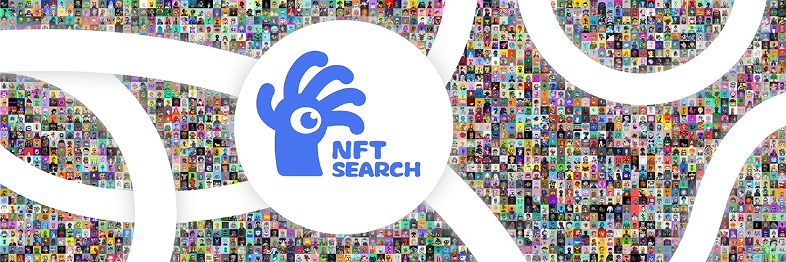
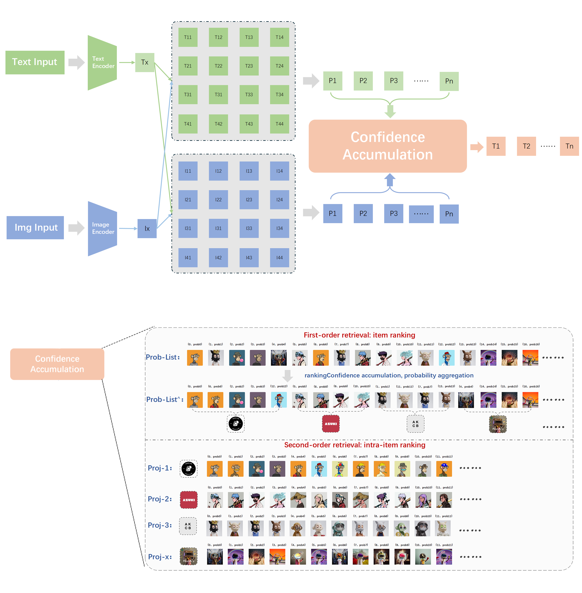
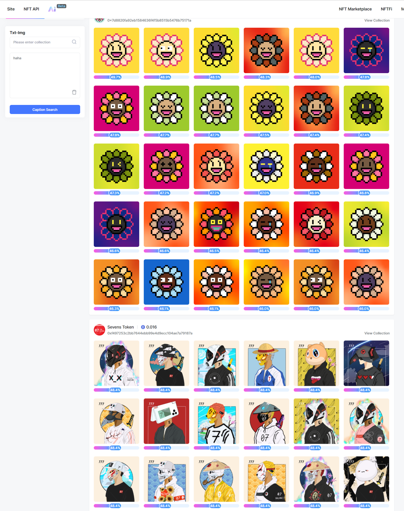
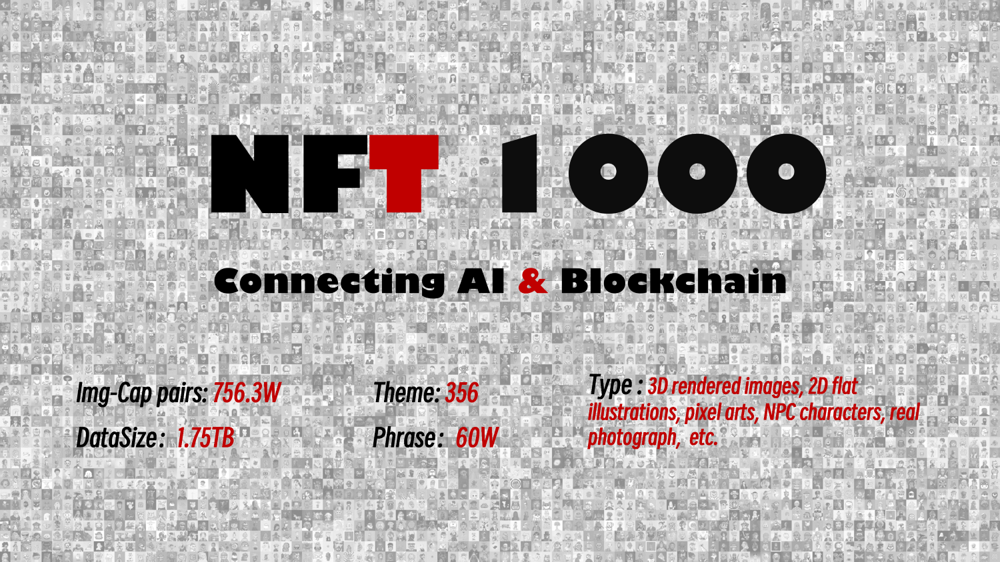

# Project NFT Search
## Introduction

NFT Search is an AI-driven cross-modal search engine based on semantic understanding. As a fundamental infrastructure for Web3.0, it allows users to perform token-level searches across hundreds of millions of NFTs using just textual descriptions or image prompts. Leveraging this powerful engine, we also offer personalized NFT recommendations and counterfeit NFT detection, enhancing user experience and security in the digital asset space.

## Features planned for the Hackathon

### NFT Search work scope

NFT Search is a project that is constantly evolving. It uses dynamic updates to gradually support NFT projects on multiple chains. Currently, it mainly supports the retrieval of NFT projects on Ethereum and Polkadot.

### Image-text retrieval

Search for target tokens by semantic description of NFTs

+ Txt2Img: Cross-modal text search image mode, extract text features input by users and calculate "feature distance" with NFT image features to obtain candidate tokens;
+ Txt2Txt: Homomorphic text search document mode, extract user input text features and calculate "feature distance" with NFT metadata features to obtain candidate tokens;
+ Max-Prob: Comprehensive mode, integrate Txt2Img and Txt2Txt results to obtain the final result

### Image-image search

Upload similar images (images similar to target token or selfies taken on mobile phones)

+ Img2Img: Homomorphic image search image mode, extract features of user-input images and calculate "feature distance" with NFT image features to obtain candidate tokens;
+ Img2Txt: Cross-modal image search document mode, extract features of user-input images and calculate "feature distance" with NFT metadata featuresto obtain candidate tokens;
+ Max-Prob: Comprehensive mode, integrate Img2Img and Img2Txt results to get the final result

### Targeted search
Specify the search space for fine-grained retrieval based on the known target token of the project name.

## Architect

### NFT Search System Demo

## Schedule

+ 2023.4 Project Start；
+ 2023.11 Dataset preparation completed；
  + 
+ 2024.7 paper**《NFT1000: A Cross-Modal Dataset for Non-Fungible Token Retrieva》**  was accepted by ACM Multimedia 2024；
+ 2024.10 Cooperation with NFTScan：https://www.nftscan.com/ai-search
+ 2024.12 Datasets open to the public；
+ 2025.6 RAG based on large language model realizes intelligent recommendation of NFT;
+ ……

## Team info

+ [Shuxun Wang](https://github.com/ShuxunoO)：Master student at [Institute of Automation, Chinese Academy of Sciences](http://english.ia.cas.cn/),Team leader, model training, algorithm design, backend；
  + 
+ Eric：Front-end, UI design
  + 

## Material for Demo（Always updating）

1. [Demo Video](https://youtu.be/BmxmYxwuMtM?si=Yn7yowIbonCqCnBo) 
2. [PPT](https://drive.google.com/file/d/1Xu1kw5oOeSCr51v791iqr7cR-3NrICX4/view?usp=drive_link)
