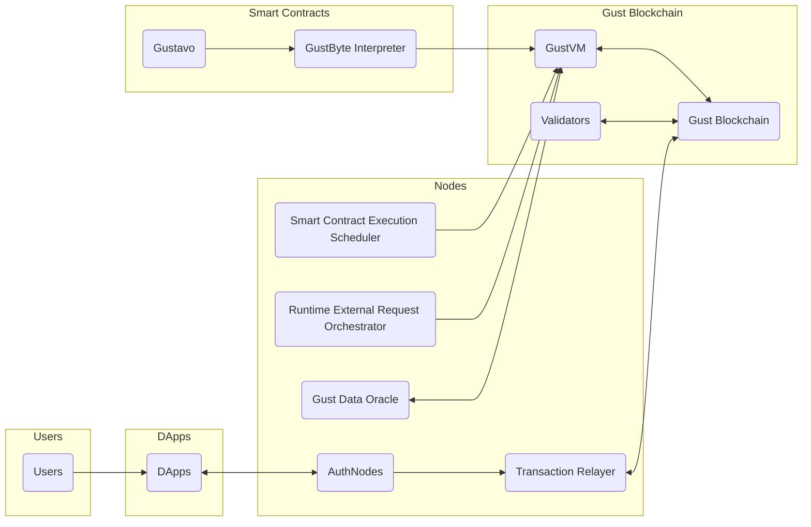

# Project Gust
## Introduction

Gust is a gasless general purpose Substrate based blockchain with smart contracts which is focused on simplifying onboarding of consumers into the Web3 ecosystem. Gust will have native keyless account support which allows for user to use their email addresses as accounts instead of the current public/private key account system in existing blockchains.

## Features planned for the Hackathon

- Gust Substrate Blockchain
- GustVM
- Gustavo (Smart Contract Language)
- Gasless
- Identity service

# Gust Blockchain 🌬️

> Making blockchain accessible to everyone through email-based transactions and gasless operations.

[]()
[]()

[Watch Demo Video](https://www.loom.com/share/9ef2df4341b14ca0a011f91a1b0bbd32?sid=2663f1d8-36f4-44ab-859c-2a203412bfda) | [Try Demo](https://gust-blockchain.vercel.app/) | [View Pitch Deck](https://gust-blockchain.vercel.app/)

## 🚀 Overview

Gust is revolutionizing blockchain accessibility by removing traditional barriers to entry. No more complicated wallet management or gas fees - just simple, secure transactions using email authentication.

### Key Features

- **Email-Based Authentication**: Forget seed phrases - use your email with OTP verification
- **Gasless Transactions**: Users never pay gas fees
- **GustVM & Gustavo Language**: Custom VM and programming language for intuitive smart contract development
- **HTTP-Capable Smart Contracts**: Make external API calls directly from smart contracts
- **Built-in Oracle Network**: Native chain-embedded oracle system for reliable off-chain data

## 🏗️ Architecture



## 💻 Tech Stack

- **Blockchain**: Substrate FRAME
- **API Integration**: Polkadot API
- **Frontend**: Angular
- **Backend Services**: Python

## ✨ Current Progress (Hackathon Achievements)

- ✅ Base Substrate chain implementation
- ✅ Gustavo smart contract language and interpreter
- ✅ Authentication and transaction relay system
- 🚧 More features in development

## 🛠️ Getting Started

### Prerequisites

```bash
polkadot SDK
Angular
Python
```

### Quick Start

```typescript
Contract PaidIncrementor accepts <token1>:
	State:
		string(contractName);
		dict<account(), number()>(accountToNumber);
		number(currentNumber);
		number(fee);

	initState<string(givenContractName)>:
		State.contractName = givenContractName;
		State.currentNumber = 0;

	incrementAndPay:
		// Check if the user has an available balance and allowed token
		if checkAvailable<token1>() && checkAllowed<token1>():
			CallBy.pay(token1, Contr.deployer, State.fee);
			State.currentNumber++;
			State.accountToNumber[CallBy.acc] = State.currentNumber;

	checkAvailable<token(tokenToCheck)><Close>:
		boolean(result) = CallBy.balance(tokenToCheck) > State.fee;
		return result;

	checkAllowed<token(tokenToCheck)><Close>:
		boolean(result) = tokenToCheck in CallBy.use;
		return result;

```

## 📖 Documentation

- [Getting Started Guide](docs/getting-started.md)
- [Gustavo Language Specification](docs/gustavo-spec.md)
- [API Reference](docs/api-reference.md)
- [Architecture Deep Dive](docs/architecture.md)

## 🤝 Contributing

We're actively developing Gust and welcome contributions! Check out our [Contributing Guidelines](CONTRIBUTING.md) to get started.

## 🚧 Work in Progress

Gust is under active development. While we've achieved significant milestones, we're continuously working to enhance and expand the platform's capabilities. Here's what we're working on:

- Expanding the Gustavo standard library
- Enhancing the oracle network capabilities
- Improving developer tools and documentation
- Scaling the validator network

## 📫 Contact & Support

- [Discord Community]()
- [Developer Forum]()
- Email: ikalonji2@gmail.com

## ⚖️ License

This project is licensed under the MIT License - see the [LICENSE](LICENSE) file for details.

---

Built with ❤️ by the Gust Team

## Team info

Issa Kalonji

## Material for Demo
1. Demo Video [link to Loom](https://www.loom.com/share/9ef2df4341b14ca0a011f91a1b0bbd32?sid=aedd4aac-8bc2-4fbe-8d53-c751300c4bbb)
2. PPT [link to google doc](https://docs.google.com/document/d/196c1bmuFqbv7RssO_Pqo2OZgZ0Ir1cKO06pFvXBA5Qw/edit?usp=sharing)
