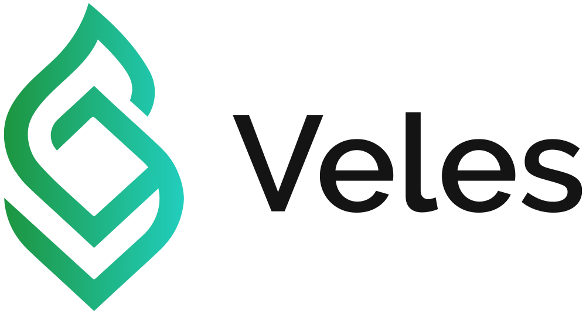

# Veles: Modular Carbon Credit Marketplace on Polkadot

The <b>Veles pallet</b> is a plug and play carbon credit marketplace solution for Substrate based blockchain networks. Veles enables its user to freely and seamlessly monitor, mint, transact and retire carbon credits. Apart from the main marketplace features, Veles also provides a solution to regulate malicious behaviors within the marketplace and to mitigate the impacts of such behaviors. 

You can find the original Veles pallet repository on the following [link](https://github.com/Ceres-Blockchain-Solutions/veles-pallet.git).

## Introduction

<b>Veles</b> - Modular Carbon Credit Marketplace on Polkadot

<b>Project creation date: 14.07.2024.</b>

We initially developed the base version of the Veles substrate pallet ([repository main branch](https://github.com/Ceres-Blockchain-Solutions/veles-pallet.git)) as a result of a successful voting cycle of our project on [Polkassembly](https://polkadot.polkassembly.io/referenda/496). During the voting cycle we provided ample evidence to support the research and work that was put into creating this project.

## Features planned for the Hackaton

Pallet upgrades and improvements:
- [x] Upgrade pallet to newer version of the Polkadot SDK
- [x] Add support for parachain deployment
- [X] Create parachain deployment example

## Architecture

If you would like to look at the underlying structure of the pallet and how each element interacts with one another, please feel free to look at the [diagrams](https://drive.google.com/file/d/1Iq0n3RrZHUGftbolThfKSwm4ME6Qs5fP/view?usp=sharing) that depict the pallets structure.

## Team info

- **Danijel Radulovic** - Lead Software & Blockchain Engineer
- **Nikola Petrovic** - Software Engineer & Blockchain Developer w/ years of Rust based development

| Team members              | Github | Linkedin |
| :----------- | :------: | :---:|
| Danijel Radulovic       |   https://github.com/DanijelCBS   | https://www.linkedin.com/in/danijel-radulovic-b2529a172/ |
| Nikola Petrovic     |   https://github.com/NikolaCBS   | https://www.linkedin.com/in/nikolapetrovic12/ |

## Track and bounty
**Track:** Category 3: (Chain) Building a blockchain based on Polkadot SDK
### Material for Demo
1. [Veles Project Presentation - Polkadot Day in Belgrade 2024](https://drive.google.com/file/d/1DGuN5zgZrO81sE3PfpB_0_M5v-L4gJQJ/view?usp=drivesdk)
2. [Veles Pitch Deck](https://docsend.com/view/5ywwa477awtv93mj)
3. [Veles Website](https://veles.technology/)
