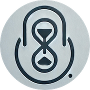
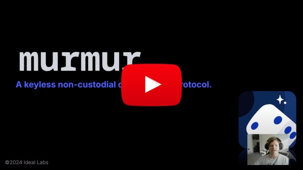
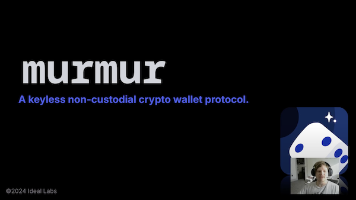

# Murmur

[Murmur](https://murmur.idealabs.network) is a **keyless crypto wallet protocol** powered by the [Ideal Network](https://docs.idealabs.network/docs/intro) (IDN). Inspired by [Hours of Horus](https://eprint.iacr.org/2021/715), the protocol uses [timelock encryption](https://docs.idealabs.network/docs/learn/crypto/timelock_encryption) and secure time-based [one-time password](https://www.techtarget.com/searchsecurity/definition/one-time-password-OTP) (OTP) generation to enable a frictionless and keyless crypto wallet. It introduces a novel solution for account abstraction on Substrate-based chains, eliminating the need for private key management while maintaining complete user control and security.

- **Team Name**: [Ideal Labs](https://idealabs.network)
- **Category 1**: (Infrastructure) Polkadot ecological developer tools
- **Development Start**: September 2024

## Problem to be Solved

> 👀 Visit our documentation at https://murmur.idealabs.network to see more in-depth information about Murmur, including protocol design and integration guide.

Traditional crypto wallet solutions force users to choose between security or convenience. Custodial wallets offer a user-friendly experience but sacrifice true ownership and control - Not your keys, not your crypto. Conversely, non-custodial wallets offer full user control yet burden users with the complexity of key management, increasing risk of wallets being lost or compromised. 

MPC (Multi-Party Computation) wallets aim to address these issues by distributing private keys among a set of workers, eliminting the inherent risks of non-custodial wallets. This approach reduces the risk of corrupt entities, including the wallet provider, from gaining full control of the wallet. However, they can be

- **Scalability limited**: Increased users result in more signature requests and network load.
- **Costly**: Enhanced security can come with significant fees, creating paywalls for wallet access and security.
- **Semi-Centralized**: Users of MPC wallets often rely on a wallet provider, a third party, introducing a potential point of failure.

## Project Overview

**Murmur** is a keyless crypto wallet protocol that allows transactions without a mnemonic or secret key. It is a flavor of **MPC** protocol that aims to eliminate the limitations above, providing a **scalable**, **secure**, and **truly keyless** crypto wallet experience. By eliminating barriers introduced by key management, the versatile protocol ensures native web3 users benefit from its robust scalability, while web2 developers can introduce web3 features with minimal friction. Unlike traditional MPC wallets that require on-demand signatures for each user interaction, Murmur wallets rely on the [IDN's Verifiable Randomness Beacon](https://docs.idealabs.network/docs/learn/etf-pfg) to produce signatures. This approach enhances scalability for Murmur wallets, being limited only by the underlying chain itself.

The [Murmur protocol](https://murmur.idealabs.network/docs/quick_start/overview) (developed during this hackathon) uses timelock encryption and secure time-based OTP code generation to introduce a mechanism that relies on "just-in-time" timelock decryption, zero-knowledge proofs, and Merkle proofs to determine transaction sender validity. Murmur wallets require that users prove they knew a *future* OTP *in the past*.

Murmur wallets provide seamless access on web-enabled devices and offer a plug-and-play solution for integrating web3 capabilities into various contexts. Developers can use a standalone wallet client or our HTTP API for in-app wallet creation.

**Key Features**

- **Truly Keyless Wallet**: No mnemonic or key management needed.
- **No Wallet Provider**: No reliance on third parties for access.
- **Infinitely Scalable**: Scales without added computational or financial overhead.
- **Non-Custodial**: Users maintain full control, even with API-based access.
- **Secure Against Key Extraction Attacks**: Utilizes threshold BLS signatures, protecting against key extraction vulnerabilities.

## Code Deliverables

All work was tracked [here](https://github.com/orgs/ideal-lab5/projects/8). We used **external repos**; refer to the [PROJECT](./src/PROJECT.md) file for details.

Our goal is to deliver an MVP of the Murmur protocol as a standalone CLI and JS library, featuring:

- Substrate [pallets](#pallets) for constructing and executing Murmur wallets
- A standalone [library](https://github.com/ideal-lab5/murmur/tree/polkadot-hackathon-2024/lib) to implement the protocol
- A permissionless [HTTP API](https://github.com/ideal-lab5/murmur-api/tree/polkadot-hackathon-2024) for outsourced computation
- A JavaScript [library](https://github.com/ideal-lab5/murmur.js/tree/polkadot-hackathon-2024) wrapping the API
- A set of [examples](#examples)

**Limitations & Future Work**

- [Limitations & Vulnerabilities](https://murmur.idealabs.network/docs/quick_start/overview#vulnerabilities-limitations-assumption)
- [Future Work](https://murmur.idealabs.network/docs/learn/protocol#future-work)

## Schedule

**All** work planned and completed during our participation was tracked [here](https://github.com/orgs/ideal-lab5/projects/8).

## Technical Architecture

The Murmur protocol is designed for flexibility and can be adapted to various contexts. This section outlines its components and their connections.

The visualization below depicts dependencies and the flow of data of each component of Murmur's architecture.

-4783283a08a2398947a580adf3b5e2a1.png>)

[**murmur-core**](https://github.com/ideal-lab5/murmur/tree/polkadot-hackathon-2024/core)

It handles the logic for constructing and proving MMR data for Murmur wallets.

[**murmur-lib**](https://github.com/ideal-lab5/murmur/tree/polkadot-hackathon-2024/lib)

An implementation of the Murmur protocol over BLS377 using type III pairings.

[**murmur-api**](https://github.com/ideal-lab5/murmur-api/tree/polkadot-hackathon-2024)

An unpermissioned HTTP API to externalize OTP code generation and ensure adequate entropy.

[**murmur.js**](https://github.com/ideal-lab5/murmur.js/tree/polkadot-hackathon-2024)

It encapsulates communication with the `murmur-api` as a JS library, facilitating the creation and execution of MMR data and proofs.

**The Ideal Network**

> ❗IMPORTANT: This is **NOT** part of our submission. Work done on the Ideal Network was funded by the [Decentralized Futures](https://medium.com/web3foundation/decentralized-futures-introducing-etf-network-cd8282be6143) program.

The Ideal Network (IDN) is a blockchain that enables **publicly verifiable on-chain randomness** and **timelock encryption** for Substrate-based chains.

### Pallets

> ❗IMPORTANT: The IDN's pallets and the Randomness Beacon pallet should not be considered for evaluation.

The Murmur pallet is the core component enabling Murmur wallets. It acts as a "prover", registering unique Murmur proxies and verifying execution parameters before dispatch. It works with a modified Proxy pallet that enables a new kind of proxy only accessible through the Murmur pallet's `proxy` extrinsic.

- [murmur pallet - Polkadot Hackathon 2024](https://github.com/ideal-lab5/pallets/tree/polkadot-hackathon-2024/pallets/murmur)
- [MODIFIED proxy pallet - Polkadot Hackathon 2024](https://github.com/ideal-lab5/pallets/tree/polkadot-hackathon-2024/pallets/proxy)

## Examples

- [murmur-cli](https://github.com/ideal-lab5/murmur/blob/polkadot-hackathon-2024/lib/src/bin/murmur/main.rs): A terminal-based Murmur client.
- [murmur-dapp](https://github.com/ideal-lab5/murmur-dapp/tree/polkadot-hackathon-2024): A basic dapp to create wallets and execute balance transfers (see: [browser integration guide](https://murmur.idealabs.network/docs/quick_start/browser)).

Murmur provides a **seamless**, **trustless** solution for **web2 users** to effortlessly transition to web3 platforms and interact with crypto wallets, **eliminating traditional barriers** to entry.
- [discord bot](https://murmur.idealabs.network/docs/quick_start/discord): A Discord bot enabling per-server wallets.
- [twitch bot](https://murmur.idealabs.network/docs/quick_start/twitch): A Twitch bot enabling per-chat wallets.

## Team Info

| Name           | Description                                                                                                                                            | Github                         | LinkedIn                                            |
| -------------- | ------------------------------------------------------------------------------------------------------------------------------------------------------ | ------------------------------ | --------------------------------------------------- |
| Tony Riemer    | Lead protocol engineer, Math at University of Wisconsin, Former S.E. Fannie Mae & Capital One, PBA Alumni                                              | https://github.com/driemworks  | https://www.linkedin.com/in/tony-riemer/            |
| Carlos Montoya | Serial Entrepreneur, 4x CTO with exit, M.S. Information Technology, Carnegie Mellon, PBA Alumni                                                        | https://github.com/carloskiron | https://www.linkedin.com/in/cmonvel/                |
| Coleman Irby   | 10+ years software engineering experience, B.S. Electrical Engineering from University of Mississippi, Physics graduate student at Univ. of Mississippi | https://github.com/colemanirby | https://www.linkedin.com/in/coleman-irby-229b13103/ |
| Juan Girini    | 10+ years leading engineering teams, Former core engineer at Parity, B.S. Information Systems Engineering, UTN, PBA Alumni                             | https://github.com/juangirini  | https://www.linkedin.com/in/juan-girini/            |

## Material for Demo

### Overview

Video overview of the protocol: this is not the demo and exceeds 6 minutes.

### Demo

Get the docker compose script from the demo [here](https://gist.github.com/juangirini/a58126b8bf9d6a32d4c6bdfed782b832)

### Slideshow

