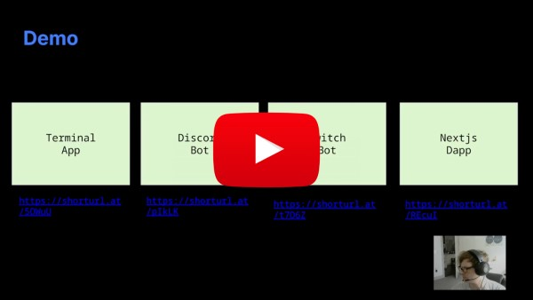

# Murmur

Murmur is a decentralized protocol that enables keyless crypto wallets.

Murmur introduces a novel solution for account abstraction for Substrate-based chains. Murmur provides a **seamless**, **trustless** solution for **web2 users** to effortlessly transition to web3 platforms and interact with crypto wallets, **eliminating traditional barriers** to entry.

Our submission showcases the implementation of this protocol.

- **Team Name**: [Ideal Labs](https://idealabs.network)
- **Category 1**: (Infrastructure) Polkadot ecological developer tools
- **Development Start**: September 2024

## Problem to be Solved

**Murmur** tackles the challenges of traditional crypto wallets, such as scalability and cost issues associated with account abstraction. Traditional MPC wallets often require third-party providers for threshold signatures, leading to:

- **Scalability issues**: Increased users result in more signature requests and network load.
- **Increased costs**: Enhanced security can come with significant fees, creating paywalls for wallet access.

## Project Overview

Murmur is a keyless crypto wallet protocol that allows transactions without a mnemonic or secret key. It's versatile and can be used across platforms, from terminals to Twitch chats.

Murmur wallets provide seamless access on web-enabled devices and offer a plug-and-play solution for integrating web3 capabilities. Developers can use a standalone wallet client or our HTTP API for in-app wallet creation. By leveraging the Ideal Network's randomness beacon, Murmur generates decryption keys for OTP codes with each block finalized by the IDN, ensuring scalability and cost-efficiency.

**Key Features**

- **Truly Keyless Wallet**: No mnemonic or key management needed.
- **No Wallet Provider**: No reliance on third parties for access.
- **Infinitely Scalable**: Scales without added computational or financial overhead.
- **Non-Custodial**: Users maintain full control, even with API-based access.
- **Secure Against Key Extraction Attacks**: Utilizes threshold BLS signatures, protecting against key extraction vulnerabilities.

## Code Deliverables

All work from this hackathon can be tracked [here](https://github.com/orgs/ideal-lab5/projects/8) (permission required). We utilized external repos instead of adding code directly to the submission repo; refer to the [PROJECT](./src/PROJECT.md) file for details.

Our goal is to deliver an MVP of the Murmur protocol as a standalone CLI and JS library, featuring:

- Substrate [pallets](#pallets) for constructing and executing Murmur wallets
- A standalone [library](https://github.com/ideal-lab5/murmur/tree/polkadot-hackathon-2024/lib) to implement the protocol
- A permissionless [HTTP API](https://github.com/ideal-lab5/murmur-api/tree/polkadot-hackathon-2024) for outsourced computation
- A JavaScript [library](https://github.com/ideal-lab5/murmur.js/tree/polkadot-hackathon-2024) wrapping the API
- A set of [examples](#examples) showcasing Murmur's versatility

**Limitations & Future Work**

Due to the hackathon's limited scope, we outline known issues and limitations to address soon:

- The MVP requires all transactions to be signed, meaning users depend on an origin for transaction signing. Alternatives, such as ephemeral light clients or unsigned origins, have been researched.
- Murmur wallets are ephemeral and lack an update function, leading to eventual expiration.
- Currently, wallets are not recoverable; losing a username or seed results in permanent access loss.
- There has been no formal security audit of the IDN or Murmur.
- Murmur wallets currently work only on the IDN solochain; future plans include transitioning to a parachain and exploring cross-chain usability.
- The Murmur HTTP API centralizes cryptographic computation when using the JS library.

## Technical Architecture

> For more in-depth technical details, visit our documentation at: https://murmur.idealabs.network.

The Murmur protocol is designed for flexibility and can be adapted to various contexts. This section outlines its components and their connections.

The visualization below depicts dependencies and the flow of data of each component of Murmur's architecture.

-4783283a08a2398947a580adf3b5e2a1.png>)

[**murmur-core**](https://github.com/ideal-lab5/murmur/tree/polkadot-hackathon-2024/core)

It handles the logic for constructing and proving MMR data for Murmur wallets.

[**murmur-lib**](https://github.com/ideal-lab5/murmur/tree/polkadot-hackathon-2024/lib)

This is an implementation of the Murmur protocol over BLS377 using type III pairings.

[**murmur-api**](https://github.com/ideal-lab5/murmur-api/tree/polkadot-hackathon-2024)

This is an HTTP API that serves as a convenience to externalize OTP code generation and ensure adequate entropy when constructing seeds for OTP codes.

[**murmur.js**](https://github.com/ideal-lab5/murmur.js/tree/polkadot-hackathon-2024)

It encapsulates communication with the `murmur-api` and the Ideal Network as a JS library, facilitating the creation and execution of Murmur wallets.

**The Ideal Network**

The Ideal Network (IDN) is a blockchain that enables **publicly verifiable on-chain randomness** and **timelock encryption** for Substrate-based chains.

> IMPORTANT: This is **NOT** part of our submission, though it plays an integral part in enabling our solution.

### Pallets

> IMPORTANT: The Ideal Network's pallets and the Randomness Beacon pallet should not be considered for evaluation.

The Murmur pallet is the core component enabling Murmur wallets. It acts as a "prover" by registering unique Murmur proxies and verifying execution parameters before dispatch. It works with a modified Proxy pallet, allowing uncallable proxies without a delegate, which can only be accessed using valid future OTP codes through the Murmur pallet's proxy extrinsic.

- [murmur pallet - Polkadot Hackathon 2024](https://github.com/ideal-lab5/pallets/tree/polkadot-hackathon-2024/pallets/murmur)
- [MODIFIED proxy pallet - Polkadot Hackathon 2024](https://github.com/ideal-lab5/pallets/tree/polkadot-hackathon-2024/pallets/proxy)

## Examples

- [murmur-cli](https://github.com/ideal-lab5/murmur/blob/polkadot-hackathon-2024/lib/src/bin/murmur/main.rs): a terminal-based way to use Murmur as a standalone client.
- [murmur-dapp](https://github.com/ideal-lab5/murmur-dapp/tree/polkadot-hackathon-2024): A basic dapp to create wallets and execute balance transfers (see: [browser integration guide](https://murmur.idealabs.network/docs/quick_start/browser)).
- [discord bot](https://murmur.idealabs.network/docs/quick_start/discord): A Discord bot that allows in-app wallets to be created and used.
- [twitch bot](https://murmur.idealabs.network/docs/quick_start/twitch): A Twitch bot that allows in-app wallets to be created and used.

## Schedule

All work completed as part of this hackathon was tracked [here](https://github.com/orgs/ideal-lab5/projects/8) (request permission to view).

## Team Info

| Name           | Description                                                                                                                                            | Github                         | LinkedIn                                            |
| -------------- | ------------------------------------------------------------------------------------------------------------------------------------------------------ | ------------------------------ | --------------------------------------------------- |
| Tony Riemer    | Lead protocol engineer, Math at University of Wisconsin, Former S.E. Fannie Mae & Capital One, PBA Alumni                                              | https://github.com/driemworks  | https://www.linkedin.com/in/tony-riemer/            |
| Carlos Montoya | Serial Entrepreneur, 4x CTO with exit, M.S. Information Technology, Carnegie Mellon, PBA Alumni                                                        | https://github.com/carloskiron | https://www.linkedin.com/in/cmonvel/                |
| Coleman Irby   | 10+ years software engineering experience, B.S. Electrical Engineering from University of Mississippi, Physics graduate student at Univ. of Mississippi | https://github.com/colemanirby | https://www.linkedin.com/in/coleman-irby-229b13103/ |
| Juan Girini    | 10+ years leading engineering teams, Former core engineer at Parity, B.S. Information Systems Engineering, UTN, PBA Alumni                             | https://github.com/juangirini  | https://www.linkedin.com/in/juan-girini/            |

## Material for Demo

### Overview

It briefly explains the demo video and the protocol. This is not the demo itself and it _does_ exceed 6 minutes.

### Demo

### Slideshow

