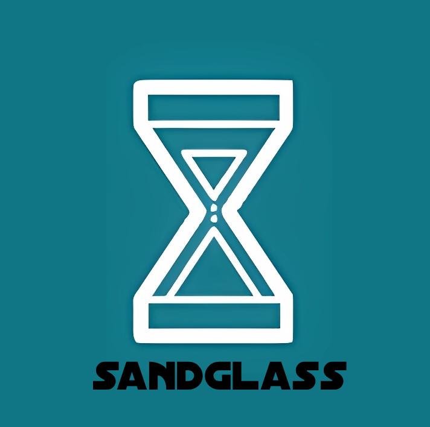

# Sandglass
Privacy-Preserving Mixer Protocol


## Project Creation Date
2024 August 24

## Table of Contents
- [Sandglass](#sandglass)
  - [Project Creation Date](#project-creation-date)
  - [Table of Contents](#table-of-contents)
  - [Introduction](#introduction)
  - [Features Planned for the Hackathon](#features-planned-for-the-hackathon)
  - [Architecture](#architecture)
    - [Zero-Knowledge Proof (zk-SNARK)](#zero-knowledge-proof-zk-snark)
    - [Merkle Tree](#merkle-tree)
    - [Smart Contract (Pallet) Features](#smart-contract-pallet-features)
  - [Schedule](#schedule)
  - [Selected Bounty](#selected-bounty)
  - [Team Info](#team-info)
  - [Material for Demo](#material-for-demo)
  - [How to Run the Project](#how-to-run-the-project)
  - [References](#references)


## Introduction
**Sandglass** is a decentralized currency mixer protocol that enhances privacy in token transactions within the Polkadot/Substrate ecosystem. Our primary focus is on solving two critical challenges:

- **Private Transfers:** Ensuring that transactions between parties remain completely anonymous by disconnecting the sender and receiver’s identities.
- **Quantitative Trading Follow-up:** Breaking the visibility of trading patterns and strategies often exposed by public transaction records, which can lead to copy trading or surveillance of large-scale traders.

To ensure compliance with legal standards, Sandglass incorporates access control mechanisms such as whitelisting and digital identity verification (e.g., Gitcoin Passport). This helps minimize legal risks commonly associated with anonymous transactions, such as those seen with Tornado Cash. Our approach ensures privacy while maintaining transparency where required by law.

Additionally, we have created unique functional points within the protocol:

- **Token Swapping:** Users can directly swap their deposited mixed tokens within the mixer, providing additional flexibility and utility beyond standard mixing functions. This feature differentiates Sandglass from other mixers, making it both a privacy tool and a DeFi solution.
- **TOTP:** In order to increase the security of account operations, we have added the  Time-based one-time password base ZKP.Time-based one-time password (TOTP) is a computer algorithm that generates a one-time password (OTP) using the current time as a source of uniqueness. As an extension of the HMAC-based one-time password algorithm (HOTP).
- **Blacklist:** In order to avoid legal risks, we have added a blacklist function. Accounts on the blacklist are prohibited from participating in currency swaps.

## Features Planned for the Hackathon
- **Develop Mixer Pallet**:
  - `setup_verification`: Verifies zk-SNARK proof inputs.
  - `deposit`: Enables users to deposit tokens while committing to a zk-SNARK proof.
  - `deposit_with_naive_otp`: Enables users to deposit tokens while committing to a zk-SNARK proof with Time-based one-time password.
  - `withdraw`: Enables users to withdraw tokens while proving ownership without disclosing their identity.
  - `swap`: Enables users to swap tokens while proving ownership without disclosing their identity.
- **OTP Pallet**:
  - `naive_approval`: Only checks that time in the proof is larger than lastUsedTime, i.e. behaves like HOTP
  - `block_time_approval`: Uses block timestamp to validate time, TOTP.
- **SWAP Pallet**:
  - `submit_order`: Submit order with token id, amount.
  - `take_order`: Take order by order id.
  - `cancel_order`:  cancel order by order id
- **Develop Mixer Frontend**:
  - **Deposit**: Frontend interface that interacts with the blockchain for depositing tokens.
  - **Withdraw**: Frontend interface for users to anonymously withdraw tokens.

## Architecture

### Zero-Knowledge Proof (zk-SNARK)
The core of the mixer’s privacy lies in zk-SNARK technology, which ensures that users can prove ownership of tokens (via commitments) without revealing any private information. A proof is generated based on a secret input and verified on-chain without disclosing the input itself.

### Merkle Tree
A Merkle Tree structure is used to store token commitments securely. The root of the Merkle Tree is public and verifiable, but individual commitments remain private. The tree grows with every deposit, and withdrawals are authorized by providing a zk-SNARK proof that corresponds to a valid leaf in the tree.

### Smart Contract (Pallet) Features
- **Commitment Storage**: Deposits are recorded as commitments in the Merkle Tree.
- **Nullifier Hashes**: Prevents double-spending by ensuring each withdrawal is unique.
- **Verification**: On-chain zk-SNARK proof verification for withdrawal authorization.

## Schedule
- **July 11, 2024**: Hackathon registration opens.
- **October 23, 2024**: Code submission deadline.
- **October 24-25, 2024**: Preliminary review.
- **November 16, 2024**: Demo Day in Bangkok (9:00 - 18:00, UTC+8).

## Selected Bounty
By integrating with Acala and Bifrost DeFi protocols, Sandglass also enables liquid staking (LST) and cross-chain liquidity to enhance the platform’s financial offerings. These integrations allow us to participate in their bounties, aligning our project with the broader goals of the Polkadot ecosystem.

## Team Info

**Smith Li**
- Blockchain Developer
- Over 9 years of experience in various aspects of programming.
- 5+ years of blockchain development experience, working with Polkadot, BitShares, Hyperledger Fabric, and more.
- [GitHub](https://github.com/baidang201)

**Pavel Burylichev**
- Product Manager
- Over 23 years of experience in software development and project management.
- Blockchain enthusiast, entrepreneur, and dedicated professional.
- [GitHub](https://github.com/uchu)

**Yunfei Li**
- Front-End Developer
- 8+ years of front-end development experience, skilled in Vue, React, and Node.js.
- Enthusiast in blockchain and decentralization technologies.
- [GitHub](https://github.com/liyunfei22)
- Email: liyunfei696@gmail.com

## Material for Demo
1. **Demo Video**: An overview of the mixer’s functionality and its usage.
https://youtu.be/lelt2F3cL5E

1. **Slideshow**: Presentation slides explaining the mixer’s architecture and features.
https://docs.google.com/presentation/d/e/2PACX-1vTHtiw_EBvSKKdz5FoxUNz9Pb9uJosksXTO2eRjvwiN9x78L-GEMR36B0I3UcZaf2L9rxrFz5PbUTjn/pub?start=false&loop=false&delayms=3000
1. **Live Demo**: Ideally, a live demonstration of the mixer, showcasing the deposit and withdrawal features in action.

## How to Run the Project

1. **Substrate Node**: Clone and run the Substrate node repository:
   ```
   git clone https://github.com/redstone-network/sandglass-node
   cd sandglass-node
   cargo build --release
   ./target/release/sandglass-node --dev
   ```

2. **Frontend**: Clone and run the frontend:
   ```
   git clone https://github.com/redstone-network/sandglass-frontend
   cd sandglass-frontend
   npm install
   npm run dev
   ```

3. **Connecting the Frontend to the Node**: Ensure the frontend is configured to connect with the Substrate node.

## References
- [Tornado Cash UI](https://github.com/tornadocash/tornado-classic-ui)
- [Substrate Merkle Tree](https://paritytech.github.io/polkadot-sdk/master/binary_merkle_tree/index.html)
- [Acala Documentation](https://evmdocs.acala.network/)
- [Bifrost Documentation](https://docs.bifrost.io/builders/liquid-staking-x-slpx)
- [zk-SNARK Overview](https://learnblockchain.cn/article/270)
