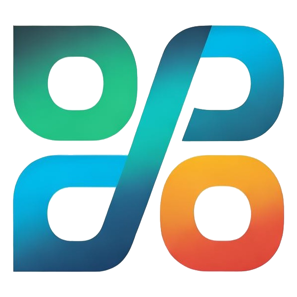

# basic information 

Project name:   Super Fair Governance

Project approval date (month and year): November 2024 

# Project Details

## Background

Voting governance is the most widely used collective decision-making method, but there are four pain points in voting governance decision-making:
1: Governance attack issues;

2: The problem of majority tyranny;

3: Infringement of the rights and interests of minority opinion holders;

4: Addressing the issue of apathy; 

## Logo

## Project overall introduction
The super fair governance chain is an L1 chain based on decentralized decision making, where all applications in the chain meet the requirements of decentralized decision-making: Decentralized decision-making technique is a different concept from decentralized execution. It is a result-oriented decision-making method that aims to satisfy the personal preferences of all participants.

The theory of decentralized decision  making has its origins in the cake-cutting problem (typical cake-cutting solutions are envy-free division and super fair distribution, two decentralized decision-making techniques based on the principle of unanimous consent, which aim to make everyone believe that their cake is bigger than that of others or that their cake is bigger than that of the average).

Developers can develop various applications based on the superfair governance chain, e.g. superfair distribution, superfair negotiation, superfair price guarantee, etc. The super fair governance chain provides governance computing, fairness verification, historical data query, and other services for various applications.

# Features planned for the Hackathon

## The application of super fair distribution
In some DAOs, digital collections or NFTs are co-created by the community, and some sharing relationships for member projects are clear. Before the NFT is publicly realized, members may want to distribute the NFT. At this time, since the NFT belongs to Indivisible projects and all members may have inconsistent valuations of the NFT, and their opinions on whether to sell the NFT are often not unified. Therefore, a universal and fair processing procedure is required.

## The application of super fair negotiation
In some communities, it often happens that different solutions to a problem may bring benefits to some people, while also harming the rights and interests of others. At this time, we need to find a collective decision through negotiation that satisfies all parties.

## Architect

 Super-fair governance is divided into the following stages:
### Voting preparation stage:
The main task of this stage is to set voting topics, tokens, and others. Among them, voting tokens should support the ability to abstain from voting: distribute abstained votes evenly to all proposals or set up a default agent;

### Ballot distribution stage:
At this stage, it is necessary to complete the task of distributing votes, and if it is required to auction votes, it should also be completed during this period;

### Proposal collection stage:
At this stage, all members can put forward proposals, and the proposal information should support the public inquiry function;

### Voting stage ( Commit ):
When the participant base is too large, due to the openness of blockchain information, we need to take specific measures to ensure that the participants who voted first have sufficient self-protection ability. Therefore, the following semi-repudiation encryption scheme is designed, and the particular measures include the following:
(1) The voting stage does not vote (transfer tokens) but only grants the transfer permission to the governance contract;
(2) Each participant can vote many time ;
(3) Voting adopts the bit commitment model, and the hash value H(x) of x to be voted is sent and stored in the blockchain;

### Voting Reveal:
In the voting disclosure stage, it is necessary to calculate the number of votes cast by members on each proposal. The specific process is as follows:
(1) Members send both the voting value x and the hash value H(x) to the governancer;
(2) The governancer counts the total number;
(3) The governancer counts the support votes of all proposals.  
 
### Decision-making and proposal implementation stage:
In this stage, the governance contract mainly realizes two functions:
(1) Realize the distribution of tokens (that is, incentive compensation) according to the super-fair governance formula according to the number of votes supported by all proposals. If there is proxy voting, it is necessary to allocate tokens based on the number of votes held by the principal;
(2) On-chain execution of approved proposals.
   

# Schedule Done during hackathon: 

## Runtime:  

### Customize a pallet-nft: 
Use of NFT to implement member identity authentication and mechanisms for joining and leaving;

### Voting Token, customize a pallet-erc20:
It realizes the functions of generation, distribution, transmission, query, batch auction, and waiver processing. At the same time, the Voting Token is also a stablecoin linked to the DAO Community Circulation Token. After the voting ends, the ballot token will be automatically destroyed, and the same number of community circulation tokens will be transferred to the ballot token holders.

### Customize a pallet-nft:  
Proposal management, creating corresponding NFTs for each proposal, recording the addresses and votes of voters, and providing external access interfaces.

### Customize a pallet-BitCommitment:
It mainly realizes the bit commitment function for the voting of the members of the community DAO (using the hash function keccak256), receives and discloses the token quotations of members, and realizes the relevant voting statistics function;
 
### Customize a pallet-SuperFairGovernance:
By using bit commitment contracts, a super-fair distribution of voting governance is attained, which involves allocating tokens both among diverse proposals and to individual members within each proposal. 

### Customize a pallet-DAO:
By utilizing the previously referenced contracts, community circulation tokens facilitate members’ independent acquisition of votes, with the tokens being automatically transferred to their wallets. This mechanism promotes member-driven vote purchasing, culminating in an exceptionally fair governance system for resolving internal community disputes.
  
  
## Web frontend: call extrinsics and querys. 

#### User 
#####  Users submit their votes through the voting interface and encrypt the voting data using BitPromise Pallet 
#####  query voting results.

#### Voting Interface
User interface for submitting votes and viewing voting results.

#### Submission of Voting
Users submit their votes through the voting interface, and the voting data is encrypted using a bit commitment pallet.   

#### Decision result query interface
Provide an interface for users to query real-time or historical voting results.

#### Decentralized Verification
Verify the decentralization level of voting results to ensure the fairness and transparency of the voting process.

#### Decentralization Level Report
Provide a report on the degree of decentralized decision of voting results for users .
 

## Team info 

| Name        | Role                   |
| ----------- | ---------------------- |
| liuCDao     | Project & Contract     |
| Sam         | Frontend               |
 

#  Bountiy want to apply  
 - ## [Category 3: (Chain )] - Building a blockchain based on Polkadot SDK.
    Build a custom blockchain challenge using Substrate.
 - ## [Blockchain for good] - Reducing Inequality  
    Social Welfare Distribution: Use blockchain technology to ensure the transparent and efficient distribution of social welfare funds, reducing corruption and waste in intermediary processes. 

# Material for Demo
1. Demo Video [link to Youtube]
2. PPT [link to google doc]

