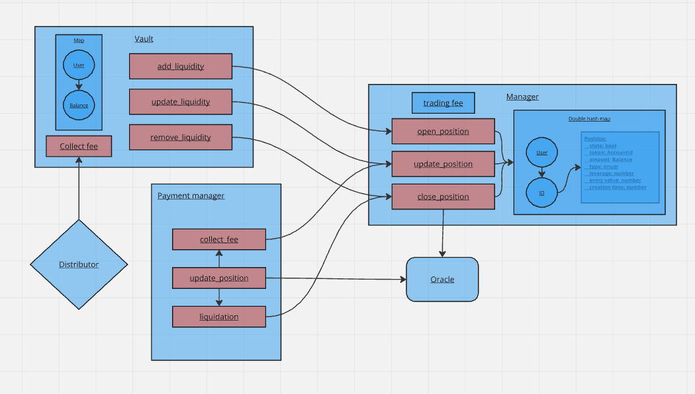

# Dazhbog: Decentralized Perpetual Futures on Polkadot
## Introduction

Dazhbog is a decentralized perpetual futures exchange built on Polkadot for the Polkadot Prodigy hackathon. It utilizes ink! smart contracts to facilitate peer-to-peer margin trading of perpetual contracts.

Our project, Dazhbog, previously earned first place in the DeFi category at the Polkadot Prodigy hackathon, and we aim to continue its development here. We already have a repository set up on [link](https://github.com/Ceres-Blockchain-Solutions/dazhbog-contracts)

## Features planned for the Hackathon

## Architect

[Miro board](https://miro.com/app/board/uXjVKDOV49s=/?share_link_id=628179226125).

## Schedule

## Team info

| Team members              | Github | X |
| :---------------- | :------: | :----: |
| Rastko Misulic        |   https://github.com/rastkoCBS   | https://x.com/rmisulic |
| Cvijan Djukanovic     |   https://github.com/CvijanCBS   | https://x.com/cvijanxd |

## Material for Demo
1. Demo Video [link to Youtube]
2. [Dazhbog Pitch Deck](https://drive.google.com/file/d/1wT30sNVUs4WRH6014FOMT3DW1r9QtKuq/view)
