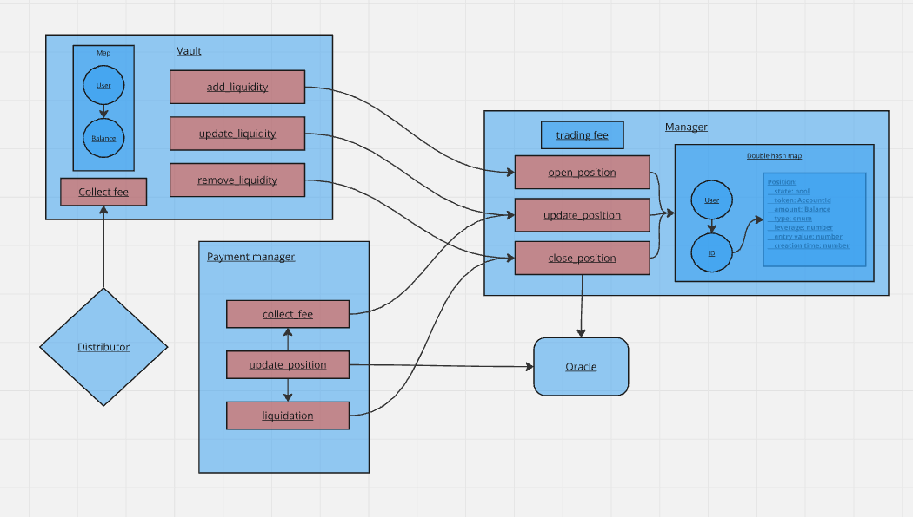

# Dazhbog: Decentralized Perpetual Futures on Polkadot


**Dazhbog** is a plug-and-play solution for a decentralized perpetual futures exchange that can be integrated into any parachain within the Polkadot ecosystem which supports ```contract-pallet```. It utilizes Ink! smart contracts to facilitate peer-to-peer margin trading of perpetual contracts. The platform  allows users to trade perpetual futures contracts in a decentralized manner, leveraging  the security, scalability, and interoperability of the Polkadot network. By integrating into  their parachains, builders aim to provide a seamless and efficient trading experience  without relying on centralized intermediaries. 

We already have a smart contract repository set up on [link](https://github.com/Ceres-Blockchain-Solutions/dazhbog-contracts/tree/polkadot-hackathon-2024).

## Introduction

**Dazhbog** - Decentralized Perpetual Futures Exchange

**Project creation date: 16.05.2024.**

We developed Dazhbog for the [Polkadot Prodigy hackathon](https://www.polkadotprodigy.com/), using the same repository as in this current hackathon. Our project won first place in the DeFi category.

Here is the [link](https://x.com/PolkadotProdigy/status/1800506214658494794) of the Twitter post where the winner was announced. This achievement demonstrates the extensive research conducted and the project's potential. The recognition highlights the traction Dazhbog has gained within the Polkadot community, further motivating our team to pursue its development.


## Features planned for the Hackathon

Implement contracts in Ink!:
- [x] Manager
- [x] Vault
- [x] Oracle
- [x] Payment manager
- [x] Distributor

Create frontend in React:
- [x] Connect wallet
- [x] Chart for following the price
- [x] Interface for open/close positions
- [x] List all wallet positions

Create backend in NestJS:
- [x] Follow all user positions
- [x] Save all position in MongoDB database
- [x] Get and update price feed in Oracle contract


## Architecture



[Miro board](https://miro.com/welcomeonboard/MnFxVEpES3RFVFZkeHliUkM5eVBFNVVUdXExVzJsbXhncEE3YU1kMUlqZGdPT09nNjVvT2dPR25Hdnh3bWRPd3wzNDU4NzY0NjAwODM1MTIzNDA5fDI=?share_link_id=236558705108).

## Schedule

In the first three days of development, which began on September 23, 2024, we integrated an ERC20 token and an AMM contract using open-source code and repositories from Ink! examples. Following that, we developed a Manager contract that contains the core logic for opening, closing, and updating positions. This contract has been tested.

Next, we created and tested a Vault contract to securely store user tokens, ensuring that the platform does not hold custody of the tokens, and users retain control. They can close their positions at any time and retrieve their tokens. 

We also developed an Oracle contract, which serves as a price feed for the current price of the underlying asset, and added liquidation checks.

Later, we built a Distributor contract that enables liquidity providers and the team to claim their share of the earnings generated from fee collections.

### All contracts were deployed on the Pop Network Testnet at the following addresses:

- **ERC20**: 13c5sTz2jVtSjg4QpMLrSjmtePJk7FJ5ZesF1JJhug7L4u9M
- **Oracle:** 1uu53t2x36nAs1YSWLYrj6ZStvqDFA5jHtas5hmCxeaVURZ
- **Vault:** 12Hr4rCHRKYLRmC1snPdh9rFknDR5ZPjZhKBQ291Gmcx2XAH
- **Manager:** 16c4vSzD2i8DHujsTtE43JuZpwn4BAQjxLn6oyiSEo2qXRyL
- **Distributor:** 12fJtnwVZrbnSCbLwGYyMwXwt66xAZZj75QPCjJScRiH13w2
- **Payment manager:** 16UCx7SwQgHmkCbtjp1MAuam6kJ416jvcDKbBC1Lt4aCebJ8

## Team info

- **Rastko Misulic** - Smart Contract Developer across all Rust/Solidity based chains
- **Cvijan Djukanovic** - Full-stack & Blockchain Delevoper w/ years of Rust based development 

| Team members              | Github | X | Linkedin |
| :----------- | :------: | :----: | :---:|
| Rastko Misulic        |   https://github.com/rastkoCBS   | https://x.com/rmisulic | https://linkedin.com/in/rmisulic/ |
| Cvijan Djukanovic     |   https://github.com/CvijanCBS   | https://x.com/cvijanxd | https://linkedin.com/in/cvijan-djukanovic/ |

## Track and bounty
**Track:** Category 2: (Hot) Smart Contract, DeFi, AI, Layer2, DePIN, etc.
### Material for Demo
1. Demo Video [link to Youtube]
2. [Dazhbog Pitch Deck](https://docsend.com/view/azxqmnarkhu8yxhh)
3. [Dazhbog Whitepaper](https://docsend.com/view/iszpqea9f8fae3xy)
