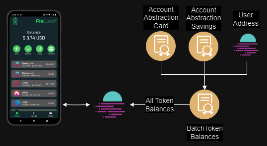

# Project name: ReLeaf

ReLeaf Wallet: Batch transactions, smart savings, and easy card payments.

### Project Creation Date: August 13, 2024

## Project Background:

Heavily based on the a submission we made to the Polkadot Hackathon North America 2024, where we were finalists:

https://www.polkadotglobalseries.com/polkadot-hackathon-north-america-edition-2024/

We used the name and some UI/UX and improved on the whole project, ALL of the backend and Polkadot functionalities were made from scratch as it was no longer useful to use the previous version, and we polished quite a lot on the business model and concept.

## Selected Bounty:

For the main Hackathon: Open Topic

Bounties: 

* Moonbeam Bounty 1: Use a Moonbeam Precompile

In our Account Abstraction model, all the accounts we have apart from the main account will be a [Light Account](https://github.com/alchemyplatform/light-account), which is a proposed ERC-4337 implementation by Alchemy and implemented in Moonbeam by our team, the code of our implementation you can find all the files in the tab [Contracts](./src/Contracts/).
Following a little the objectives of the Moonbeam precompiles, we have made our own "precompile" contract which serves to be able to make a batch call of multiple tokens to obtain their balances and decimals from a single RPC Call. [MORE DETAILS](./src/ReLeaf/src/screens/main/tabs/tab1.js)
One of the most important components in our project is the use of [Batch Precompile](https://docs.moonbeam.network/builders/pallets-precompiles/precompiles/batch/) to greatly improve the user's UI/UX, since we can perform more complex transactions from a single signature to the RPC.

* Darwinia Network: Build something valuable on the Darwinia Chain. We don't have a fixed requirement for the application, but it would be better to create something related to cross-chain functionality.

We use the RING Token as part of the payment methods available in our dApp [Tokens](./src/ReLeaf/src/utils/constants.js), in addition to facilitating the acquisition of that token in its xcRING version through Stellaswap [StellaSwap](./src/ReLeaf/src/screens/swapWallet/swapWallet.js).

## Planned Code Deliverables during the Hackathon 

- Wallet Creation: [LINK](./src/ReLeaf/src/screens/setup/setup.js)
- Savings Wallet: [LINK](./src/ReLeaf/src/screens/main/tabs/tab2.js)
- AA Card Creation: [LINK](./src/ReLeaf/src/screens/main/tabs/tab3.js)
- Card Payments: [LINK](./src/ReLeaf/src/screens/paymentWallet/paymentWallet.js)
- Swap with Stellaswap: [LINK](./src/ReLeaf/src/screens/swapWallet/swapWallet.js)
- Playstore App Deploy: [LINK](https://play.google.com/store/apps/details?id=com.altaga.releaf)

Check out our Fast links for more!

## Fast Links:

WALLET CODE: [CODE](./src/ReLeaf/)

PLAYSTORE: [LINK](https://play.google.com/store/apps/details?id=com.altaga.releaf)

VIDEO DEMO: [VIDEO](https://www.youtube.com/watch?v=5sqK4OsX_tQ)

Pitch Deck PPT: [PPT DECK](https://docs.google.com/presentation/d/1PGjP9kA1-iAU0iW03tAZFh8CtRLJITOvobgMC07NlrA/edit?usp=sharing)

## Team Information

Luis Eduardo Arevalo Oliver: My background is in Mechatronics and Biomedical Engineering, Well versed on Cloud Computing (maily AWS), AI, ML and now Blockchain development. In Web3 more than a year with a very active participation, in which the team aims to become the premier team in Latin America regarding payments. https://www.linkedin.com/in/luis-eduardo-arevalo-oliver-989703122/

Victor Alonso Altamirano Izquierdo: Engineer and full stack developer, I have extensive experience in the development of blockchain and cloud technology as well as in the development of native mobile dapps such as web applications on the Solana and EVM networks. https://www.linkedin.com/in/victor-alonso-altamirano-izquierdo-311437137/

Alejandro Sanchez Gutierrez: I am a biomedical engineer with a diverse professional background, having worked in various companies within the field. I have actively participated in numerous projects and hackathons, where I have had the opportunity to contribute innovative ideas and solutions. https://www.linkedin.com/in/alejandro-sanchez-gutierrez-11105a157/

## Introduction and Problem

Let’s start by asking the most obvious question: Have we really Banked the unbanked and reached the final consumer in our Web3 Applications? The answer for this regrettably is a big NO.

The DeFi world and certain projects such as uniswap have proven to be resilient and a decentralized way to Borrow, lend and earn. However, to achieve widespread adoption, we must cater to everyday consumers, including major retailers and mom-and-pop shops. And at the same time offer something more to these users.

Let me share with you an experience we had this Q1 of 2024, we were allocating telecommunications systems in a very underserved community in our country. And the deal is not really the job per se, but that we were able to see and feel the financial divide. We had to work with individual residences and in some cases pay the people living there and that’s where our problems began as we had to live the fact that only about 65% of people there are banked. Mostly this is caused by a horrid user experience, because most of the people over there had cellphone even high end ones.

The Latin American region has poor Credit inclusion and digital banking numbers, but astonishing Mobile phone penetration ones.

That is a huge opportunity for an integration of TradFi with Web3 via Mobile phones and existing infrastructure.

# Technical Architecture:

Our project has 4 fundamental components and their diagrams are as follows.

## Account Abstraction Creation:

In our Account Abstraction model, all the accounts we have apart from the main account will be a [Light Account](https://github.com/alchemyplatform/light-account), which is a proposed ERC-4337 implementation by Alchemy and implemented in Moonbeam by our team, the code of our implementation you can find all the files in the tab [Contracts](./src/Contracts/).

- [Entrypoint](./src/Contracts/core/EntryPoint.sol): This contract serves as an entry point to execute commands in the AA wallets.
    - EntryPoint Deployment Address: https://moonscan.io/address/0x0835980A1f2f32A12CA510E73bE3954D9F437114    
- [ReLeafAccountFactory](./src/Contracts/ReLeafAccountFactory.sol): This contract facilitates the creation of AA wallets in order to improve the user's UI/UX when creating their wallet.
    - ReLeaf Account Factory: https://moonscan.io/address/0x2D991fE2767FF819F6b3dab83625d331ecCe61a3
- [ReLeafAccount](./src/Contracts/ReLeafAccount.sol): Lastly, this Contract is the interface that will be deployed in the chain once we create it with the Factory, all operations carried out on this wallet must be carried out from the owner account.

## Batch Balances:

Following a little the objectives of the Moonbeam precompiles, we have made our own "precompile" contract which serves to be able to make a batch call of multiple tokens to obtain their balances and decimals from a single RPC Call. [MORE DETAILS](./src/ReLeaf/src/screens/main/tabs/tab1.js)

- [Batch Token Balances](./src/Contracts/ReLeafBalances.sol): This contract is used to carry out batch token balances.
    - ReLeafBalances Deployment Address: https://moonscan.io/address/0xcdEE75520dcE5240C39a308A705Ed3D6c6D82664  

## Batch Payments:

One of the most important components in our project is the use of [Batch Precompile](https://docs.moonbeam.network/builders/pallets-precompiles/precompiles/batch/) to greatly improve the user's UI/UX, since we can perform more complex transactions from a single signature to the RPC.

- Direct Transfer: We can carry out a series of batch transactions with either native or ERC20 tokens, all in a single transaction. [MORE DETAILS](#send)

     - If the savings account is turned on, according to the saving protocol that is activated, an extra transaction will be attached to the batch which will send money to that account. [MORE DETAILS](#savings)

- Card Payment: We can make payments without needing our wallet, only from our card linked to our Account Abstraction Card Wallet. [MORE DETAILS](#payment)

## Swap Tokens:

In the same way as in batch paymens, we have made the necessary code to improve the user experience of the Stellaswap swap to carry out all swaps from a single batch transaction. [MORE DETAILS](#swap)

- Swap SDK: The stella swap swap-sdk was based on it, but it was adapted to work with the Swap function.
    - Swap-SDK: https://github.com/stellaswap/swap-sdk/tree/main

# Screens:

ReLeaf is a comprehensive payment, savings and card solution. Integrated the SDKs and Precompiles of the Moonbeam ecosystem in a single application.

## Wallet:

As a basis for using all Moonbeam services and resources, we created a simple wallet, which allows us to view the Assets on the moonbeam network. [CODE](./src/ReLeaf/src/screens/main/tabs/tab1.js)

In turn, this tab integrates the contract of [ReLeafBalances](./src/Contracts/ReLeafBalances.sol), which allows us to obtain all the balances of all the X-Tokens in the Moonbeam ecosystem from a single RPC Call.

    const tokenBalances = new ethers.Contract(
        BatchTokenBalancesAddress,
        abiBatchTokenBalances,
        this.provider,
    );
    const [balanceTemp, tempBalances, tempDecimals] = await Promise.all([
        this.provider.getBalance(publicKey),
        tokenBalances.batchBalanceOf(publicKey, tokensArray),
        tokenBalances.batchDecimals(tokensArray),
    ]);

## Send:

With the send function, we can send native tokens or ERC20 tokens in batch, which means that all transactions will be executed in the same transaction. [CODE](./src/ReLeaf/src/screens/sendWallet/sendWallet.js)

  

It is very important to check that all transactions are executed through the [Batch Precompile](https://docs.moonbeam.network/builders/pallets-precompiles/precompiles/batch/) Contract of Moonbeam. 

    this.batchContract = new ethers.Contract(
        BatchTransactionsAddress,
        abiBatch,
        this.provider,
    );
    ...
    const transactionBatch =
    await this.batchContract.populateTransaction.batchAll(
        [...transactions.map(item => item.to)],
        [...transactions.map(item => item.value)],
        [...transactions.map(item => item.data)],
        [],
        {
        from: this.state.publicKey,
        },
    );

## Receive:

With this screen, you can easily show your Wallet to receive funds, whether native tokens or ERC20. [CODE](./src/ReLeaf/src/screens/depositWallet/depositWallet.js) 

## Swap:

Thanks to Stella Swap and the fact that its SDK is public, we can make swaps between tokens, whether native or ERC20. [CODE](./src/ReLeaf/src/screens/swapWallet/swapWallet.js)

 

As mentioned before, unlike a swap from the StellaSwap platform, we can carry out the entire swap through a single transaction through [Batch Precompile](https://docs.moonbeam.network/builders/pallets-precompiles/precompiles/batch/).

    const batchData = this.batchContract.interface.encodeFunctionData(
        'batchAll',
        [
        [this.state.tokenSelected1.address, AGGREGATOR_ADDRESS],
        [],
        [allowance, swapData],
        [],
        ],
    );

## Payment: 

In this tab we intend to make it the same as using a traditional POS, this allows us to enter the amount to be charged in American dollars and to be able to make the payment with one of our virtual cards. [CODE](./src/ReLeaf/src/screens/paymentWallet/paymentWallet.js)

  

As you can see, since it is an AA Card, we can review the amount of money it has in all the available tokens to be able to make the payment with any of them, whether it is a native token or ERC20.

  

Finally, if our device has the option to print the purchase receipt, it can be printed immediately.

## Savings:

In the savings section, we can create our savings account, this account is linked to our main wallet account, meaning that our wallet will be the owner of it. [CODE](./src/ReLeaf/src/screens/main/tabs/tab2.js)

  

### Savings Protocol:

- Balanced Protocol, this protocol performs a weighted rounding according to the amount to be paid in the transaction, so that the larger the transaction, the greater the savings, in order not to affect the user. [CODE](./src/ReLeaf/src/utils/utils.js)

        export function balancedSavingToken(number, usd1, usd2) {
            const balance = number * usd1;
            let amount = 0;
            if (balance <= 1) {
                amount = 1;
            } else if (balance > 1 && balance <= 10) {
                amount = Math.ceil(balance);
            } else if (balance > 10 && balance <= 100) {
                const intBalance = parseInt(balance, 10);
                const value = parseInt(Math.round(intBalance).toString().slice(-2), 10);
                let unit = parseInt(Math.round(intBalance).toString().slice(-1), 10);
                let decimal = parseInt(Math.round(intBalance).toString().slice(-2, -1), 10);
                if (unit < 5) {
                unit = '5';
                decimal = decimal.toString();
                } else {
                unit = '0';
                decimal = (decimal + 1).toString();
                }
                amount = intBalance - value + parseInt(decimal + unit, 10);
            } else if (balance > 100) {
                const intBalance = parseInt(Math.floor(balance / 10), 10);
                amount = (intBalance + 1) * 10;
            }
            return new Decimal(amount).sub(new Decimal(balance)).div(usd2).toNumber();
        }

- Percentage protocol, unlike the previous protocol, this one aims to always save a percentage selected in the UI. [CODE](./src/ReLeaf/src/utils/utils.js)

        export function percentageSaving(number, percentage) {
            return number * (percentage / 100);
        }

## Cards:

Finally, in the cards section, we can create a virtual card, which will help us make payments without the need for our wallet directly with a physical card in any POS terminal with ReLeaf. [CODE](./src/Cloud%20Functions/Add%20Card/index.js)

  

This AA Card has as its owner a wallet completely controlled by our backend in Google Cloud. However, the only way to make payments from this card is through the physical card. And all transactions are encrypted using SHA256. [CODE](./src/Cloud%20Functions/Card%20Transaction/index.js)
