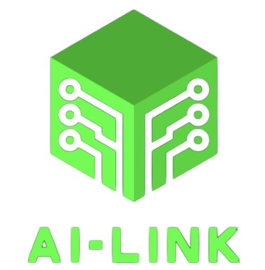

# AI-Link

## Introduction
AI-LINK is a Byzantine-Robust Circuit designed to ensure privacy and data sovereignty. It leverages smart contracts to connect decentralized storage and computing resources, enabling secure AI training and applications while safeguarding the user's original data from exposure.

## Features planned for the Hackathon

- [x] Implement a smart contract to orchestrate AI training schedules 
- [X] Smart contract serve as a foundation for models proof of existence.
- [x] Create an aggregation server that combines local models into a global model.
- [x] Create a validation proxy server that verifies the models integrity.
- [x] Create a client that performs local training and submits the model to the server.

## Architecture

## Explanation
The AI-Link architecture combines federated learning and blockchain technology to securely train AI models while protecting data privacy. Clients, such as smartphones and computers, train their models locally, ensuring that sensitive data remains on their devices.

After training, each model is hashed to create a unique identifier that helps validate its integrity. Clients encrypt their models before sending them to the Validation Proxy, which safeguards the data during transmission. These models are then stored in CESS Storage Nodes for backup and decentralized access.

The Validation Proxy verifies model hashes through the blockchain, preventing tampering and ensuring integrity. It also checks compatibility by calculating cosine similarity with previous models. Once validated, the encrypted models are sent to a central Server, which aggregates them into a global model.

This global model is hashed and recorded on the blockchain to track its integrity. The validated global model is then rolled out to the clients via the Validation Proxy, ensuring it meets quality standards. The architecture allows ongoing verification of model hashes, promoting trust and consistency while effectively addressing data privacy concerns in a decentralized setup.

## Advantages
- **Enhanced Privacy:** By allowing clients to train models locally, sensitive data never leaves the device, ensuring user privacy and data sovereignty.

- **Data Security:** The use of encryption and decentralized storage protects models during transmission and storage, minimizing the risk of data breaches.

- **Integrity Verification:** Hashing models and utilizing blockchain technology ensures that model updates are tamper-proof and can be verified for integrity at any time.
  
- **Control Over Training Schedule:** The administrator have the flexibility to determine when the training cycle begins, allowing for better alignment with data availability and resource constraints.

- **Robust Against Attacks:** The architecture incorporates mechanisms to detect and mitigate poison attacks, safeguarding the performance of the global model.

- **Decentralization:** The system eliminates reliance on a single data repository, distributing data storage and processing across multiple nodes, which enhances reliability.

- **Scalability:** The architecture can efficiently handle an increasing number of clients and models, making it suitable for large-scale deployments.

- **Real-Time Updates:** The ability to quickly validate and aggregate models allows for timely updates to the global model, keeping it relevant and effective.

- **Collaboration:** Clients can contribute to a shared model without exposing their data, fostering collaboration while maintaining individual data privacy.

- **Cost-Effectiveness:** Reducing the need for centralized data storage and processing can lead to lower operational costs and resource utilization.

## Team info
Kwuaint Lee, Chunshu Dai, Mark Liu

## Material for Demo
1. Demo Video [link to Youtube]
2. [PPT](https://docs.google.com/presentation/d/1EbokU6l0DUOa4j9J2_cC8p8TWP2Qci96s1w2Mj8Z_7E/edit?usp=sharing)
3. [Website](https://chunshudai2001.wixsite.com/ai-link)
4. [White paper](https://docs.google.com/document/d/1gH5mu9Vj2SpWoAR_g7PFqo9eIwVKlUS3uKzMJIPMt9Q/edit?usp=sharing)
