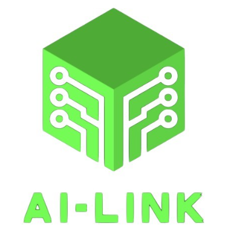
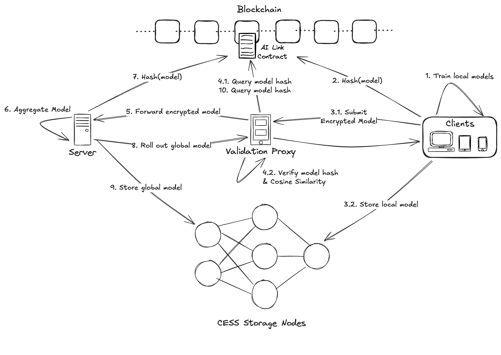

# AI-Link

### **Introduction:**
AI-LINK is a Byzantine-Robust Circuit designed to ensure privacy and data sovereignty. It leverages smart contracts to connect decentralized storage and computing resources, enabling secure AI training and applications while safeguarding the user's original data from exposure.

### **Motivation:**
In federated learning environments, ensuring the integrity of model updates is critical, malicious actors can launch poison attacks by submitting tampered models. These attacks can degrade the performance of the global model and compromise the privacy of users data. The challenge lies in creating a robust framework that can detect and mitigate such attacks while preserving the benefits of decentralized data training.

### **Components:**
1. **Clients**: Represent different devices (e.g., phones, tablets, computers, etc) that train models locally on their data.
2. **Server**: Acts as the central node for aggregating local models into a global model.
3. **Validation Proxy**: A data integrity checkpoint server that ensures confidentiality and integrity of model exchange. (Replace with TEE in the future.)
4. **Blockchain & Smart Contract**: Provides a decentralized and transparent ledger to store and verify the integrity of model updates.
5. **CESS Storage**: A decentralized storage to securely store trained models.

### **Architecture:**

### **Explanation:**
The AI-Link architecture combines federated learning and blockchain technology to securely train AI models while protecting data privacy. Clients, such as smartphones and computers, train their models locally, ensuring that sensitive data remains on their devices.

After training, each model is hashed to create a unique identifier that helps validate its integrity. Clients encrypt their models before sending them to the Validation Proxy, which safeguards the data during transmission. These models are then stored in CESS Storage Nodes for backup and decentralized access.

The Validation Proxy verifies model hashes through the blockchain, preventing tampering and ensuring integrity. It also checks compatibility by calculating cosine similarity with previous models. Once validated, the encrypted models are sent to a central Server, which aggregates them into a global model.

This global model is hashed and recorded on the blockchain to track its integrity. The validated global model is then rolled out to the clients via the Validation Proxy, ensuring it meets quality standards. The architecture allows ongoing verification of model hashes, promoting trust and consistency while effectively addressing data privacy concerns in a decentralized setup.

### **Advantages:**
- **Enhanced Privacy:** By allowing clients to train models locally, sensitive data never leaves the device, ensuring user privacy and data sovereignty.

- **Data Security:** The use of encryption and decentralized storage protects models during transmission and storage, minimizing the risk of data breaches.

- **Integrity Verification:** Hashing models and utilizing blockchain technology ensures that model updates are tamper-proof and can be verified for integrity at any time.
  
- **Control Over Training Schedule:** The administrator have the flexibility to determine when the training cycle begins, allowing for better alignment with data availability and resource constraints.

- **Robust Against Attacks:** The architecture incorporates mechanisms to detect and mitigate poison attacks, safeguarding the performance of the global model.

- **Decentralization:** The system eliminates reliance on a single data repository, distributing data storage and processing across multiple nodes, which enhances reliability.

- **Scalability:** The architecture can efficiently handle an increasing number of clients and models, making it suitable for large-scale deployments.

- **Real-Time Updates:** The ability to quickly validate and aggregate models allows for timely updates to the global model, keeping it relevant and effective.

- **Collaboration:** Clients can contribute to a shared model without exposing their data, fostering collaboration while maintaining individual data privacy.

- **Cost-Effectiveness:** Reducing the need for centralized data storage and processing can lead to lower operational costs and resource utilization.

### **Process Overview:**
**1. Train Local Models** 
- Clients (such as computers, smartphones, or other devices) train models locally using their private data.
- This ensures that raw data remains on the client side, which enhances privacy and security.

**2. Hash Local Models**
- Once the local models are trained, each model is hashed (i.e., a unique hash value is generated based on the model’s data).
- The hash helps in tracking and validating the models integrity.

**3.1. Submit Encrypted Model**
- Clients encrypt their local models and submit them to the Validation Proxy.

**3.2. Store Local Models**
- Local models are stored in CESS Storage Nodes for backup and decentralized access.

**4.1.; 4.2. Query and Verify Model Hash**
- The Validation Proxy communicates with the Blockchain to query the model hashes to ensure integrity and prevent tampering.
- Additionally, the proxy verifies the hash values and calculate cosine similarity to compare the new model with previous versions ensure compatibility and performance.

**5. Forward Encrypted Model**
- After validation, the encrypted model is forwarded to the Server.

**6. Aggregate Model**
- The server aggregates the received models from different clients into a global model.

**7. Hash Global Model**
- The aggregated global model is hashed, and the hash is recorded in the Blockchain to maintain integrity and track the version.

**8. Roll Out Global Model**
- The server rolls out the global model to the Validation Proxy, which ensures that it is properly validated before distributing it back to the clients.

**9. Store Global Model** 
- The global model is stored in CESS Storage Nodes for distributed access and backup.

**10. Query Model Hash**
- The Blockchain can be queried again by the Validation Proxy or other entities to verify the model hash for future operations, ensuring the model's integrity and consistency over time.