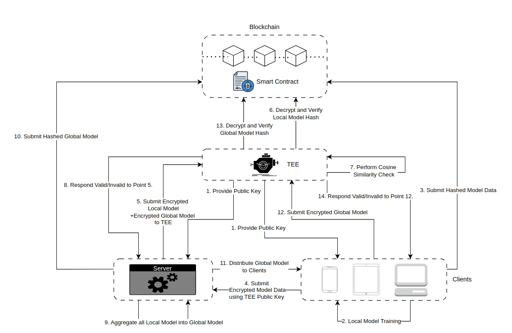

# AI-Link

### **Introduction:**
AI-LINK is a Byzantine-Robust Circuit designed to ensure privacy and data sovereignty. It leverages smart contracts to connect Polkadot's storage and computing resources, enabling secure AI training and applications while safeguarding the user's original data from exposure.

### **Components:**
1. **Clients**: Represent different devices (e.g., phones, tablets, computers) that train models locally on their data.
2. **Server**: Acts as the central node for aggregating local models into a global model.
3. **Trusted Execution Environment (TEE)**: A secure area within the server that ensures confidentiality and integrity of code and data.
4. **Blockchain & Smart Contract**: Provides a decentralized and transparent ledger to store and verify the integrity of model updates.

### **Architecture:**

### **Process Overview:**
1. **Step 1: TEE Provides Public Key**  
   The TEE generates and shares a public key with the server and clients, which will be used to encrypt local and global models.

2. **Step 2: Local Model Training**  
   Each client device trains a local model using its own data. The local model weights are then prepared for submission.

3. **Step 3: Submit Hashed Model Data**  
   After local training, each client hashes its local model and submits the hash to the smart contract on the blockchain. This ensures that the integrity of the local model can be verified later.

4. **Step 4: Submit Encrypted Model Data using TEE Public Key**  
   The client encrypts its local model using the TEE’s public key and submits the encrypted model to the server. This step ensures that the server cannot view the raw model data but can pass it to the TEE for processing.

5. **Step 5: Submit Encrypted Local Model and Encrypted Global Model to TEE**  
   The server receives the encrypted local model and an encrypted global model (from a previous aggregation round) and forwards both to the TEE for secure validation.

6. **Step 6: Decrypt and Verify Local Model Hash**  
   The TEE decrypts the local model and verifies it against the hash submitted to the blockchain. This verification step ensures the model’s integrity.

7. **Step 7: Perform Cosine Similarity Check**  
   The TEE performs a cosine similarity check between the local model and the global model. This check ensures that the local model update is not significantly different or malicious (Byzantine-Robust).

8. **Step 8: Respond Valid/Invalid to Point 5**  
   The TEE responds to the server, indicating whether the local model is valid or not based on the similarity check

9. **Step 9: Aggregate all Local Models into Global Model**  
   If the local model is validated, the TEE aggregates all received local models into a new global model, combining updates from multiple clients.

10. **Step 10: Submit Hashed Global Model**  
    The TEE hashes the new global model and submits the hash to the smart contract on the blockchain. This step ensures that the integrity of the global model can be verified by any party.

11. **Step 11: Distribute Global Model to Clients**  
    The server distributes the new encrypted global model to all clients, which is encrypted using the TEE’s public key.

12. **Step 12: Submit Encrypted Global Model**  
    The server submits the encrypted global model to the TEE for verification and distribution.

13. **Step 13: Decrypt and Verify Global Model Hash**  
    The TEE decrypts the global model and verifies its integrity using the hash stored on the blockchain.

14. **Step 14: Respond Valid/Invalid to Point 12**  
    The TEE sends a response back to the clients indicating whether the global model is valid or not.

### **Summary of Key Features:**
- **Blockchain Integration**: Ensures transparency and immutability of model hashes, facilitating secure verification.
- **TEE Usage**: Provides a secure environment for sensitive computations like model aggregation and similarity checks.
- **Server Role**: Acts as an intermediary for communication and data transfer, but without access to the raw models due to encryption.
- **Client Contribution**: Clients train models locally and submit updates, participating in a privacy-preserving learning process.

## Team info
Kwuaint Lee, Chunshu Dai, Mark Liu

## Material for Demo
1. Demo Video [link to Youtube]
2. PPT [link to google doc]
