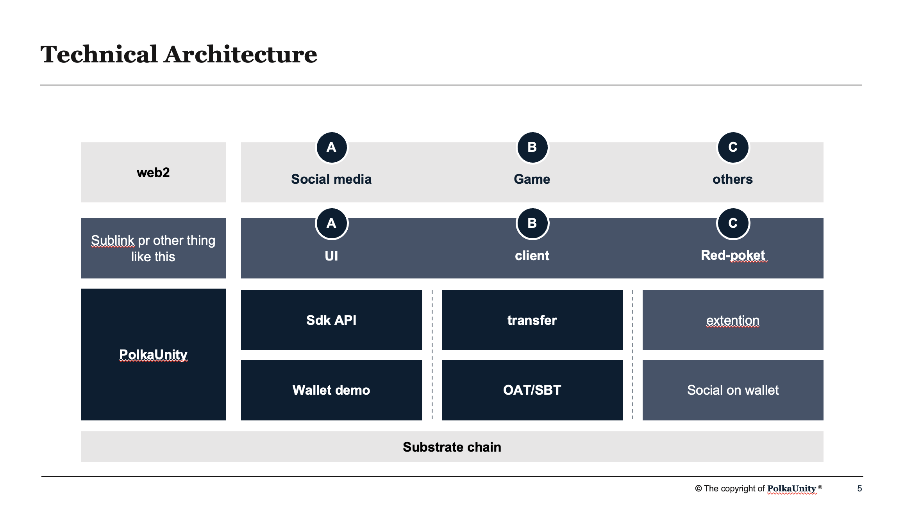
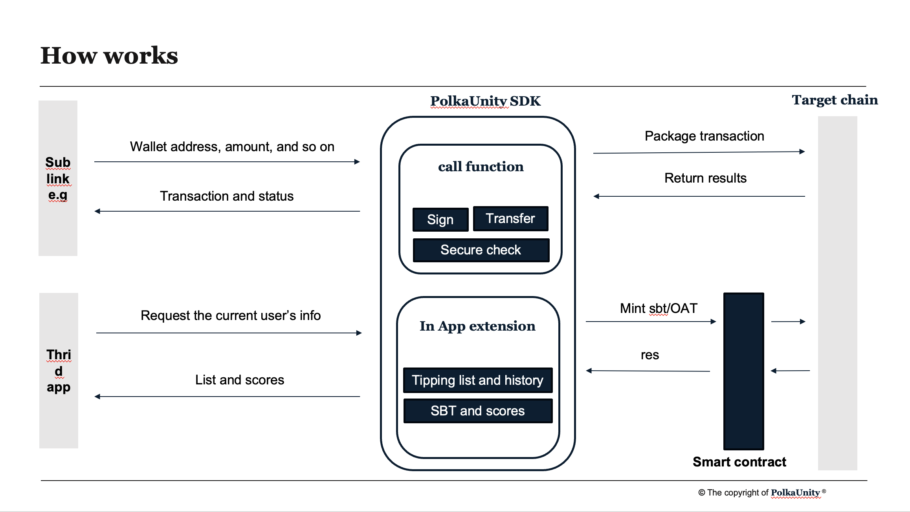

# Project PolkaUnity
Universal Web3 wallet sdk for all social platform developers
## Introduction
This project aims to create a universal Web3 wallet SDK as a middleware layer that enables developers to easily integrate wallet functionality, decentralized identity (DID), and social media into any project. The SDK will provide simple API calls, reducing development complexity while offering users a seamless Web3 experience.
Target Audience: All Web3 application developers, decentralized application (DApp) projects, and projects needing social media integration.

## Features planned for the Hackathon

- [ ] 

- [ ] 

- [ ] 

- [ ] 

- [ ] 

## Architect

## Schedule
| Phase | Timeline | Description |
| ----- | -------- | ----------- |
|    Phase 1   |          |             |
|    Phase 2   |          |             |
|    Phase 3   |          |             |

## Team info
| name         | role         | GitHub |
| ----------- | ----------- | -----------  |
| yushen       | Product Manager | yushen165 |
| fage         | Software Engineer | - |
| juanniao     | Software Engineer | - |

##  Bountiy want to apply 
1. Vara Network & Gear
2. CESS Network
3. Darwinia Network

## Material for Demo

1. Demo Video [link to Youtube]
2. PPT [https://drive.google.com/file/d/1BLdetsUvaycmYNY5sA819rbVfIsvH17Y/view?usp=sharing]
