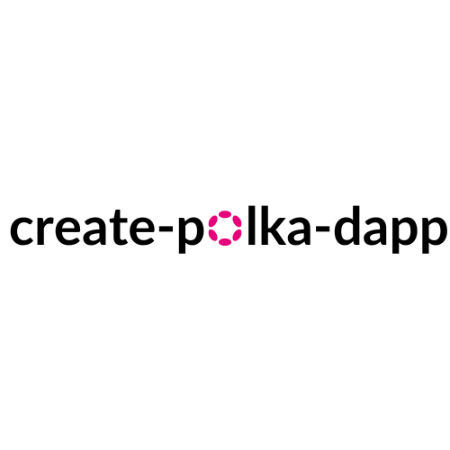

## Basic Information

Project name: Create Polka Dapp

Project approval date (month and year): September 2024

Project Creation date: May, 2024

[Demo Video (LOOM)](https://www.loom.com/share/a3b65bf8b5f34e9bb6dbf363dc590c68?sid=e1f71081-60cc-457a-addf-ed2beec2437a)

### Project Background

- [Repo](https://github.com/OpeOginni/create-polka-dapp)
- Participated in the Polkadot Prodigy Hackathon where the project was initiated.
- Have received no extra funding or grants.

### Introduction

**Create Polka Dapp** is a scaffolding CLI tool aimed at developers looking to quickly set up their Polkadot-based dApp. It currently focuses on frontend-only development but has a roadmap for expansion. The key features include:

### Problem Statement

Polkadot offers a highly scalable, interoperable network for building decentralized applications, but many developers face the challenge of getting started with setting up projects. To solve this, **Create Polka Dapp** provides an easy-to-use CLI for scaffolding starter applications, simplifying the development process for Polkadot-based dApps.

Despite its initial utility, the project currently supports only frontend creation, and there’s a strong need for more flexibility in terms of frameworks, contracts, and evm and substrate chains.

The complexities with wallets in the Polkadot ecosystem also makes many developers to rush to ship out only custodial wallet systems for their users, this makes some builders shy away from developing on polkadot.

Create-Polka-Dapp solves this by providing simplified and customizable templates in different frontend frameworks that assist developers with setting up the wallet flow on their dapps, and now we also support contract side development providing users with ways to deploy and interact with their contracts, using simple scripts, with Javascript.

The project's main code repository is available [here](https://github.com/OpeOginni/create-polka-dapp/tree/polkadot-2024-hackathon), and the NPM package can be found [here](https://www.npmjs.com/package/create-polka-dapp).

## Things Planned to be Done During the Hackathon

- Runtime Module
  - [x] Scaffold contracts for different parachains.
  - [x] Integrate contract templates alongside frontend templates.
- Web Frontend
  - [x] Add Next.js as a frontend option.
  - [x] Improve existing React and Svelte templates with modern best practices.
- CLI Templates
  - [x] Scaffold options for contracts, frontend-only, or full-stack depending on developer needs.
  - [ ] Custom CLI templates for specific parachains based on development tools (EVM or INK)
- Contract LifeCycle Process Support (Mentorship Meetup advice)
  - [x] Provide developers who decide to generate contracts with simple tools (utilities) to perfom tasks like deploy and interact with their contracts. Though the Command Line or Through easy to write scripts.. Just like Hardhat for the Eth ecosystem

## Hackathon Progress

As the project develops during the hackathon, this section will track the completed features and milestones.

- 2024 Hackathon Milestone:
  - Added new CLI templates.
  - Enhanced wallet functionality and flow.
  - Initial contract scaffolding support.

### Commit Progress

- [Updated CLI dependencies (moved to more lightweight deps) & Setup templates into categories (frontend, contract, frontend + contract)](https://github.com/OpeOginni/create-polka-dapp/commit/13d0a79bab110845b73aec3310b9bb8c80ccf43a)

- [Worked on Current React Frontend Templates](https://github.com/OpeOginni/create-polka-dapp/commit/c1b479e8be1353d0c641227a4243969dd50f3764)

  - Reduced the size of the package by getting rid of JS frontend templates as developers can easily switch the TS templates to work as JS.
  - Completely updated the React + TS frontend template, adding tailwindcss for styling and improving the wallet connection UI and UX.
  - Lastly I decided to stick with `Polkadot-Onboard` for the wallet connection and interaction as this provides end developers with a smooth use and they can make their own custom changes as easy as they like.

- [Created Template for NextJS App Router + Typescript plus new frontend features](https://github.com/OpeOginni/create-polka-dapp/commit/b6d627b0e6cba04f3762b571601f5de9ebfc5189)

  - Added extra extension wallets and nice UI making users install suggested wallets they dont have
  - Implemented a chain switching system where users can move from chain to chain

- [Added Ink Contract Template](https://github.com/OpeOginni/create-polka-dapp/commit/3f971c3edb1c8f85294f5d26f8244e6ae4589ed3)

  - Implemented a simple Hello World Ink Contract Teamplte with a simple Set and Get function.

- [Updated CLI Generation Script](https://github.com/OpeOginni/create-polka-dapp/commit/13a426a0d01c7e2b8fc609784b24e9ff6297fd85)

  - Upgraded Scripts to work for Contracts, Frontend and Contacts + Frontend
  - Added a SubDir Option for users who want to scaffold in a new project but a unique directory.

- [Final Template Details](https://github.com/OpeOginni/create-polka-dapp/commit/2467a9b492be91d8f5a4c915d10fd0c64c26aa81)

  - Added details on how users can implement contract calls on their frontends
  - Fixed Bugs on React + TS template

- [Updated polkagate-icon](https://github.com/OpeOginni/create-polka-dapp/commit/f64218e0d6f169dac6d403d95bea265905db8505)

- [Added Development utilities for ink contract templates](https://github.com/OpeOginni/create-polka-dapp/commit/50fe3b9f2eab7c083d897bae0e8fbe4e0d28a47b)

  - Created Scripts and CLI commands that developers can use to simply deploy their contracts to various chains.

- [Updated Contract Utilities & Added Next Pages Router Frontend Template](https://github.com/OpeOginni/create-polka-dapp/commit/4868bcd5fdba3aa111cf0396abde54732e05220e)

  - Created NextJS Pages Router template for frontend
  - Updated Contract Utilities

- [Added Finishing touches to CLI](https://github.com/OpeOginni/create-polka-dapp/commit/4c1abb465ff1614ef8a130b2cc5d77ee71cecc8e)

  - Made sure Uncompleted Templates show as disabled on the CLI
  - Update Package Readme

- [Bug Fixes to Contract LifeCycle Commands](https://github.com/OpeOginni/create-polka-dapp/commit/6f21a19f6b70ca8f39dc8ead5e1bbb0b0613695d)

  - Fixed CLI Bugs
  - Completed Interact Command

- [Merged Polkadot 2024 Hackahton Branch to Prod](https://github.com/OpeOginni/create-polka-dapp/pull/1)

- [Released Version 0.1.0](https://www.npmjs.com/package/create-polka-dapp)

- [Updated Pakcage Description and Added Fixes to reduce package size](https://github.com/OpeOginni/create-polka-dapp/commit/28d5915c54873af1032abcac8c80d87b9abe88db)

- [Released Version 0.1.1 & 0.1.2](https://github.com/OpeOginni/create-polka-dapp/commit/3fb57a2a6b024db07f473aedcb2ddc3097931d98)

## Choosen Track

This project is for the **Category 1: (Infrastructure) Polkadot ecological developer tools** Track

## Features Worked on and completed during the hackathon

- [x] Scaffold for INK contracts.
- [x] Integrate contract templates alongside frontend templates.
- [x] Add Next.js as a frontend option (app router & pages router).
- [x] Improved existing React Template.
- [x] Scaffold options for contracts, frontend-only, or full-stack depending on developer needs.
- [x] Provide developers who decide to generate contracts with simple tools (utilities) to perfom tasks like deploy and interact with their contracts. Though the Command Line or Through easy to write scripts.. Just like Hardhat for the Eth ecosystem

<!-- - [Pitch Deck](https://github.com/OpeOginni/create-polka-dapp/tree/polkadot-2024-hackathon) -> will be updated -->

- [Demo Video (LOOM)](https://www.loom.com/share/a3b65bf8b5f34e9bb6dbf363dc590c68?sid=e1f71081-60cc-457a-addf-ed2beec2437a)

### Post Hackathon Features

These are some extra features I would like to continue to work on, based on advice given from workshops and mentor sessions

1. **Standalone Contract Development Library**: We're extracting our contract development utility to create a tool on its own making it a separate library for more flexibility and easier maintenance.

2. **Modular Wallet Connection Component**: The wallet connection functionality will be available as a standalone, customizable component library, so developers can decide to use the component if they

3. **Enhanced CLI Capabilities**: More commands and options to further streamline your development workflow.

4. **Additional Framework Support**: We're planning to add support for more frontend frameworks and build tools.

## Member Information

**Ope Oginni**

- Over 2 years of software development experience, specializing in blockchain and decentralized applications.
- Github: [OpeOginni](https://github.com/OpeOginni)
- Discord: obo.baddest
