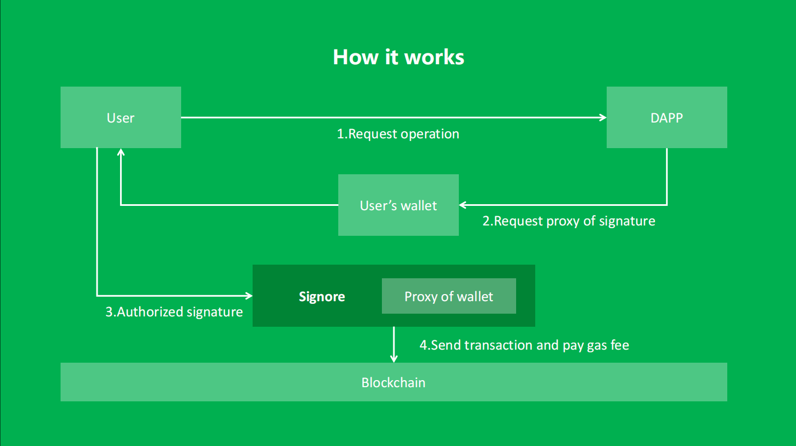

# Project Signore
## Introduction

Signore is a pallet developed based on the substrate framework, dedicated to lowering the threshold for users. By sending unsigned transactions and proxy calls, users are exempted from gas fees.

## Features planned for the Hackathon

- [ ] Realize the main function of proxy signing to exempt users from gas fees.

- [x] Ensure the security of the proxy signing process and no risk of being attacked.

- [x] Add nonce field and tip field to construct transactions in a more reasonable way.

## Architect

## Schedule

| Roadmap | Description |
| ----- | ----------- |
|    2024 Q4   | Enhance security verification and signing. Add nonce value recording. Support tip input. Complete demo. |
|    2025 Q1       | Add custom function interfaces. Allow developers to configure rules through runtime. |
|    2025 Q2  | Add EVM account adaptation. |

## Team info

| name         | role         | GitHub |
| ----------- | ----------- | -----------  |
| PANDA       | Product Manager | - |
| projectY         | Blockchain Engineer | projectY |

## Material for Demo
1. Demo Video [link to Youtube]
2. PPT [https://docs.google.com/presentation/d/1Txno1InhrKLkciaoYX9c9bFoZLCLh-H4ncIo0MLm5EE/edit#slide=id.p1]
