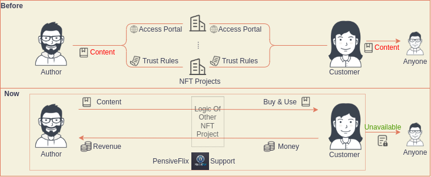
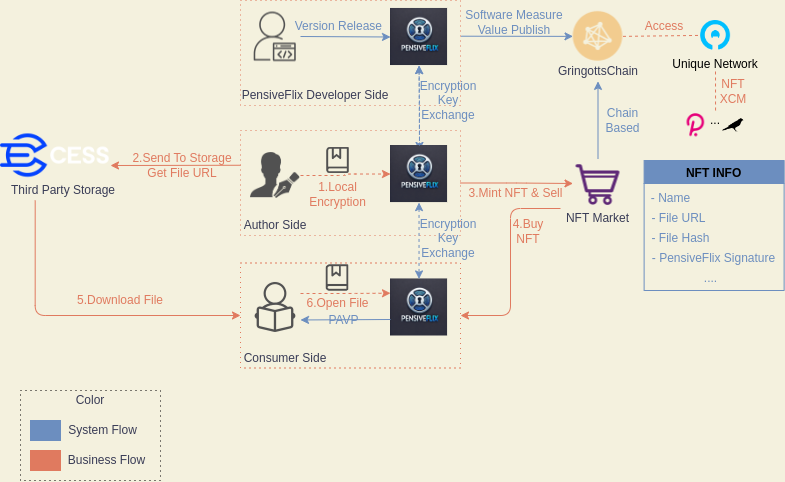

# PensiveFlix

## What is PensiveFlix

​	**PensiveFlix** is an open-source NFT platform designed to address the needs of paid knowledge sharing and digital rights verification. By leveraging privacy computing technology, it safeguards users' intellectual property within a trusted environment. NFT holders have the authority to manage the ownership of this intellectual property. The platform consists of a blockchain built on Substrate and an application protected by privacy computing technology.

## Problem

​	For convenience and efficiency, many internet users now choose to enhance their knowledge by learning online. As the demand for knowledge continues to grow, intellectual property owners are becoming increasingly aware of the need to protect their knowledge. Against this backdrop, paid knowledge-sharing platforms are becoming more common. However, current platforms for knowledge protection face the following shortcomings:

* 😰**High costs of copyright protection**: Intellectual property owners often need to pay significant fees for protecting their rights. These costs are typically charged by knowledge-sharing platforms for services like custodial storage and encryption of the owner's content. Additionally, these platforms may impose extra fees on the intellectual property that the owners sell.
* 😰**Poor security**: As seekers of knowledge protection services, intellectual property owners are required to unconditionally trust all the terms of centralized knowledge-sharing platforms and upload their content to these platforms. This means that the platform also has absolute control over the knowledge.
* 😰**Unused knowledge cannot be resold**: For users, owning knowledge products that are no longer needed but left idle on a platform is wasteful. They are unable to get a refund or resell the purchased content to others.
* 😰**Numerous and incompatible platforms**: Users have diverse knowledge needs, and for those seeking knowledge from various sources, the existence of numerous knowledge-sharing platforms increases the complexity of obtaining information. Users may need to download multiple applications to access knowledge available across different platforms.

## Introduction

​	PensiveFlix was created specifically for the paid knowledge-sharing sector, offering a new solution for intellectual property protection. It consists of a blockchain built on Substrate (named Gringotts), which supports NFT minting, and a specialized player (PensiveFlix) running within Intel SGX's Enclave.

​	As NFT merchants on PensiveFlix, knowledge owners only need to encrypt their content in a trusted local environment provided by PensiveFlix. Once the knowledge is encrypted, the file can be uploaded to decentralized storage infrastructures like CESS. During the NFT minting process, the file link and other relevant information are added, then you will completing the listing for intellectual property sale. Any user can download the encrypted file, but PensiveFlix only allows NFT holders to play the encrypted content. Users can also resell the NFT under certain rules to earn a profit. Once the resale is successful, the previous owner loses the right to access the knowledge content.

​	The entire process of paid knowledge-sharing is protected within PensiveFlix, cutting out intermediaries from the transaction. This not only reduces the trust costs for both knowledge owners and consumers but also lowers costs for both parties.

==================Bounty Application: CESS==================

## Features planned for the Hackathon

- [x] Users can purchase NFTs through the NFT marketplace and access the encrypted content, such as images, to view them using **PensiveFlix**.
- [ ] PensiveFlix supports more format types, such as PDF, Word, Blu-ray movies, and more.
- [ ] PensiveFlix is not limited to standard digital assets; it will support AI model data NFTs. PensiveFlix includes federated learning capabilities, allowing users to train AI models in a trusted environment.

## Architect

​	The system and business processes of PensiveFlix are illustrated in the diagram below:

## 		

## Advantages

### Bottleneck Kill

PensiveFlix addresses the following critical pain points in the knowledge payment sector:

* 🥳**It reduces the cost of copyright protection**: while ensuring knowledge dissemination, content owners can earn significant revenue by minting and selling NFTs at a low transaction fee. They can also securely store their encrypted knowledge content on any storage infrastructure of their choice, free from platform constraints.
* 🥳**Strong Security**: Utilizing privacy computing capabilities, PensiveFlix encrypts knowledge content locally, keeping the security of this content on the user's machine without any third party holding the original content.
* 🥳**Flexible Business Model**: NFT merchants can choose their sales model when minting NFTs, including whether allow buyers can resell or lend the NFT, the expiration time of the NFT, and whether it is set to self-destruct after viewing etc.
* 🥳**Simplicity of Use**: Requiring only a Polkadot-based account, NFT merchants can publish their works as easily as posting a video on a social platform, with just one click to mint and list, avoiding the complexities of registration and personal privacy information requirements, along with excessive centralized user agreements.
* 🥳**True Knowledge Preservation**: Knowledge will not be lost but will exist indefinitely. Anyone can download and retain the encrypted knowledge, making PensiveFlix potentially the largest knowledge preservation platform in human history.

### Benefits For Polkadot

​	Knowledge payment is a very popular topic today, with numerous thriving platforms emerging in the industry. As a knowledge payment platform, PensiveFlix:

* 😆Acts as a practical application of a decentralized DApp, promoting traditional internet users' understanding and participation in the Web3 ecosystem.
* 😆Offers significant advantages over traditional knowledge payment platforms, attracting a large number of Web2 users to the Polkadot ecosystem.
* 😆The audience willing to pay for knowledge generally possesses a higher level of education, potentially bringing more talent into the Web3 field and creating new possibilities for Web3.

## Team info

| Name        | Role                         |
| ----------- | ---------------------------- |
| DemosChiang | Product Manager&Full Stack   |
| Billw       | Full Stack                   |
| Liheng Chen | PhD,Privacy computing expert |
| Bolun Zhang | PhD,AI experts               |

## Material for Demo

1. Demo Video [link to Youtube]:Todo
2. PPT [link to google doc]:Todo