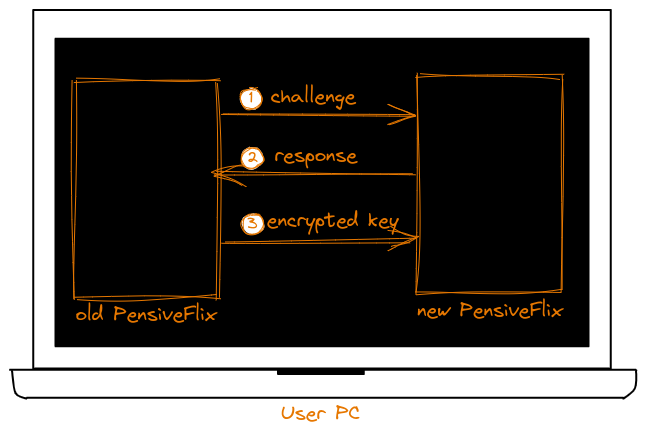

# PensiveFlix

## What is PensiveFlix

​	**PensiveFlix** is an open-source decentralized digital asset protection tools designed to address the current NFT market's inability to effectively protect users' digital assets. It leverages TEE (Trusted Execution Environment) technology to create an encryption and decryption mechanism within a trusted environment to safeguard users' digital assets. The platform consists of a blockchain built on Substrate and applications protected by TEE technology.

## Problem

​	As the NFT market and technology continue to develop, and as users' awareness of intellectual property rights continues to grow,more and more content creators are benefiting from their creations through NFT-based platforms. However, the current NFT-based projects faces the following problems:

* 😰**Poor Security**: Content creators need to send their digital assets to third-party platforms, where these platforms host the content. This poses a significant security risk to the digital assets of content creators.
* 😰**Piracy Issues**: Although NFT technology offers protection in terms of ownership and transaction transparency, problems such as piracy and plagiarism still persist. Digital copies of works can still be freely copied or shared on other non-blockchain platforms.
* 😰**Incomplete Decentralization**: Some NFT-based platforms cannot achieve full decentralization in the true sense. They still rely on certain centralized services to perform certain operations in order to control user behavior and implement complex functionalities.
* 😰**Overwhelming**: There are too many projects,The variety of features and platforms in different NFT-based projects can be overwhelming for users, requiring them to spend significant time on browsing and reading.

## Introduction

​	PensiveFlix is a security tool designed to support the NFT market, offering a new solution for intellectual property protection. It consists of a blockchain built on Substrate that supports NFT minting (called Gringotts) and a specialized player (PensiveFlix) that operates within a TEE environment.

​	PensiveFlix leverages its TEE technology to comprehensively protect the entire process of NFTs, from minting to usage, through its security features, preventing the possibility of users' digital assets being illegally copied or misused. Additionally, the tamper-proof nature of TEE regulates the behavior of content creators (hereafter referred to as "creators") and buyers (hereafter referred to as "customers"), ensuring that end users faithfully execute the corresponding business logic. Numerous NFT-based projects can develop on PensiveFlix to gain decentralized capabilities.

​	PensiveFlix integrates the infrastructure capabilities of the Polkadot ecosystem, uses the CESS network to store encrypted user digital assets, and can use Polkadot's XCM protocol through the Unique network to help the NFT of the entire Polkadot ecosystem.

==================Bounty Application: Unique Network==================

==================Bounty Application: CESS Network==================

## Features planned for the Hackathon

- [x] Author use PensiveFlix to encrypt files and mint NFTs, while users purchase and use the NFTs.
- [ ] PensiveFlix supports more format through PAVP technology, such as PDF, Word, Blu-ray movies, and more.
- [ ] PensiveFlix supports other NFT platforms to develop applications on top of it, enabling more innovative use cases in the NFT space.

## Architect

​	The structure of the fully functioning PensiveFlix program is as follows:

* **PensiveFlix**: A TEE-protected program
* **Bridge Program**: The bridge program is a backend service that helps PensiveFlix synchronize data such as pallets from the Gringotts chain.
* **Chain RPC (optional)**: Provides on-chain data; it is not necessary to run locally, as other Chain RPC nodes can be used.

​	Taking a typical NFT marketplace built on PensiveFlix as an example, the system and business processes are shown in the following diagram:

* **Overall Business Process**:

  ​	As NFT seller on PensiveFlix, content creator*(Author Side)* only need to encrypt their content in a trusted local environment provided by PensiveFlix*(step 1)*. Once the knowledge is encrypted, the file can be uploaded to decentralized storage infrastructures like CESS*(step 2)*. During the NFT minting process, the file link and other relevant information are added, then you will completing the intellectual property sale*(step 3)*. Any user can download the encrypted file*(step 5)*, but PensiveFlix only allows NFT holders*(step 4)* to play the encrypted content*(step 6)*. 

  ​	Additionally, from a business perspective, content creator can mint NFTs based on different contracts, leveraging PensiveFlix's capabilities. This means they can define various business logic scenarios, such as whether to allow buyers to resell, implement a "burn after reading" feature, subscription-based columns, and more.

* **System Workflow**:

  ​	PensiveFlix has a globally unique Masterkey, randomly generated within a TEE environment. This key is used as part of the encryption mechanism for users' content and is stored within each instance of PensiveFlix. The Masterkey is protected locally by TEE’s Measure encryption. Measure is a hash calculated by the TEE for the protected program, and because each version of PensiveFlix has different code, the Measure value will vary, ensuring that only PensiveFlix can use the Masterkey. No other entity can access or use the Masterkey. During version updates, the new version inherits operational data securely from the old version using ***"Trusted Channel"*** technology. Additionally, PensiveFlix instances can synchronize Masterkey information with each other using this ***"Trusted Channel"***.

  Developers will publicly release version information by posting the corresponding PensiveFlix Measure on the Gringotts chain's pallet during each version release. A newly launched instance of PensiveFlix can interact securely with the chain using the ***"Trusted Off-chain Message Synchronization Mechanism"***.
  
  When users play content via PensiveFlix, audio and video streams are rendered to the user's playback devices using ***Protected Audio Video Path (PAVP)*** technology. This prevents unauthorized devices from hijacking the audio and video stream content.

### Trusted Off-chain Message Synchronization Mechanism:

​	

### Trusted Channel:

​	The Trusted Channel is a secure communication bridge between two PensiveFlix programs, enhanced by the attestation algorithms provided by TEE. This communication method, combined with the Trusted Off-chain Message Synchronization Mechanism, helps both parties verify each other's identity. Once both sides confirm the legitimacy of each other’s identity, they will agree on a symmetric key and use TLS to encrypt the communication content, ensuring that the information is not leaked. Below is the data handover process during a user's version update.

* **Step 1**: The old PensiveFlix generates a challenge using the attestation algorithm. The challenge includes the current block height, timestamp, and a data structure generated by the algorithm.
* **Step 2**: The new PensiveFlix generates a symmetric key and includes it in the algorithm to create a proof. The proof is then returned and contains the Measure value.
* **Step 3**: The old PensiveFlix receives the proof and verifies it, checking whether the Measure value from the new PensiveFlix is correct. If the Measure is correct, the old PensiveFlix encrypts the data using the symmetric key and sends it.

### Protected Audio Video Path(PAVP):

​	PAVP is a set of technologies creating a "Protected Environment,that is used to enforce digital rights management (DRM) protections on content,It provides a "wall" against outside copying,where within the walls,content can be processed without making the content available to unapproved software.

​	For TEE technologies, such as Intel's, there is a system based on HDMI using HDCP (High-bandwidth Digital Content Protection) to safeguard the data within the TEE from being stolen. This is done through an authentication process that secures the entire video transmission channel, preventing unauthorized access or theft of the content.

## Advantages

### Bottleneck Kill

PensiveFlix addresses the following critical pain points in the NFT space:

* 🥳**Prevention of Piracy**: Since user behavior is regulated by PensiveFlix, users are unable to pirate or plagiarize digital assets.
* 🥳**Low Credit Cost**: The encryption of digital assets by creators occurs securely and reliably on their local devices, preventing the possibility of digital asset leakage.
* 🥳**Fully Decentralized**: With a decentralized design, users' digital assets and operations occur securely on their local devices without relying on external centralized services.
* 🥳**Simplified Process**: As a security tool, PensiveFlix supports other NFT projects to develop on its foundation, allowing them to implement the required complex business logic without relying on centralized services. For users, only one tool is needed to enjoy the benefits brought by NFT technology.

### Why Polkadot

​	PensiveFlix thrives within the Polkadot ecosystem, complementing each other perfectly:

* 😆As a tool, PensiveFlix aims to have greater adaptability to support more on-chain NFT assets, and Polkadot, with its strong cross-chain capabilities, is a perfect fit for this.
* 😆The integrated design and development philosophy enhances security while simplifying usage, attracting more Web2 and Web3 users to enter the Polkadot ecosystem.
* 😆It promotes the development of Polkadot infrastructure projects.For example, CESS network, unique network.

## Team info

| Name        | Role                         |
| ----------- | ---------------------------- |
| DemosChiang | Product Manager&Full Stack   |
| Billw       | Full Stack                   |
| Liheng Chen | PhD,Privacy computing expert |
| Bolun Zhang | PhD,AI experts               |

## Material for Demo

1. Demo Video [link to Youtube]:Todo
2. PPT [link to google doc]:Todo
