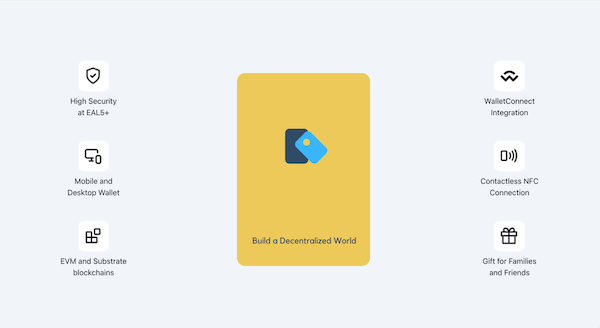

# Project Keyring

Secure and handy hardware wallet solution for Web3 citizens. 

## Introduction

Keyring hardware wallet brings the financial card experience to blockchain. It allows users to transfer or teleport assets, staking the native token, interact with DApps, etc.

The main features of Keyring including,
- High Security with EAL5+
- Mobile and Desktop Wallet App
- Support EVM and Substrate blockchains
- Contactless NFC Connection

## Implemented Functionalities in Hackathon

- ED25519 implementation on secure element
- SLIP-0010 implementation for Javacard
- Support features for Polkadot/Substrate based blockchain, including:
  - transfer native token
  - teleport assets
  - staking via nomination pool
- Substrate based EVM compatible blockchain integration

## Source code

- Javacard applets: https://github.com/keyring-so/applets
- Desktop wallet app: https://github.com/keyring-so/keyring-desktop

## Architect

Using Javacard 3.0.4 to build firmware for secure element, and implement the ED25519 and SLIP-0010 on it. 

The desktop wallet app communicates with the Javacard applets via smartcard reader, using ISO-7816 standard.
The mobile wallet app communicates with the Javacard applets via NFC, using ISO-14443 standard.

Tech stack used,
- Golang Wails framework
- React and React Native

## Resources
1. Website: https://keyring.so/
2. Demo Video (TODO)
3. Slides: https://docs.google.com/presentation/d/1XWeGgnagaEGo-I1CV0H-20eLT2fUjre4RUOYco3xO24/edit?usp=sharing

## Team info

- Kaichao, research and development
- Echo, product and UX design

