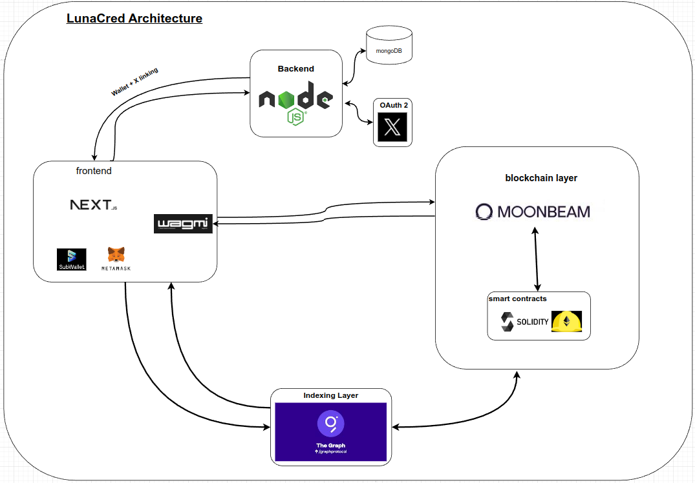

# LunaCred

## Introduction

Lunacred is a decentralized staking and trust-based DApp built on the Moonbeam parachain. The platform allows users to build their credibility by staking tokens and receiving stakes from others, enabling a social-proof-based ranking system. Quadratic voting mechanisms are employed to ensure that a greater number of backers contribute more to a user's credibility score rather than just the volume of tokens staked.

### 🌐 [Try Live Demo](https://lunacred.vercel.app/)

## Features Planned for the Hackathon

1. **Credibility Staking**:

   - Users can stake DEV tokens (Moonbase Alpha testnet) on other users to increase their credibility score
   - Quadratic voting mechanism: Credibility points are calculated as the square root of staked tokens
   - Weekly rewards distribution based on credibility scores

2. **User Interface**:

   - Stake/Unstake interface
   - Display of user's rank, available DEV, locked DEV, and credibility staking rewards
   - Credibility score display with weekly yield information
   - Table showing address interactions, stakes, and credibility points

3. **Token Economy Integration**:

   - Full integration with Moonbase Alpha's DEV tokens for staking and rewards
   - Testnet faucet integration for easy onboarding

4. **Decentralized Governance**:

   - Governance tools using credibility scores for community-driven trust

5. **Smart Contract Development**:
   - Core smart contracts for staking, credibility scoring, and reward distribution

## How Credibility Staking Works

1. Users stake DEV tokens on other users' addresses to boost their credibility
2. Credibility points are calculated using a quadratic voting system:
   - When a user stakes 25 DEV tokens, the recipient gains √25 = 5 credibility points
   - This system rewards having more supporters over larger individual stakes
3. Weekly rewards are distributed based on credibility scores
4. Users can claim their rewards, which are a percentage of their CRED score

## Architecture

LunaCred follows a typical DApp architecture, consisting of:

1. **Smart Contracts**: Written in Solidity, deployed on the Moonbase Alpha testnet
2. **Frontend**: React-based user interface with features for staking, unstaking, and viewing credibility scores
3. **Web3 Integration**: Using Ethers.js for blockchain interactions
4. **Moonbase Alpha**: Development and testing on Moonbeam's testnet

## Schedule

| Phase               | Timeline | Deliverables                                  |
| ------------------- | -------- | --------------------------------------------- |
| Research & Planning | Week 1   | Architecture design, token economics planning |
| Development         | Week 2-3 | Smart contracts, frontend implementation      |
| Testing             | Week 4   | Testnet deployment, bug fixes                 |
| Final Release       | Week 5   | Documentation, community onboarding           |

## Team Members

| Name    | Role                     | Social                                            |
| ------- | ------------------------ | ------------------------------------------------- |
| Shankar | Smart Contract Developer | [@shankarlive](https://x.com/shankarlive)         |
| Vivek   | Full Stack Developer     | [@VivekJami4](https://x.com/VivekJami4)           |
| Lokesh  | Full Stack Developer     | [@lokeshkatari921](https://x.com/lokeshkatari921) |
| harish  | UI/UX Developer          | [@harris_defi](https://x.com/harris_defi)         |

## Demo Materials

### 🎥 [Watch Demo Video](https://vimeo.com/1022210852?share=copy#t=0)

### 📊 [View Presentation](https://drive.google.com/file/d/1IM00LeviusqMytLnfKTJ5RFr3pDzyUdZ/view?usp=sharing)

### 🌐 [Try Live Demo](https://lunacred.vercel.app/)

## Future Scope

LunaCred has significant potential for implementation across various organizational structures:

### 1. DAO Integration

- Credibility-weighted voting systems
- Trust-based proposal submissions
- Automated role assignments

### 2. Corporate Implementation

- Team member reputation tracking
- Performance-based incentives
- Cross-team collaboration metrics

### 3. DeFi Applications

- Trust-based lending protocols
- Reputation-weighted liquidity pools
- Social-backed yield farming

### 4. Community Governance

- Reputation-based moderation
- Trust-weighted voting power
- Community role progression

The platform's unique approach to quantifying trust through token staking and quadratic voting creates a foundation for fair and transparent reputation building in web3 communities.

## Getting Started

1. Connect to Moonbase Alpha testnet
2. Get DEV tokens from the [Moonbase Alpha Faucet](https://faucet.moonbeam.network)
3. Connect your wallet to LunaCred
4. Start staking and building your credibility!

## Contact & Support

- Community: [Twitter / X](https://x.com/luna_cred)
