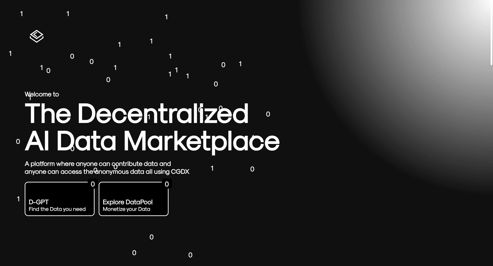
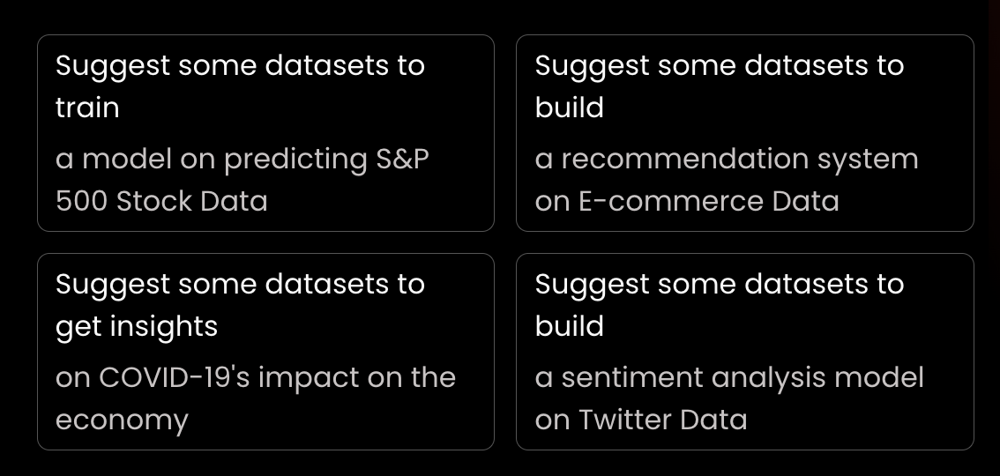
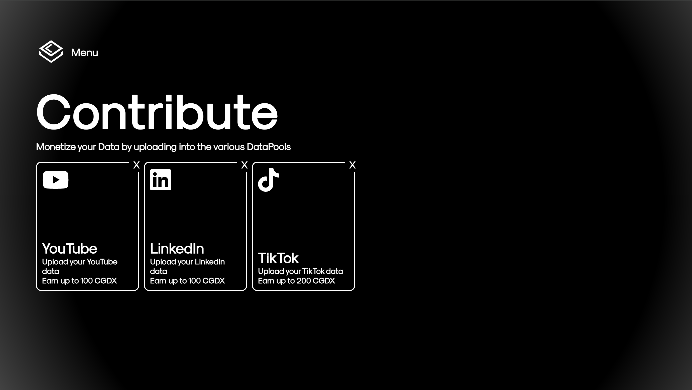
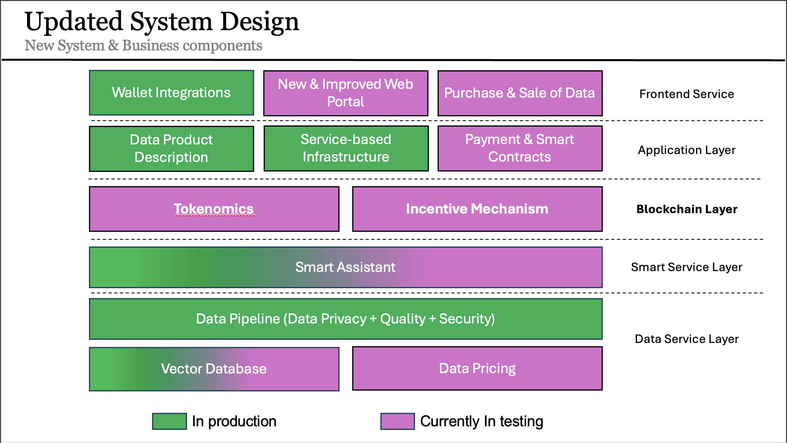

# CognideX
Each project must provide the sufficient information, please check all mandatory parts as follows.

-- mandatory parts
## Introduction
CognideX (**Cogni**tive **D**ata **Ex**change)

**Created on:** 30th October 2023
(Built with ❤️ in Singapore)

    

CognideX is a decentralized data marketplace built on the Polkadot ecosystem that incentivizes users for the high-quality data they provide. Users contribute to data pools and receive rewards in our native token, CGDX, based on the quality of their submissions. What sets us apart from other data marketplaces is our use of blockchain technology to verify each transaction, ensuring that all collected data is authentic and reliable. We prioritize user privacy by masking personal identifiable information (PII) and assigning each user an anonymous unique identifier hash.

We merge individual data pools into a single, comprehensive Data Pool containing all user-uploaded data. This consolidation is achieved using cutting-edge AI technology while maintaining each user's unique identifier hash. With this extensive Data Pool, we can easily provide valuable insights into target markets.

In addition to user-contributed data, CognideX features access to 22,000 datasets from across the internet. Our smart assistant, powered by Large Language Model (LLM) agents, seamlessly fetches these datasets, enabling users to search for datasets based on specific use cases. By leveraging LLMs, users can generate crystal-clear insights through any query, accessing information from an agent that has in-depth knowledge of both user-uploaded data and external datasets.

CognideX was featured in Polkadot Decoded Asia 2024 in Singapore.

Our mission in CognideX is to allow everyone to be able to make full use of the data they generate, not only that but for the data buyers to get what they want. CognideX has 2 main components, using these 2 components, users can easily access and monetize data.

1. Data Pools
Data Pools are where users can contribute their data in exchange for CGDX tokens (our native token). The data is then made available to other users.

2. Smart Assistant
The CognideX Smart Assistant is a conversational AI that helps users to access 22,000 datasets over the internet.

## Features planned for the Hackathon
CognideX is currently in the MVP stage and working towards a solid deployable product that is capable of handling various datasets and facilitating the sale and purchase of user sourced datasets through a Data Pipeline that masks PII (Personally Identifiable Information), scores data based on it's quality and ensures verifiability & traceability via Blockchain. 

Current CognideX has successfully implemented the following features:

### Data Pools
Datasets that are formed by aggregating many individual datasets from users. Users can contribute their data to these pools in exchange for CGDX tokens. The data is then made available to other users.

#### Mechanics of Data Pools
Each Data Pool will have the following attributes:

**1. Token Allocated:** The amount of CGDX tokens that are allocated to the pool.

**2. Minimum Data Quality Score:** The minimum quality score of data that can be contributed to the pool.

**3. Max Incentive per User:** The maximum number of CGDX tokens that can be earned by a user for contributing data to the pool.

**4. An Option to Stake:** Users can stake their CGDX tokens to the pool to earn a share of the pool's rewards if this option is enabled.

**5. Price:** The price at which users can access the data in the pool.

### Data Pool Lifecycle
The lifecycle of a data pool is as follows:

#### 1. Data Pool Creation
- Any one can create a data pool. 
- The creator of the pool will have to specify the attributes mentioned above. 
- The creator will need to hold a certain amount of CGDX tokens to create a pool.

#### 2. Data Pool Usage
- Users can access the data in the pool by paying the price set by the pool creator. 
- The price will be in CGDX tokens.
- The data quality score of the data in the pool will be displayed to the user before they decide to access the data.

#### 3. Data Pool Rewards
- Users can earn CGDX tokens by contributing data to the pool. 
- The amount of tokens earned will depend on the quality of the data contributed. 
- The data quality score will be calculated by the CognideX platform.

#### 4. Data Pool Staking
- Users can stake their CGDX tokens to the pool to earn a share of the pool's sale. 
- The share of rewards will depend on the amount of tokens staked by the user. 
- The staking option will be enabled by the pool creator.

#### 5. Data Pool Closure
- Once the token allocation of the pool is exhausted, the pool will be closed for contribution. 
- Users can still access the data in the pool by paying the price set by the creator. 
- The creator can choose to close the pool at any time.

#### 6. Price Proposals
- Anyone can negotiate for a deal with the pool creator to access the data in the pool at a different price. 
- The creator will then create the proposal and the user can accept or reject the proposal.

#### 7. Contributing Data to a Data Pool
- To contribute data to a data pool, users will have to follow the steps the creator of the pool has set. 
- The data quality score of the data will be calculated by the CognideX platform. 
- The user will be rewarded with CGDX tokens based on the quality of the data contributed.

> **For Example:** 
If a user contributes data with a quality score of 8, and the max incentive per user is 100 CGDX tokens, the user will earn 80 CGDX tokens.

### Smart Assistant
An AI-powered conversational assistant that helps users access datasets on the CognideX platform. The Smart Assistant is designed to help users find the data they need quickly and efficiently.

> **Tip:** Search for datasets much faster using the Smart Assistant!

#### Use Case Search
With natural language processing capabilities, the Smart Assistant can understand user queries and provide relevant datasets. Users can ask questions like "What is the GDP of Thailand?" or "Show me the population of China" and the Smart Assistant will provide the relevant datasets available on the platform.

Some examples are as follows:

    

## Features planned for the Hackathon:

### Data Pool 
We plan on showcasing the Data Pool that is fully capable of enabling users to Buy and Sell data. 

    

Users can immediately upload their datasets to the data pool and earn the appropriate CGDX based on their data quality score.

## Architecture

    

### Frontend Service
1. Wallet Integrations
- This component allows users to connect their cryptocurrency wallets to the system, enabling seamless transactions and participation in the decentralized marketplace.

2. New & Improved Web Portal
- A redesigned and enhanced web interface that facilitates user interaction with the platform. It includes features for accessing data, managing profiles, and navigating through various system functionalities.

3. Purchase & Sale of Data
- This allows users to buy and sell data on the platform, powered by smart contracts and blockchain, ensuring security and transparency in all transactions.

### Application Layer
1. Data Product Description
- This module is responsible for defining and managing metadata and descriptions of data products available on the marketplace, making it easier for users to search, understand, and purchase data.

2. Service-based Infrastructure
- This refers to the backend architecture that supports scalable and modular services, allowing the platform to grow and support various data transactions efficiently.

3. Payment & Smart Contracts
- The system leverages blockchain smart contracts to automate payments between users and data providers, ensuring trust and security without needing intermediaries.

### Blockchain Layer
1. Tokenomics
- This component defines the economic system behind the native token (CGDX). It regulates token distribution, usage, and incentives, encouraging users to contribute high-quality data.

2. Incentive Mechanism
- A set of rules and rewards that encourages users to provide valuable data, ensuring that contributors are fairly compensated for their contributions.

### Smart Service Layer
1. Smart Assistant
- This feature is powered by AI and LLM agents, helping users to search for datasets, perform queries, and derive valuable insights from the data available on the platform. The assistant interacts with both internal and external datasets for enhanced data discovery.

### Data Service Layer
1. Data Pipeline (Data Privacy + Quality + Security)
- A critical system that ensures data is processed and transferred securely while maintaining high standards for privacy and quality. It is the foundation for ensuring the integrity of the data used on the platform.

2. Vector Database
- This specialized database stores data in a vectorized format, which allows for more efficient querying and data retrieval, especially in AI and machine learning applications.

3. Data Pricing
- This module determines the pricing of data products, taking into account factors such as data quality, demand, and usage history. The pricing is dynamic and adjusts based on market conditions.

#### Key Indicators
- In Production (Green): These components are fully operational and actively being used in the system.
- Currently in Testing (Purple): These are the components still under development or in the testing phase, which will soon be integrated into the production environment.

## Schedule
1. Timeline for all activities before Hackathon:
- 30th September - 4th October: Smart Contracts on Moonbeam & Backend Integration - Planning and Architecture
- 7th October - 11th October: UI Dev & Smnart Contracts Testing & Deployment
- 14th October - 18th October: Smart Contracts Backend & integration
- 21st October - 25th October: UI & Backend & SC Integration (all round development)

2. Important Milestones
- 23rd October: Hackathon Submission
- 18th October: CognideX live on Moonbase Alpha Testnet
- 21st October: End-to-End data lifecycle & production website on Moonbase Alpha

## Team info
1. Jia Ye Tey 
 X: @JiayeTey
 Github: JyTey2004
 email: bizv1086@partner.nus.edu.sg

2. Bhargav Sagiraju
 X: @bargovis
 Github: bssagiraju
 email: bhargavs@nus.edu.sg

3. Jen Park
 X: @jhpark8716
 Github: jenpark77
 email: jh.park@nus.edu.sg

4. Harsh Sharma
 X: @sharma4_harsh
 Github: harshvs4
 email: harshsharma@nus.edu.sg

5. Soumya Haridas
 Github: Soumya-H22
 email: soumya.haridas@nus.edu.sg

6. Lu Xinyu
 Github: luxinyu222
 email: lu.xinyu@nus.edu.sg

## Track and bounty
Chosen Tracks:
- Category 2 & 4

Bounties:
1. Moonbeam Bounty:
- Blockchain for good: Security and Transparency

# Documentation
Official Documentation is available here: https://docs.cognidex.ai/

This documentation contains all information related to CognideX including the Tokenomics Design and details of other components currently in Production.

# VCs & Further Investments
We humbly look forward to investments as we are doing mass user acquisition on campus and look forward to scaling new heights within the Data Ecosystem.