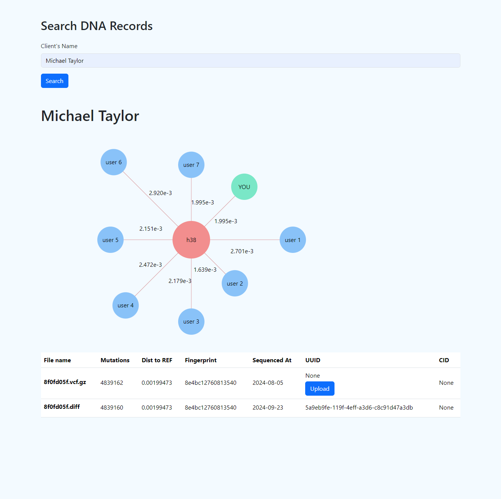
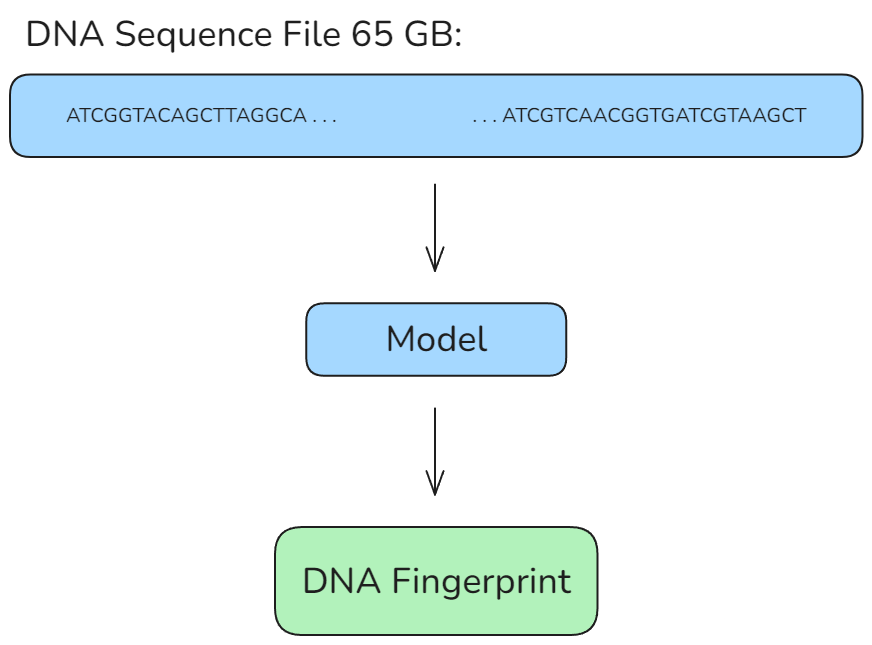

# GenomTex

The project aims to store an individual's DNA information indefinitely, tracking any changes in
the DNA to detect potential cancerous gene variants. It also generates a DNA fingerprint to ensure
the individual's identity remains unambiguous.

## Background

A company specializing in DNA analysis.

### Team

- **Jakub Vonsovky:** senior full-stack developer, specialized in machine learning and AI.

- **Dusan Jansky:** blockchain development, also competent in cybersecurity and computer graphics.

- **Vit Majer:** sales management, marketing.

## Problem to be solved

We seeked for decentralized storage solution for the DNA files of the users. Obsticles to solve:

1. DNA files are LARGE (approx 65GB).
2. Security of such sensitive files stored on a public decentralized storage.
3. Problem of digital individuality and identity.
4. Binding of the DNA files to users.

## What we have for the presentation

  - cooperation with genome sequencing laboratory
  - know-how to create minimal differential DNA files
  - code to work with the blockchain storage
  - functional front-end and back-end
  - code to correctly calculate changes for the entire DNA reconstruction

## Things planned to be done during the hackathon

- [X] Reading various DNA properties from DNA files.
- [X] Creation of DNA diff files.
- [X] Creation of cosine distances to visualize difference between 
- [X] DNA fingerprints: PCA model to generate DNA fingerprints
- [X] Database: structured for users and their samples.
- [X] Server cache storage of the diff files.
- [X] Encryption of DNA diff files (for decentralized storage).
- [X] Decentralized storage of the diff files (via Crust).
- [X] Synchronization between server cache and decentralized storage (IPFS).
- [X] Frontend demo page.


## Future development

- better metrics for DNA distances, e.g. to cover complementary strings
- rewrite string operations to C
- look for cancerous mutations

## Project Explained

As a demontration, we used "Michael Taylor".

As you can see, Michael Taylor has 2 DNA scans available. One on which is synchonized to IPFS via Crust (decentralized pinning service).



You can use [ipfs scan](https://ipfs-scan.io) to verify that the file is stored on [IPFS network](https://https://ipfs.tech/). See the IPFS Scan image.


**Security** is our priority. All DNA data that are stored on IPFS are encrypted ([AES-GCM]([url](https://www.techtarget.com/searchsecurity/definition/Advanced-Encryption-Standard))) to ensure that no sensitive data will be compromised.

Explanation of Dist to RED parameter in the Our Application Image above. Distance represents a difference from *hg38* reference genome data. This distance value is computed in a way so it is likely unique for the user and we can visualize the difference from hg38. See the 


Where our project really shines is in **DNA fingerprinting**. Jakub created a custom model that assigns a unique value that we call **DNA Fingerprint**. This fingerprint is unique to every user and can serve as a distinct identifier. *DNA Fingerprint* is a unique string.



Unlike traditional biometric fingerprints used for verification (e.g. on smartphones), DNA has the unique property of producing similar fingerprint values for geneticaly related individuals. This behavior unlocks new use cases. Behaviour of producing very distinct values for unrelated individuals stay, as you expect.

**Simplified Data:** We would like to point out that some data are simplified/anonymized. The reason is simple: DNA data are very private, and we do not want to expose any sensitive information that we hold. We outlined what is modified bellow:

- Michael Taylor is pseudonym of a real person. The data of Machael are real but his identity is anonymous.
- The fingerprint model was trained and tested on smaller samples than usual (one sample of full genome data is 65 GB, making it expensive for us to train the model at this time, especially for the purpose of the hackathon). However, we believe that our data is completely suitable for demonstration purposes and more importantely algorithms and codebase overall is robust.
- Records of `dist_cos` in database is simplified. No public link to complete users/DNA records. Complete record is available only at "Michael Taylor".


## Storage

The differences in DNA among humans are minimal. To efficiently store these variations for each individual,
a format called Variant Call Format (.vcf) was created, allowing for more compact records. To monitor changes
in individual DNA records over time, we only track modifications relative to this .vcf file. The reference
genome used in our program is known as hg38.

DNA in .vcf format, along with its subsequent differences, is stored locally for quick access and on the Crust Network.
The local storage serves as a cache. If the cache becomes outdated or storage fails for any reason, it can be
re-downloaded from the Crust Network. This system ensures that an individual's genome remains securely stored,
protecting it from any malicious attempts to alter its content.

## Architecture


## Techstack

- Python: Flask
- Apillon (Crust and IPFS abstraction)
- SQLite

## Installation

`pip install -r requirements.txt`

Run flask web server for front-end access of our data.

`python run app.py`

Visit `localhost:5000` in browser of your choice, input "Michael Taylor" to the search bar.

**Note:** You won't be able to upload files to IPFS (because of missing API keys). Demontrated in demo.

## Development

### Get Biotechnology tools

Samtools and BCFtools are standard tools used in the field of genomics.
Get them for data preparation at <https://www.htslib.org>.

### Get reference genome

Most of our sequencing data are generated against *hg38* reference genome. We need to download this one.

```bash
wget ftp://ftp.ensembl.org/pub/release-104/fasta/homo_sapiens/dna/Homo_sapiens.GRCh38.dna.primary_assembly.fa.gz
```

Index it to make any subsequent operations faster.

```bash
samtools faidx Homo_sapiens.GRCh38.dna.primary_assembly.fa
```

### Generate .bcf / .vcf file for diffs

Generate .bcf file with all variants kept.

```bash
bcftools mpileup -Ou -f hg38.fa 8f0fd05f-3b35-422c-b5d4-bc9f2888225f.bam | \
bcftools call -mv -Ob -o variants.bcf
```

Convert back to .vcf

```bash
bcftools view variants.bcf -Oz -o variants.vcf.gz
```

Filter out low-quality data for even better compression

```bash
bcftools filter -s LOWQUAL -e '%QUAL<20 || DP<10' variants.vcf -o filtered_variants.vcf
```

### Create bcftools index

Index is required if you don't want to process difference files (.vcf) sequentially.

```bash
bcftools index 8f0fd05f-variants-from-bcf.vcf.gz
```

### Compute distance to reference genome

Call in the following methods from `dna.py`:

```python
align_all_chromosomes(`vcf filepath`)
compute_chromosomes_similarity_from_cache(`vcf filepath`)
```

### Get the complete reading for a chromosome

In `dna.py`:

```python
chr_ref = read_ref_chromosome(`chr num`)`
reconstruct_specific_chromosome(chr_ref, `chr num`, `vcf filepath`)
```


