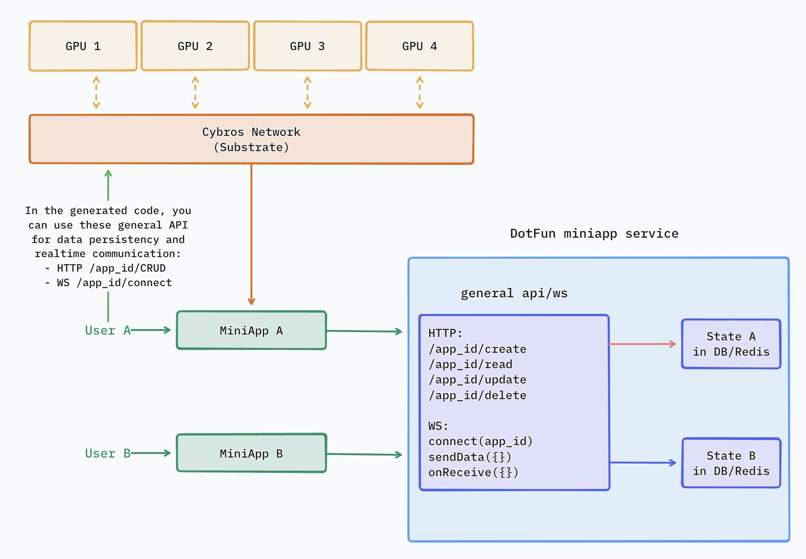
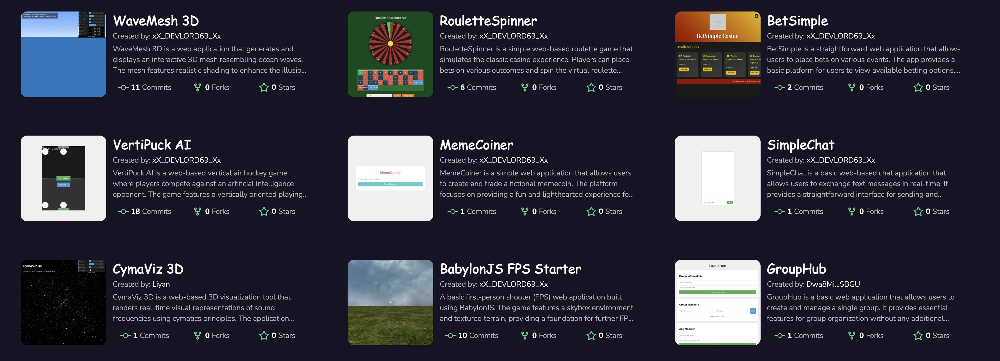
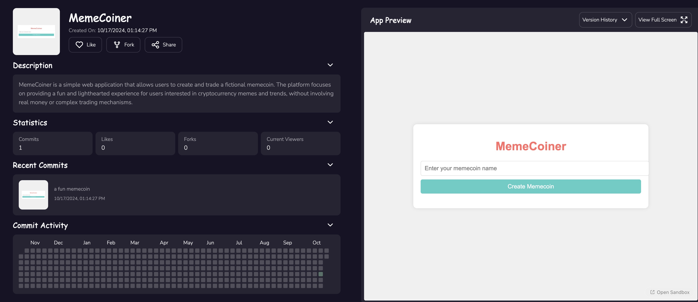
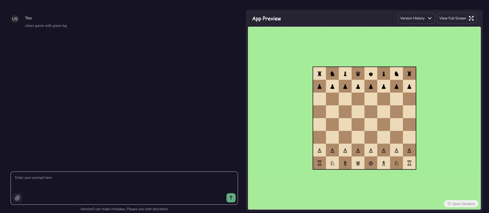

# DotFun
====

## Introduction
DotFun is an AIGC dapp development platform. Developers only need to submit their requirements, and DotFun will automatically generate ink contract code and related web app source code, as well as provide a preview website page.

The entire inference process is coordinated by the Cybros Network based on Substrate, with tasks published on-chain, executed off-chain, and results archived back on-chain.

## Features planned for the Hackathon
- Support polkadot wallet login, input requirements, generate web app
- Support user profile / app details / like app / fork app / follow users functions
- Provide fine-tuning of Polkadot knowledge base, support ink contract generation

## Architect
DotFun is a user-oriented dapp development platform, implemented based on Cybros Network.
Cybros Network is an async task scheduling protocol developed based on Substrate.
After DotFun receives a user's request to generate a dapp, it sends the request to Cybros. Cybros then schedules the DePIN device network, selects suitable GPU devices to execute the inference task, and returns the code results.

## Team info

Ocean
Founder
Senior Engineer at Microsoft AI & Big Data Platform.
Full stack engineer in Web3.

## Snapshots

App list created by developers:

App detail page with commit history

Create a new dapp on Polkadot in chat with AI:
