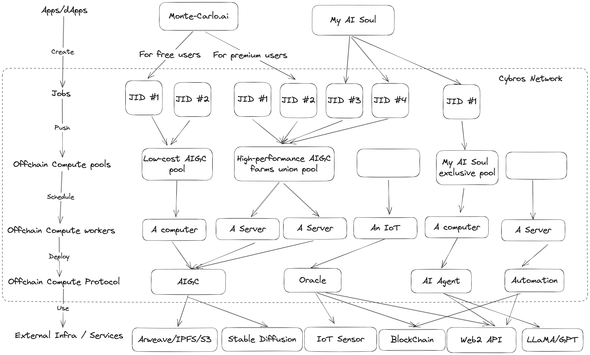

Cybros Network
====

Cybros Network is a Web 3 infra that provides blockchain-based job scheduling ability,
which is extremely useful for automation, edge tech (like AI) and Web 2 services integration, oracles, etc.
It shall help innovate new dApp forms we have yet to see.

## Dev net

Dev net will often reset to reflect latest change!

- WS RPC: wss://node-rpc.cybros.network
- Indexer: https://squid.cybros.network/graphql

## Why Cybros

> WIP

## Why job

> WIP

You can learn more about "job" from Wikipedia
- Job https://en.wikipedia.org/wiki/Job_(computing)
- Job scheduler: https://en.wikipedia.org/wiki/Job_scheduler
- Job queue: https://en.wikipedia.org/wiki/Job_queue

## Goal

- Provides a way to connect the non-blockchain world, including work with Web2 services, IoT sensors, GPUs, etc.
  - Help to build a computing power supply chain for developers.
- Easy to interact with other blockchain systems.

## How it works



## Concepts

### Job

A job is a unit of work or execution.
It runs in an off-chain environment and can access most resources,
including on-chain, off-chain, and hardware.

### Implementation (impl)

Implementation is an application that implements Cybros protocol
for executing a specific job written by the developer,
requiring a register on-chain before use.

### Implementation Build (impl build)

Implementation build is a release of an Implementation,
requiring a register on-chain before deployment to workers.

### Worker

Worker is a running instance of an Implementation build.

### Pool

Pool is used for managing workers and acts as a jobs queue.
It must bind with an Implementation and can't change after creation,
so workers must run allowed Implementation builds.

**Note:** Implementation can create multiple pools,
isolating workers and jobs in those pools.

#### Job policy

Job policy is the contract for consumers to create jobs in a pool
which defines the pricing to create a job, how to share profit
between the pool and the worker, etc.
It is read-only and can only delete once created.

## Technical abstraction

### Implementation

- Allow developers to register freely. Deposit required.
  - Requires to declare decentralization: only the implementation's owner can deploy, and only the people in allow list can deploy, or anyone can deploy.
    - The network shall validate the worker's owner when it attempts to go online.
  - Requires to declare trustless: Trusted Execution Environment (TEE) required, Certificate-based license issued by the implementation owner needed or no requirement.
    - The network shall validate the worker's attestation when it attempts to go online and may require to refresh the attestation.
- Interacting with the network with signed extrinsic calls
  - Online, requesting offline
  - Respond offences
    - Like Substrate's offences, it will be offline and get slashed if there is no answer in the time window.
  - Refresh attestation
  - Submit job progress and result
- No limit to programming languages and running environments.
  - It only requires interaction with the network.

### Implementation build

- Developers require register builds on-chain.
  - The hash is optional because only TEE can get a non-tempering hash that the network can help to verify.
- The network can help developers manage builds' lifecycle.
  - Released: workers can go online with the build.
  - Deprecated: online workers can still work, but new workers, including offline workers, can not go online with the build.
  - Retired: Online workers will force offline, and no worker can go online with the build.

### Worker

- No limit to what kind of hardware and software. It's only required to connect with the network.
  - You could deploy a full/light node locally.
  - Edge IoT devices could connect to an RPC gateway.
  - Browsers can use Smoldot light client and WebAssembly.
- Workers have their wallets to gather income and pay gas fees.
  - The owner can withdraw profit at will.
- Workers must subscribe to pools to get jobs.
- Workers shall get random and periodicity offence challenges when online
  - A successful response shall update its uptime.
    - It's possible to calculate the uptime ratio.
  - It will be offline and may get slashed if it does not respond in time.

### Pool

- It must bind to an Implementation and can't be changed.
- The owner must permit workers first to subscribe to the pool.
- It must add workers first so that it can process jobs.
  - It's flexible to add and remove workers.
- Incoming jobs shall schedule to a worker by the network, and jobs shall run in parallel.
  - Workers' performance and amount influence the handling capacity.
- It can set metadata on-chain to store configurations.

### Job Policy

- It can create multiple in a pool.
  - It can specify who can apply the policy: the pool owner, selected users, or anyone.
  - It can specify a period of validity.

### Job

- It has a status: Pending, Processing, Processed, and Discarded.
- The business also has a status: Success, Fail, (expected) Error, and (unexpected) Panic.
- The worker who processed the job can submit proof of confidence if it is running in a TEE.
- The Implementation's developer can also make proof of the job result.
- Input and output will save to the network during the job's lifecycle.
  - The job's creator and the worker must deposit for on-chain storage and will return after the job is processed.
  - There have limitations for input and output size, which currently is 2KiB.
- Workers in a pool may have different Implement builds.
  - It can declare ABI called spec version. The scheduler will help to assign the job to a worker that can process the spec version.
- The scheduler runs in network validators and securing by NPoS consensus.
- There has a plan to support DAG-based workflow and scheduled jobs.

### Others

The network provides the essential infrastructure for management workers and jobs.
However, economic incentives for workers and decentralized Implementation builds distribution are outside the scope.

We recommend building the workers' economic incentive layer by integration with LSD products or Smart Contracts.

We plan to develop a decentralized FaaS-like platform for decentralized job execution.
- It will be an Implementation, just like others.
- The developer experience should be similar to Smart Contracts.
- It should support TEE to ensure its confidentiality.
- It should support ZK to help developers make proof of jobs' results without leaking privacy data.
- It should have an economic incentive layer for workers.

## Project Structure

- `/node` the node
- `/pallets`
  - `offchain_computing_workers` The pallet for managing Implementations, Builds, and workers
  - `offchain_computing` The pallet for managing pools, jobs, and scheduling
- `/runtimes/origin` The runtime of the Origin development network
- `/protocol_impl` A demo Implementation build written in Deno
  - `examples/simple_echo` The simplest sample, it will echo the input as output
  - `examples/echo` A complex echo sample that supports e2e encryption.
  - `examples/imaginator` a real-world sample that shows a MidJourney-like AIGC service based on Stable Diffusion
- `/squid` The Subsquid indexer
- `/docs` Docs

## Development

### Build

```sh
cargo build --release
```

### Run

Once the project has been built, the following command can be used to explore all parameters and
subcommands:

```sh
./target/release/cybros-node -h
```

#### Single-Node Development Chain

This command will start the single-node development chain with non-persistent state:

```bash
./target/release/cybros-node --dev
```

#### Connect with Polkadot-JS Apps Front-end

Once the node is running locally, you can connect it with **Polkadot-JS Apps** front-end
to interact with your chain. [Click here](https://polkadot.js.org/apps/#/explorer?rpc=ws://localhost:9944) connecting the Apps to your
local node.

## Getting Started

See [quick-start](./docs/quick-start.md) for details.

## License

Pallets (`/pallets`), runtimes (`/runtimes`), and the node (`/node`) released under [AGPL v3.0 License](./AGPL3-LICENSE).

All primitives (`*-primitives`) released under [GPL v3.0 with a classpath linking exception](./GPL3-LICENSE).

Third-party vendors (`/vendors`) released under their own licenses.

Docs (`/docs`) released under [Creative Commons](https://creativecommons.org/licenses/by/3.0/).

The prototyping protocol implementation (`/protocol_impl`), the Subsquid project (`/squid`),
and all other utilities licensed under [MIT License](./MIT-LICENSE).
