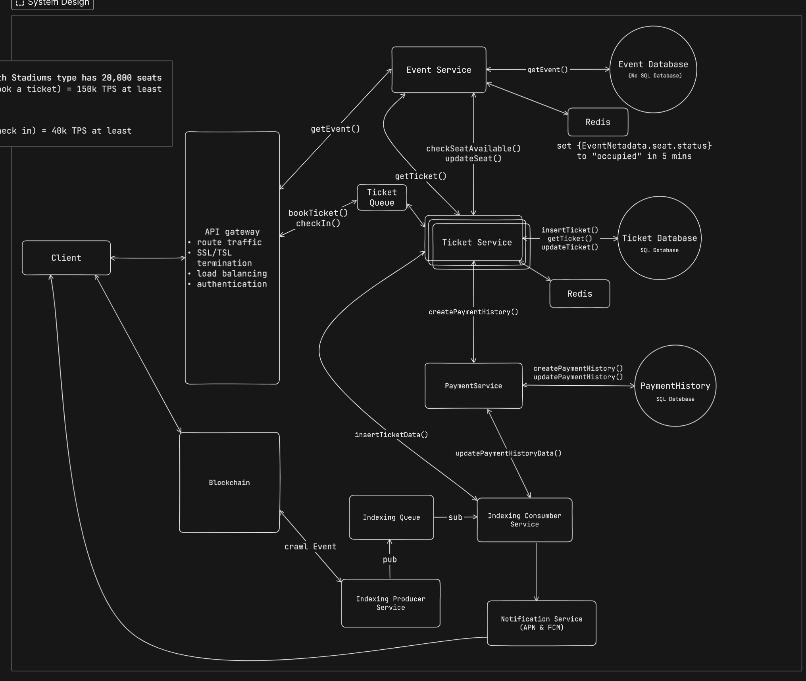
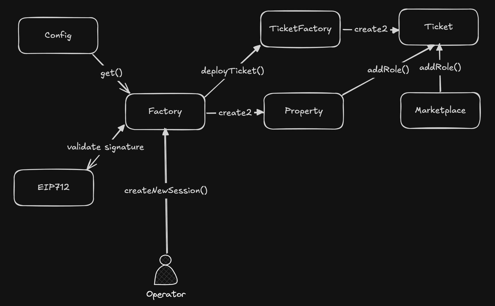

# Project Overview: Bookadot

**Bookadot** is an open marketplace/ticketing platform built on Polkadot’s Moonbeam Layer1, offering a secure, transparent and efficient platform for ticket transactions across various events like films,concerts, sports, F1, and more.

# Introduction

- Project Name: Bookadot
- Creation Date: August 2024
- Problem Being Solved: The current ticketing system is driven by profit, riddled with touts, and susceptible to scams especially in the secondary market. By using NFT ticketing, tamper proof NFTs can address these issues.

# Hackathon Features

- Status Before the Hackathon: The project is on idea foundation stage, then being built from scratch for the hackathon.

- Planned Features for the Hackathon:
    - Architectural design
    - Blockchain
        - [x] BookadotFactory: Property abstraction factory 
        - [x] BookadotProperty: Stands for a session
        - [x] BookadotTicketFactory: Ticket abstraction factory 
        - [x] BookadotTicket: NFT ticket 
        - [x] Marketplace: Bookadot marketplace
    - Frontend
        - [x] Ticketing site for cinema
        - [ ] Marketplace (On-going)
    - Backend
        - [x] Restful API for ticketing site
        - [ ] Restful API for marketplace site (On-going)
        - [ ] Indexing (On-going)
    - Infrastructure
        - [x] Smart contract was deployed on Moonbase Alpha network (Moonbeam testnet)
        - [x] Application deployed on AWS

- Architecture Diagram:
    - High level Architecture:
    

    - Smart Contract:
    

# Schedule

- Timeline for Activities During Hackathon:
    - Coding Period: 08.11 – 10.23
    - Pitch Deck & Demo: 10.20 – 10.22
    - Registration for Each members: 10.21
    - Submit: 10.21
- Completed Features:
    - Ticketing site for cinema
    - Marketplace (Still on working)

# Team Information

- Tony
    - Senior Software Engineer & Security Consultant
    - 10+ years of experience
    - Email: phamanhtan@proton.me
    - Discord: phamanhtan

- Daniel
    - Senior Software Engineer
    - 5+ years of experience
    - Email: huytung12@proton.me
    - Discord: danielbui12

- Min
    - Marketing Executive
    - 2+ years of experience
    - Email: dominhngoc169@gmail.com
    - Discord: minhngoc
    - WeChat: minhgoc_

- Olivia
    - Senior Business Development
    - 5+ years of experience
    - Email: hello@thecosmicblock.com

# Track & Bounty

- Chosen Track: Category 2
- Bounty Applied For:
    - Blockchain for good: Security and Transparency
    - Moonbeam: Use a Moonbeam Precompile

**Mandatory Requirements Before OfflineDemo:**
- [Demo Video](https://www.youtube.com/watch?v=KT5xi9rnrgg)
- [PPT \(Including marketing plan\)](https://drive.google.com/file/d/1dT-ISwJGtNUJHrTdnIpcZNe7RXUSrZqD/view?usp=sharing)

