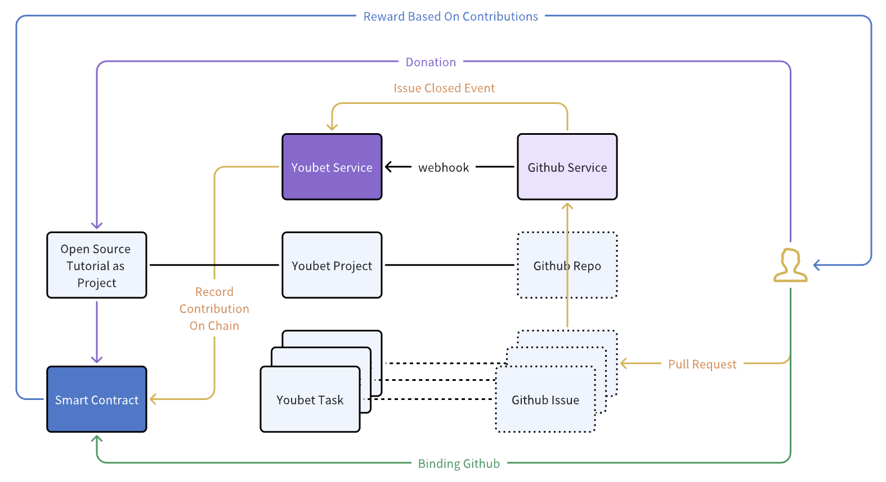
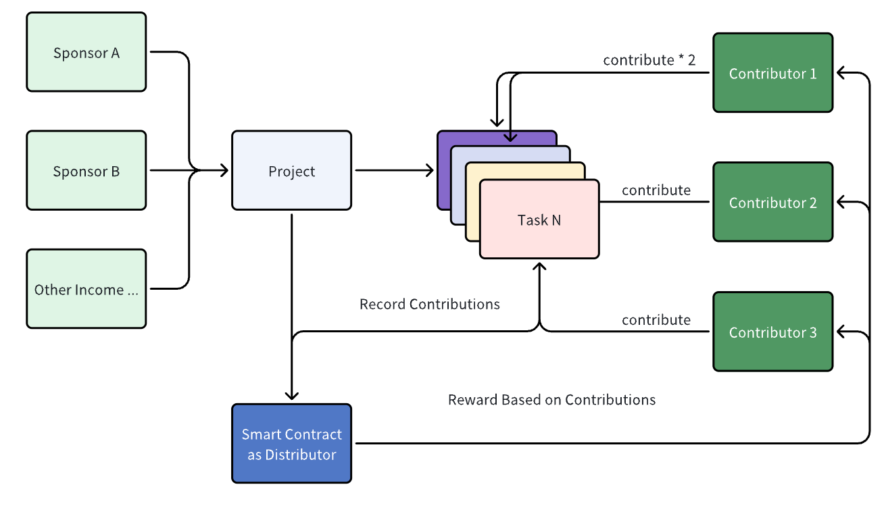

# Project Overview: According.Work

**According.Work** is a platform for automated and fair reward distribution to open source developers based on their contributions.

# Introduction

- Project Name: [According.Work](https://according-work-beta.netlify.app/projects)
- Creation Date: July 2024
- Problem Being Solved:

Our platform addresses a common issue in the Web3 world: many airdrops are distributed evenly, which is neither fair nor efficient, often requiring extensive manual effort to track contributions. With According.Work, contribution tracking and reward distribution are automated, allowing project owners to allocate rewards with precision, even down to individual commits.

And our ultimate goal is to create an environment where developers are free to unleash their creativity. By leveraging blockchain technology, we aim to make every effort truly worth it.

# Hackathon Features

- Status Before the Hackathon: The project has a simple demo in late July, cannot really distribute reward and not support for third-party repos and admin features.

- project background

  - Won Scroll Mini Hackathon \ ETH Shenzhen \ EDU Chain Hackathon
  - https://github.com/YoubetDao/youbet-task
  - https://github.com/YoubetDao/youbet-sdk
  - https://github.com/YoubetDao/youbet

- Planned Features for the Hackathon:

  - Architectural design
  - Blockchain
    - [x] Record all contributions on chain and distribution reward base on that.
    - [x] Additional reward distribution for each task
  - Frontend
    - [x] Basic Management of Repos and Issues
    - [x] Support Import third-party Repos
    - [x] Tutorial Display
    - [ ] Kanban board for project management
  - Backend
    - [x] Automatically sync data bidirectionally between our platform and github.
    - [x] Basic Admin Features
    - [x] Support for third-party repos
    - [ ] Project management features
  - Infrastructure
    - [x] Share our infrastructure by building SDK for our contract
    - [x] Smart contract was deployed on Moonbase Alpha network (Moonbeam testnet)
    - [ ] Building an oracle base on zk-email

- Architecture Diagram:

  - High level Architecture:
    

  - Reward distribution flow:
    

# Schedule

- Timeline for Activities During Hackathon:
  - Coding Period: 08.11 – 10.23
  - Pitch Deck & Demo: 10.20 – 10.22
  - Registration for Each members: 10.22
  - Submit: 10.22

# Team Information

- Qinghao

  - Senior Software Engineer - https://github.com/wfnuser
  - 5+ years of experience
  - Email: wfnuser@hotmail.com
  - Discord: perturbation_theory

# Track & Bounty

- Chosen Track: Category 4
- Bounty Applied For:
  - Blockchain for good: Reducing Inequality
  - Moonbeam: Use a Moonbeam Precompile

**Mandatory Requirements Before OfflineDemo:**

- [Live Demo](https://according-work-beta.netlify.app/projects)
- [Demo Video](https://youtu.be/EvAnz4V2N9E)
- [Deck](https://docs.google.com/document/d/1xhI1QrZj2h0STt3sHG5OGsY0IO6WYML-Law4O3h_j80/edit?tab=t.0#heading=h.ekvl858vgvv5)
