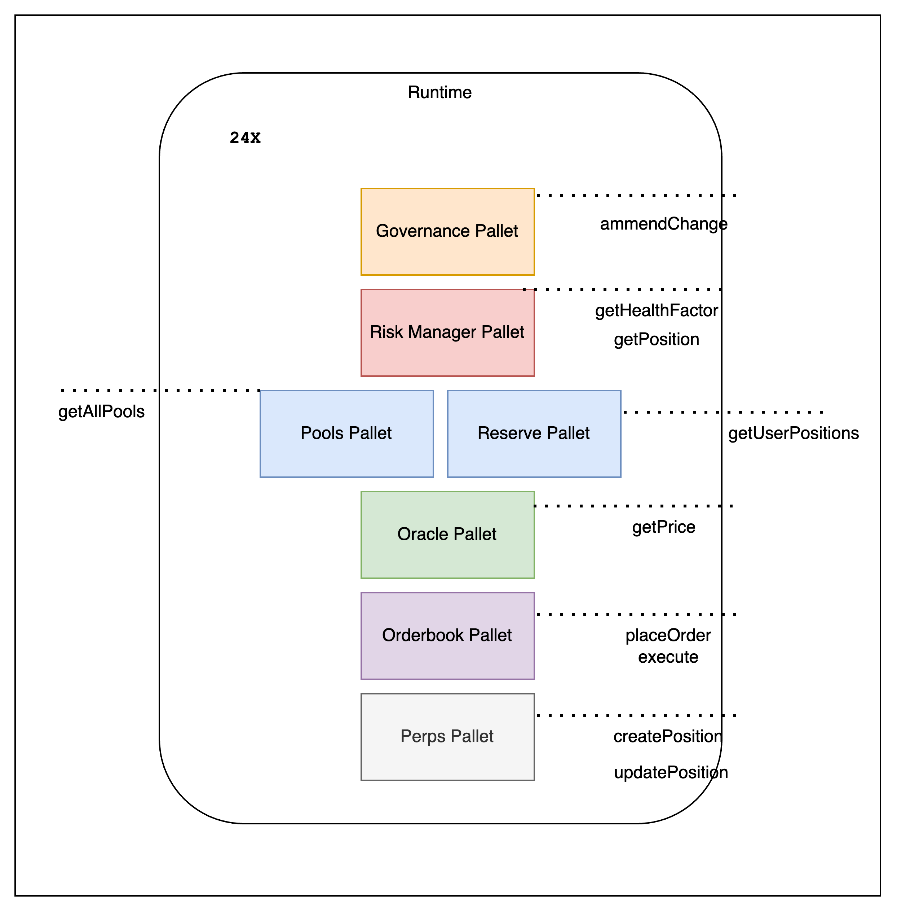
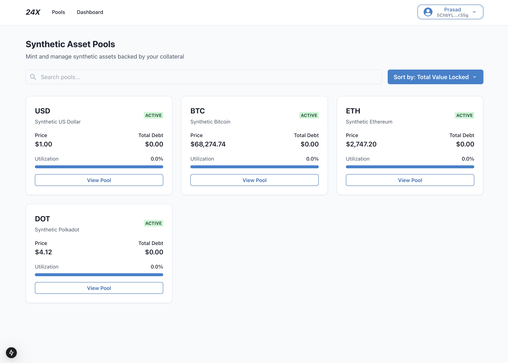
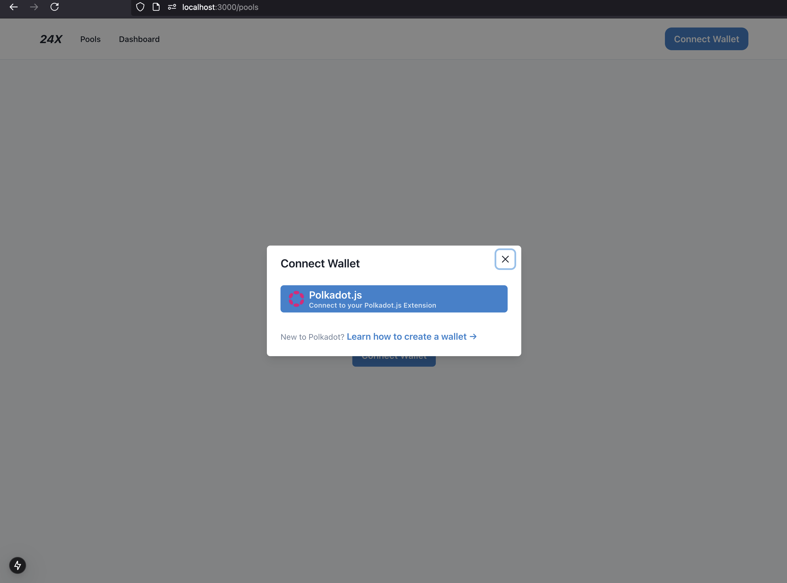
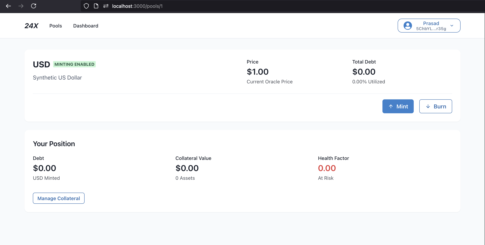

Here's a polished description for your 24X Chain project:

# 24X Chain: 24/7 Decentralized Derivatives Trading Platform

## Introduction 

**Project Name:** 24X  
**Created:** September 30, 2024  
**Origin:** Polkadot Bangkok Hackathon 2024 Project

### The Problem & Solution
Traditional derivative markets are restricted by trading hours, geographical boundaries, and centralized control. 24X leverages Polkadot's infrastructure to create a truly 24/7, borderless, and decentralized derivatives trading platform. Our solution enables users to trade synthetic versions of any asset (stocks, forex, commodities) at any time, from anywhere, without relying on centralized intermediaries.

## Hackathon Development Status

### Pre-Hackathon Status
- Initial concept and ideation phase

### Planned Hackathon Deliverables

✅ Completed:
- Parachain implementation on Polkadot
- Core pallets for synthetic derivatives creation
- User interface for asset creation and transfers

🚧 In Progress:
- Trading functionality pallets

## Architecture

### Core Components

1. **Synthetic Token Pallet**
   - Creates and manages synthetic assets
   - Handles token minting and burning
   - Manages token parameters and metadata

2. **Pools Pallet**
   - Enables permissionless pool creation
   - Manages liquidity provision
   - Handles pool parameters and trading pairs

3. **Reserves Pallet**
   - Manages user deposits and collateral
   - Handles reserve requirements for synthetic tokens
   - Processes withdrawals and reserve adjustments

4. **Risk Management System**
   - Real-time position monitoring
   - Automated risk assessment
   - Liquidation mechanism implementation
   - System health indicators

5. **Oracle Pallet**
   - External price feed integration
   - Price data validation and aggregation
   - Failsafe mechanisms for price updates

6. **UI and Frontend**
   - User-friendly interface for asset creation
   - Deposit and withdrawal management
   - Real-time data

🚧 Under Development:
- Orderbook Pallet
- Perpetuals Trading Pallet
- Governance System

## Technical Stack

- **Blockchain Framework:** Substrate
- **Runtime Environment:** FRAME
- **Smart Contract Language:** Rust
- **Frontend:** React with Polkadot.js
- **Testing Framework:** Substrate Test Suite

## Project Schedule

### Hackathon Timeline
1. Week 1: Core infrastructure setup & parachain deployment
2. Week 2: Synthetic asset creation & management implementation
3. Week 3: UI development & integration
4. Week 4: Testing & documentation

### Key Milestones
- Initial Submit: October 15, 2024
- Pre-demo Testing: October 25, 2024
- Testnet Launch: November 1, 2024

### Deliverable Status
✅ Completed:
- Basic parachain functionality
- Core pallet implementation
- Initial UI components

🚧 In Progress:
- Integration testing
- Documentation
- Advanced trading features

## Team Information
1. Prasad Kumkar
    - **Role:** Project Lead & Blockchain Developer
    - **Bio:** Blockchain enthusiast with 5 years of experience in DeFi projects

## Track & Bounty

**Selected Track:** Build a Blockchain using Polkadot SDK

**Target Bounties:** None

### Demo Materials (To Be Submitted)
1. Demonstration 

Pools Dashboard

Connect Wallet

Pool 

2. Technical Presentation: https://docs.google.com/presentation/d/1TC-HxZVwHvjwxBOIZFrUUqxd8ecAiQzXsmLautC5uI8/edit?usp=sharing

### Future Development
- Advanced trading features
- Cross-chain integration
- Market maker incentives
- Community governance implementation

24X aims to revolutionize derivatives trading by making it truly accessible, transparent, and decentralized through Polkadot's powerful infrastructure.