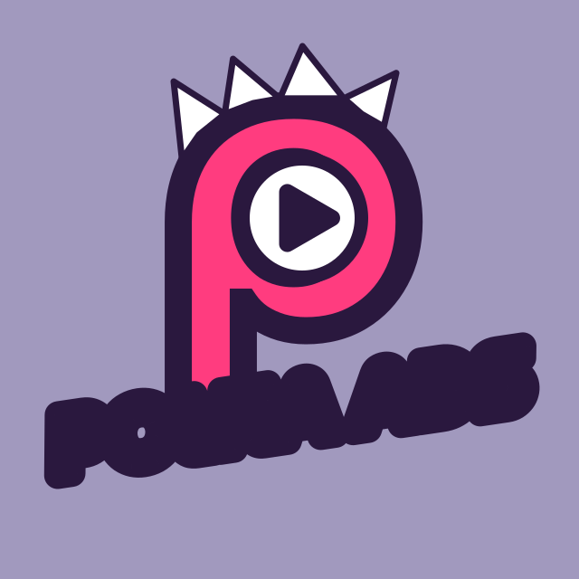
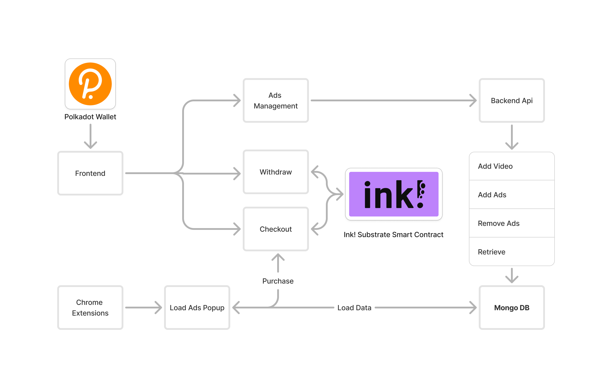

# Polka Ads
Polka Ads is a web3 platform that embeds product ads into social media platforms, allowing viewers to make purchases directly via a Chrome extension, all secured by Polkadot’s blockchain.

# Category
Category 2: (Hot) Smart Contract, DeFi, AI, Layer2, DePIN, etc.
Category 4: Open topic

# Selected Bounty
Blockchain for Good - Reducing Inequality

# Introduction
### project name: Polka Ads
### project creation date : September and October 2024

## Background:
Polka Ads is a cutting-edge web3 platform that integrates product advertisements into social media platforms, allowing users to purchase items directly from videos without leaving the website. It leverages Polkadot’s secure, on-chain transactions to make purchases easy and safe. This brings blockchain innovation into mainstream content consumption and helps make Polkadot more accessible in everyday interactions.

## Problem to be solved - solution
As people consume more media online, they’re constantly bombarded with advertisements that disrupt their experience. On top of that, purchasing an item after seeing an ad often requires navigating multiple web pages, which complicates the user journey. Polka Ads solves this problem by providing an integrated ad experience within social platforms. With the help of blockchain technology, users can instantly purchase items within the same platform, making their experience more seamless, while securing their transactions via Polkadot.
What project does
Polka Ads offers a streamlined shopping experience that allows users to buy products directly from advertisements. With a few steps, users can watch a video, see a product, and make a purchase without leaving the platform. Purchases are secured through the Polkadot blockchain, making it both a seamless and safe transaction.

## Things planned to be done during the hackathon
1. [**Backend**](./src/backend):    
    - [Mongodb](./src/backend/models/Video.js):    
    - [Api making](./src/backend/server.js):    
    
2. [**Frontend**](./src/frontend/src/)
    - [Making conection with Backend](./src/frontend/src/)
    - [Calling Smart Contract And Reading Smart contract](./src/frontend/src/context/PolkadotContext.js)
    - [Withdraw](./src/frontend/src/components/Withdraw.js)
    - [Checkout](./src/frontend/src/components/Checkout.js)

3. [**Blockchain:**](./src/frontend/src/ink_contracts/) 
    - [Ink Smart Contract](./src/frontend/src/ink_contracts/lib.rs)
    - Purchase and save logs
    - Show logs

4. [**Chrome Extension**](./src/chrome-extension/content.js)
    - [Purchase](./src/chrome-extension/content.js)
    - [Popup](./src/chrome-extension/popup.html)

# User flow for ad clients:
1. Install the Polka Ads and Polkadot JS extensions.
2. Create or log into your Polkadot account.
3. Visit any supported website (currently YouTube) and watch your favorite videos. Relevant ads pop up at specific moments in the video.
4. Love a product? Click “Purchase” on the ad, fill in your details, and confirm the payment via Polkadot JS.
5. See a success message once your purchase is complete!

# User flow for an ad managers:
1. Ad managers can upload ads and link them to specific videos.
2. Purchase logs are available, making it easy for managers to withdraw money and contact customers directly.

# The market
The global internet advertising market was valued at USD 578.14 billion in 2023 and is expected to grow with the increasing integration of blockchain and web3 technologies. Polka Ads offers an innovative solution for both users and advertisers, providing a seamless advertising experience on popular social media platforms.
The benefits of Polka Ads for users and businesses
1. Users can enjoy uninterrupted content consumption while making instant purchases.
2. Ad Managers can better target their audience, gain insights from purchase logs, and manage their campaigns more effectively.
3. Businesses can leverage a new form of interactive advertising, increasing engagement and sales while using secure blockchain technology.

# Technology
1. Integration with Polkadot wallets for secure transactions.
2. A Chrome extension that works seamlessly with social media platforms (like YouTube).
3. A backend system for Ad Managers to upload and monitor ads, linked to video content.
4. Polkadot JS extension used for contract signing and secure purchases.
5. Smart contracts ensure transactions are secure and decentralized.

# Future Expansion
1. Polka Ads is designed with scalability in mind, allowing for several future expansions that will enhance both the user and advertiser experience. Key areas of future development include:
2. Expand beyond other platforms: Support for additional platforms like Twitch, TikTok, X, and more to broaden the reach of Polka Ads and create new opportunities for seamless shopping experiences across different media.
3. Donations: Introduce donation overlays, allowing users to contribute to charitable causes directly from the video, utilizing Polkadot’s blockchain for secure and transparent on-chain donations.
4. Generate reports and metrics: Provide advertisers with the ability to generate detailed reports on ad performance, including metrics on which products are purchased during specific videos, engagement rates, and trends, helping them refine their strategies for maximum impact.
5. Consumer order history in the extension: Users will have access to their complete purchase history directly within the Polka Ads Chrome extension, where they can view past orders, check order statuses, access receipts, and easily reorder products.
6. Shipping management from the extension: Integrated shipping management will allow users to track their order shipments in real-time, receive updates, and manage their shipping preferences within the extension, making the post-purchase experience seamless.
7. Cashback opportunities: implement cashback enabling users to earn Polkadot tokens for every purchase they make, encouraging higher engagement and repeat purchases on the platform.

# Architecture
Astar Shibuya, Substrate, Rust, ink, Typescript, Javascript, Api, Node js, Mongo DB, Polkadot Js

1. Chrome Extension: At the heart of Polka Ads is a Chrome extension that users install to enable the interaction with product ads directly within videos. This extension is built using standard web technologies such as JavaScript, HTML, and CSS. It interfaces with both YouTube and the Polkadot blockchain. The extension listens for specific ad triggers during the video playback and displays an interactive ad overlay.

2. React Frontend for Ad Management:
The Ad Manager Dashboard is built using React.js, providing an intuitive interface for advertisers to upload ads, link them to videos, and view purchase logs. React was chosen for its component-based architecture, making it easier to build a dynamic and scalable interface.

3. Backend 
The backend services are built using Node.js, providing a scalable, event-driven architecture. The Node.js server handles various tasks, such as managing requests from the frontend, including ad uploads and video-linking logic. The Node.js backend is connected to the database and provides a RESTful API for the frontend to interact with.

4. Polkadot Blockchain Integration
The Polkadot blockchain is at the core of Polka Ads, providing a secure environment for on-chain transactions. When a user decides to purchase an item from an ad, the transaction is recorded on the blockchain via a smart contract.

By utilizing the same streamlined process, viewers could donate to nonprofits or causes they care about with a simple click, leveraging Polkadot’s blockchain for secure, transparent donations. This creates an additional engagement layer, where users aren’t just passively consuming content—they’re actively contributing to meaningful causes.

# Team info
1. Zakir Hossain:  Student at Jagatshi Gopal Krishna M. Saifur Rahman School & College, Senior Web3 developer, blockchain expert.
2. Steve Thijssen: Business/design/strategy. Founder of Wavy Health Inc. & FamilyPay. Raised over 4 million Euros in grants.

# Demo
### Website: https://polka-ads.vercel.app/

### Demo Video: https://vimeo.com/1022352614?share=copy

### Link to presentation: https://docs.google.com/presentation/d/1WciMfsD6sB9Qxe1QhAxudpY9dDCbb8la/edit?usp=sharing&ouid=101559367215941846840&rtpof=true&sd=true

