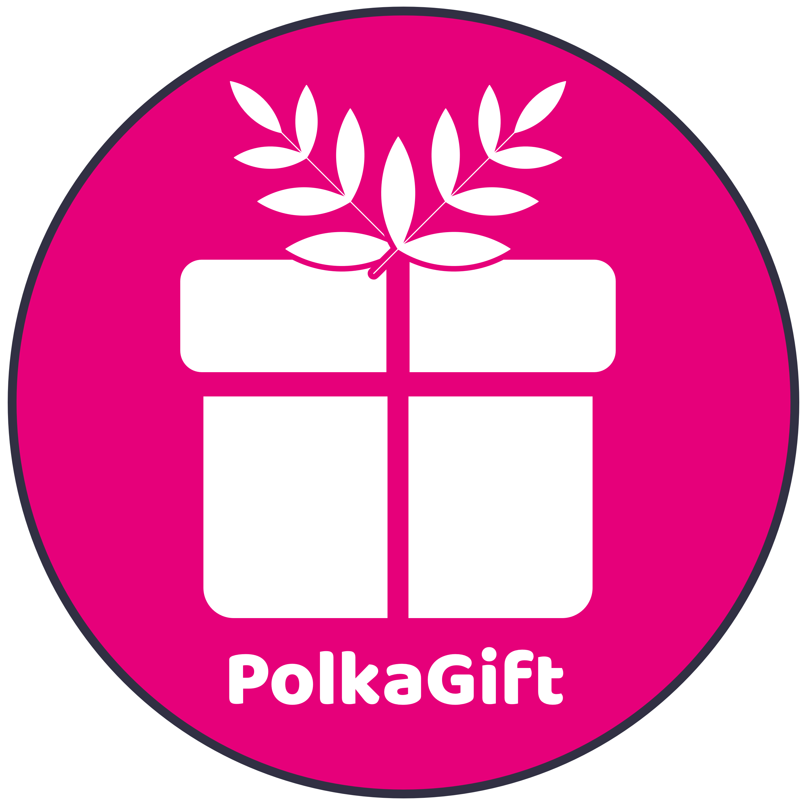
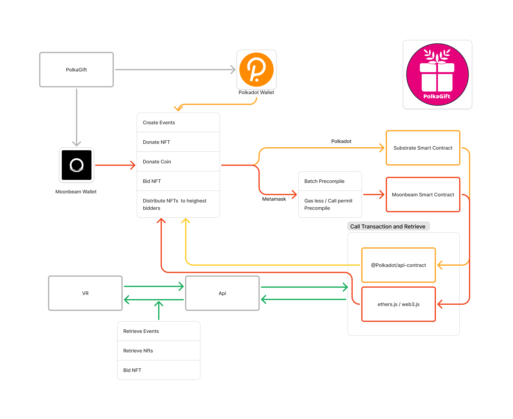

# PolkaGift
Events as a service, to create the most easy, transparent and fun NFT charity auction on Web3. PolkaGift is using the power of Polkadot with DAO, to help organizations raise additional support for a better world!

# Category
### Category 2: (Hot) Smart Contract, DeFi, AI, Layer2, DePIN, etc.
### Category 4: Open topic

# Selected Bounty
### Blockchain for Good - Reducing Inequality
### Moonbeam - Bounty 1: Use Moonbeam Precompile - Batch and Call Permit Precompile

# Introduction
### project name: PolkaGift
### project creation date : Mid August till and 23 October 2024

# Problem to be solved - solution
It's been six years since the world has embraced the sustainable development goals of the United Nations. Via diverse SDGs they create awareness and support thematic issues such as poverty, technology, and science.
 
Unfortunately, there are still many challenges and problems that are being faced. For instance, in Africa there are more than 25 million people living with HIV which makes it a leading cause of death among women around the reproductive age from 15-44 years old. Globally there were more than 1.4 million pregnant women with HIV in 2017. Almost 86% of the estimated 160.000 children newly infected were in the WHO African Region. Most people acquire the HIV infection through sexual transmission of transmission from mother to child. This happens during pregnancy, childbirth, or pregnancy.
 
Thankfully because of charity organisations we have communities that provide a better environment and solve problems in our society and more importantly do research. Through love, motivation and opportunities, they help people thrive and become self-sufficient. Donations are strongly needed to support these charities.
 
As a team we want to do something for the world, especially for SDG 3 and 5. During the interview with Yvette Rafael from APHA South Africa, we found out several difficulties for charity organisations:
1. The process of donations is not always transparent for donators
2. Charities have to invest in a payment infrastructure
3. Donation processes create a lot of administration
4. Creating charity events, like auctions, are even more difficult because of COVID-19
 
The market and benefits of PolkaGift for users and businesses
PolkaGift creates the most easy, transparent and fun NFT charity auction on Web3, by helping charities raise additional support. PolkaGift is a new way of donating by bridging the two major markets, namely donation ($470 billion) and digital NFTs ($40bn), which will grow extremely in the coming decade. Besides the unique proposition, PolkaGift:
1. creates a transparent process of donations and gives an automatically overview which donators can use for tax-free donations
2. provides charities/organizations a payment infrastructure with multiple wallet integrations, like Polkadot and Moonbeam, to pay from wallet to wallet
3. makes it possible to create events, like auction events, in just a couple minutes. The platform provides a bid infrastructure and there is plugin which makes it possible for organizations to setup an event on their own website
4. events can be shown in a virtual reality environment. NFTs that are minted during the auction can be shown in the PolkaGift museum in VR.
5. provides a lottery integration to setup a lottery in just a couple seconds

PolkaGift  is the platform that provides everything in one place to make donations fun and help organizations to set up events easily without expensive organization costs.

# Technology
In the PolkaGift there are two roles which are Event Manager and Donator. Event Manager can create events. And donors can donate coins and donate NFTs to the events. Other users then bid on those donated NFTs. When the auction is ended the money will be transferred to event manager and all the donated NFTs will be transferred to highest bidders.

We have integrated Moonbase Alpha and Astar Shibuya Network. We are allowing  users to connect either Metamask or Polkadot.js wallet to continue rest. We have deployed smart contracts on both networks. On moonbase alpha we have used Solidity Smart contract and on Astar Shibuya we have used Ink Substrate Rust smart contract. Then we are retrieving and calling those using @polkadot/api-contract and ethers.js and web3.js. We are mixing both data into one array, then showing on frontend. Hence, users can use any of the wallets.

# Features planned for the hackathon
1. Integration of Polkadot.js wallet (Done)
2. Integration of Metamask wallet (Done)
3. Events (Done)
4. Donation of NFTs and Coins to events (Done)
5. Bid NFts (Done)
6. Distribute NFTs to highest bidders (Done)
7. Moonbeam Smart Contract (Done)
8. Moonbeam Smart Contract Implementation on frontend (Done)
9. Moonbeam Batch and Call Permit Precompile Integration (Done)
9. Polkadot Smart Contract (Done)
10. Implementation of Polkadot Smart contract on frontend (In Progress)
11. Mixing Data of Polkadot with Moonbeam (In Progress)
 
# Future Expansion
We have made the Polkadot Smart Contract. But implementation is left. We are going to implement it in the coming days.

# Architecture
Shibuya Astar Network, Ink, Substrate, Smart contract, Solidity, Batch and call permit Precompile, API, Polkadot Wallet, Metamask, Rust, Typescript, Javascript, Next js

## [Website](./src/Website/):
1. [Login using Metamask/Polkadot](./src/Website/pages/login/index.jsx)
2. [Batch Precompile](./src/Website/contexts/UtilsContext.jsx)
3. [Call Permit Precompile](./src/Website/services/CallPermit.js)
3. [Moonbeam Smart Contract Service](./src/Website/services/useContract.js)
3. [Polkadot Smart Contract Service](./src/Website/contexts/PolkadotContext.jsx)
4. [Create Event](./src/Website/pages/CreateEvents/index.jsx)
4. [Event list](./src/Website/pages/donation/index.jsx)
4. [Event page](./src/Website/pages/donation/auction/index.jsx)
5. [Donate NFT modal](./src/Website/components/components/modals/DonateNFTModal.jsx)
6. [Donate Coin](./src/Website/components/components/modals/DirectDonateModal.jsx)
7. [NFT lists](./src/Website/pages/donation/auction/index.jsx)
8. [Bid NFT](./src/Website/components/components/modals/BidNFTModal.jsx)
9. Distribute NFTs to highest bidders

## [Blockchain](./src/Website/contracts/): :
1. [Solidity Smart Contract](./src/Website/contracts/contract/contracts/PolkaGift.sol)
2. [Ink Smart Contract ](./src/Website/contracts/ink_contracts/lib.rs)
3. Create Event
4. Donate NFT
5. Donate Coin
6. Bid NFT
7. Distribute NFTs

## [API](./src/Website/pages/api/): 
We are connecting VR with Frontend. Using api it is possible to Retrieve events, NFTs and Bid Nft.

## [VR](./src/VR/):
In the VR we are showing the NFTs and other things by using api.

# Team info
1. Ihor Malytskyi: Full stack developer, expert in web3, worked for international companies like Snapchat
2. Gudule Martens: Founder of Mama Producties (https://vr-mamaproducties.com/), VR developer, front-end web developer. Won international prizes like Dutch Design Week and is doing participating projects in social domains, like governments.
3. Lian Kuiper: Designer and medical researcher. Want to create an impact in the world and have a passion for blockchain for good.

Our team is an international and inclusive team 

# Demo
### Website: https://polkagift.vercel.app/ 
### Demo Video: https://vimeo.com/1022359428?share=copy
### Link to presentation: https://docs.google.com/presentation/d/1Tcn0IycO7fVQ90Mw4bb0rgG5dzkQqKtC/edit?usp=sharing&ouid=101559367215941846840&rtpof=true&sd=true

# Revenue model
## The revenue model of PolkaGift is simple:
1. The platform with all the functionalities is free for organizations
2. For each transaction on the platform we ask 5%
3. Other revenue comes from ads on the platform
 
## KPIs
### Social media October 2024 till end of 2026
1. By the end of 2026, we have more then 20k followers on Instagram
2. By the end of 2026, we have more then 10k discord users
 
## Funding and prizes
1. In the year 2025 we have raised at least 200k USD and 100k USD in prizes
2. In the year 2026 we have raised at least 2 million USD and 200k USD in prizes
 
## Employees
1. By the end of 2025, we will have 15 employees of which at least 40% is women and 30% BAME
2. By the end of 2026, we will have over 30 employees of which at least 50% is women and 40% BAME
 
## Transactions
1. By the end of 2027, more then 5000 organizations are using PolkaGift
2. By the end of 2027, over 10.000 events are created
3. By the end of 2027, more then 200 million USD is sent on PolkaGift
 
## Revenue
In the year 2027 we will have over 20 million USD in revenue, of which 10 million is from transaction fees and 10 million from marketing

## ICO PolkaGift
1. Q3 2027, 25 million tokens (of the 1 billion total supply) of 0,50 USD are sold in private sales
2. Q4 2027, 100 million tokens (of the 1 billion total supply) of 0,50 USD are sold in public sales

