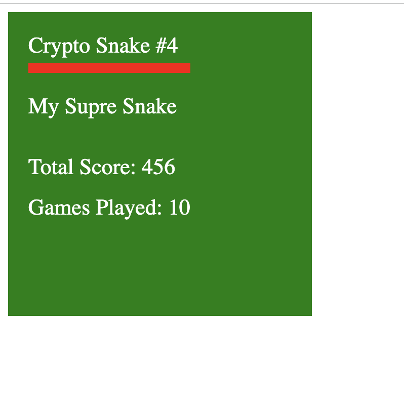

# Project Crypto Snake Unique

## Introduction

- project name: Crypto Snake Unique

- project creation date: 2024-10

- project background: just a simple game that build via the unique sdk and native NFT features

## Features planned for the Hackathon

The status of project before participate the Hackathon: we fork a opensource snake game and integrate the unique sdk and native NFT features into it

## Architect

- Frontend code: This project
  - Forked from https://github.com/ekinkaradag/snake-vue3, added Unique SDK implementation
- Contract code: https://github.com/LuckyFT-com/unique-contracts
  - Forked from Unique's official contract code repository, added `/recipes/CryptoSnake.sol` for implementation

## Team info

dev@luckyft.com, https://github.com/luckyft-com, Tom

## Track and bounty

Track: Open Track

bounty: unique network

- Online: https://crypto-snake.vercel.app/
- Video demo: https://www.loom.com/share/5bfc5d3e6eb34d07ba7f780949f6cb1b?sid=5ee7b853-b0a6-410d-9be1-1a098028fc5f

## Track: Unique Network

The competition requirements are:

- Use Unique Network's SDK to interact with the blockchain
- Use Unique Network's native NFT logic (i.e., use `CollectionMinter` and `TokenMinter`)
- Use Unique TS SDK in the frontend to interact with the contract

## Code

- Frontend code: This project
  - Forked from https://github.com/ekinkaradag/snake-vue3, added Unique SDK implementation
- Contract code: https://github.com/LuckyFT-com/unique-contracts
  - Forked from Unique's official contract code repository, added `/recipes/CryptoSnake.sol` for implementation

## Project Description

- The project is developed using Vue 3 and TypeScript.
- The project uses Unique Chain's SDK to interact with the blockchain.
- Players can start the game after creating a new Crypto Snake NFT.
- When the game ends, the player's Crypto Snake NFT attributes are updated.
- Players can play the game on [Crypto Snake](https://crypto-snake.vercel.app/).
- Used `CollectionMinter`
- Used `TokenMinter`
- After attribute updates, the corresponding NFT image is also updated (NFT images are on-chain)
  - The NFT's attribute JSON is dynamically assembled by reading on-chain data through `tokenURI`, and the image is in SVG format: https://github.com/LuckyFT-com/unique-contracts/blob/main/contracts/recipes/CryptoSnake.sol#L104-L128

## Project Features

- Connect wallet
- Disconnect wallet
- Get account information
- Get account balance
- Get account assets
- Send transactions
- NFT logic
  - The entire game is an NFT collection: Crypto Snake
  - Each NFT represents a Crypto Snake in the game
  - Each Crypto Snake has several attributes
    - nickname
    - totalScore
    - gamesPlayed

