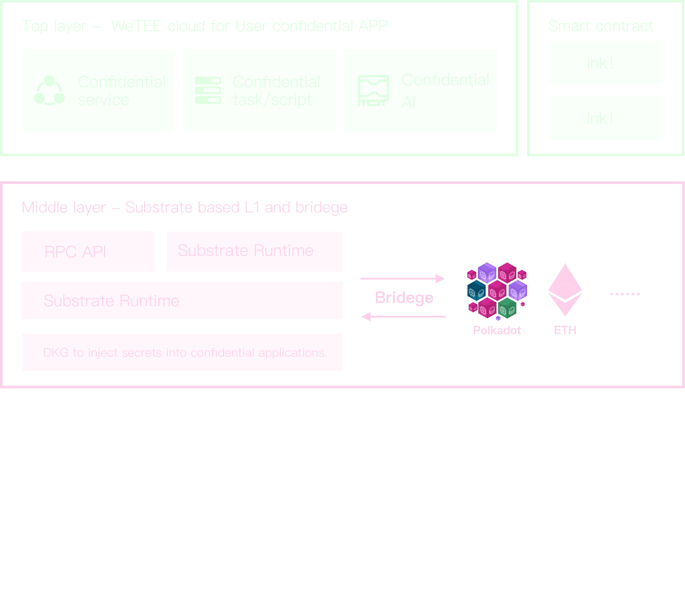

# Project WeTEE
## Introduction
WeTEE is a user-friendly and secure computational power infrastructure for Web3. It utilizes decentralized trusted computing power in a cloud-like manner and provides hardware-level security assurance for Web3 applications and DeAI.

WeTEE utilizes privacy-preserving computation to provide universal computing power for the Polkadot ecosystem, allowing all web2 applications to be deployed at zero cost into a decentralized privacy computing environment, transforming them into TEE applications. This makes confidential computing effortlessly simple.

WeTEE also offers a TEE Bridge to facilitate interoperability between smart contracts and trusted applications, enabling Polkadot smart contracts to achieve functional expansion through TEE applications. This makes smart contracts omnipotent.

## Features planned for the Hackathon
- [x]  DKG， DKG is sidechain to save and inject secrets (Environment variables, configuration files, file encryption keys.) into confidential applications.  [Github repo link](https://github.com/wetee-dao/dsecret/tree/polkadot-2024-hackathon)
- [x] Substrate pallet for DKG, DKG will operate as a sidechain alongside WeTEE, this is the interface point between DKG and WeTEE. [Github repo link](https://github.com/wetee-dao/chain/tree/polkadot-2024-hackathon)
- [x] Substrate pallet for TEE Bridge, enabling smart contracts to directly invoke TEE trusted applications. [Github repo link](https://github.com/wetee-dao/chain/tree/polkadot-2024-hackathon)
- [x] Worker for TEE Bridge, Handle the calls from on-chain TEE (Trusted Execution Environment) applications and forward them to the TEE application. [Github repo link](https://github.com/wetee-dao/worker/tree/polkadot-2024-hackathon)
- [x] LibOS for TEE, inject the TEE application interface meta file to generate the API documentation for the TEE program as it faces smart contracts. [Github repo link](https://github.com/wetee-dao/libos-entry/tree/polkadot-2024-hackathon)
- [ ] The core functions of worker and libos will run in dual modes of ZK (Zero-Knowledge) and TEE (Trusted Execution Environment).[Libos repo link](https://github.com/wetee-dao/libos-entry/tree/polkadot-2024-hackathon) | [Worker repo link](https://github.com/wetee-dao/worker/tree/polkadot-2024-hackathon)

## Architect

## Schedule

## Team info
| name         | role         | GitHub |
| ----------- | ----------- | -----------  |
| BaiL       | Full-stack engineer  | BurnWW   |
| flownchao  | Front-end Engineer     |     |
| Nina       | UI Designer   |        |

Approved and completed https://grants.web3.foundation/applications/WeTEE_Network

##  Bountiy want to apply 
 - [Blockchain for good](https://dorahacks.io/hackathon/polkadot-2024-singapore/bounties-details#blockchain-for-good)

## Material for Demo
1. Demo Video - [Youtube](https://youtu.be/QveGcIUHLeE)
2. PPT google doc - [LINK](https://drive.google.com/file/d/1bX5nDMbrPtKXYLLJmnNotGM87QUc-9Ht/view?usp=sharing)
3. Devloper Docs - [LINK](https://wetee.gitbook.io/docment) 
4. Code repository
    - [Main chain code](https://github.com/wetee-dao/chain)
    - [Side chain TEE minner code](https://github.com/wetee-dao/tee-worker)
    - [Side chain TEE DKG code](https://github.com/wetee-dao/tee-dsecret)
    - [TEE Confidential container libos](https://github.com/wetee-dao/libos-entry)
    - [DAPP](https://github.com/wetee-dao/dapp)