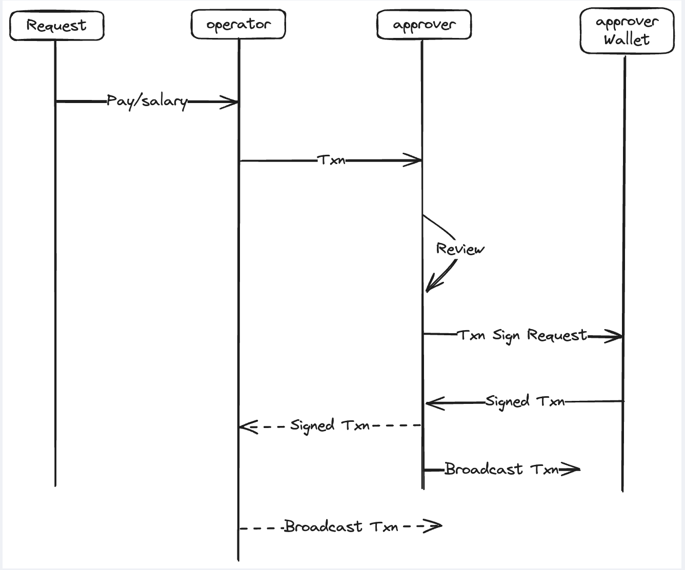

# Enhanced Token Fortress (ETF.one)
## Introduction

Enhanced Token Fortress (ETF.com) is a zero-trust Web3 asset management platform.

Is your team’s asset management centralized and controlled by a single person? As a key leader, are you stuck doing accounting tasks daily, even for small reimbursements? Do you feel uneasy about entrusting new staff with a multi-sig key?

ETF addresses these issues by leveraging the power of cryptographic algorithms to create a zero-trust environment:
* Depositing cryptocurrencies is not required or necessary.
* Run your Web3 business by inviting staff, accountants, and operators into your team without the need for trust.

## Features planned for the Hackathon
- [ ] Authentication & Authorization
- [ ] Multi-tenancy support
- [ ] Polkadot Integration
- [ ] Transaction workflow Management
- [ ] zero-trust applied to asset management

## Architect

## Schedule

## Team info

## Material for Demo
1. Demo Video [link to Youtube]
2. PPT [link to google doc]
