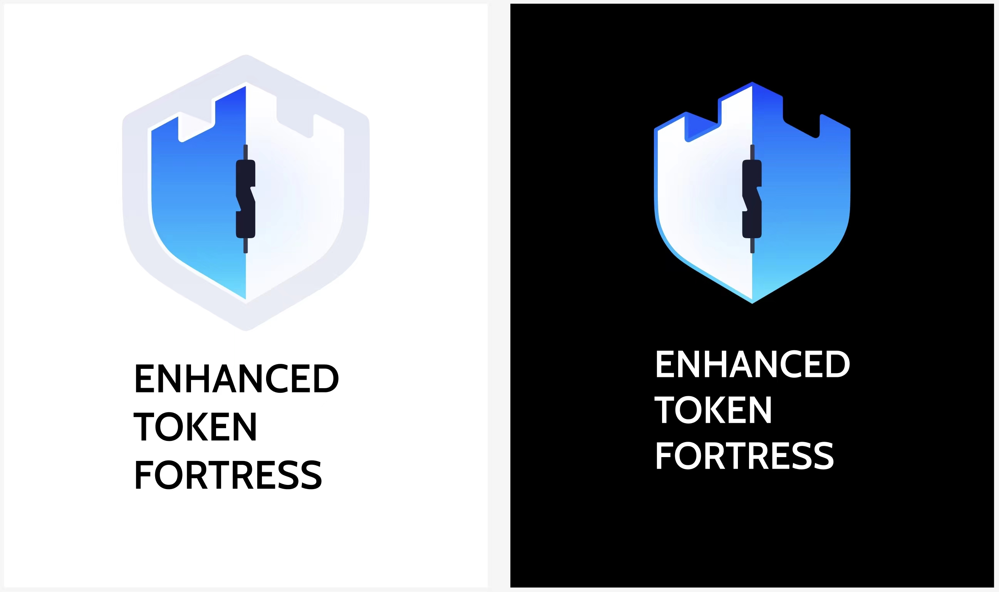

# Enhanced Token Fortress (ETF.one)

## Introduction

Enhanced Token Fortress (ETF.com) is a zero-trust Web3 asset management platform.

Is your team’s asset management centralized and controlled by one person? As a key leader, are you stuck handling accounting tasks daily, even for minor reimbursements? Do you feel unsafe about entrusting a new staff member with a multi-sig key?

ETF addresses these issues by leveraging the power of cryptographic algorithms to create a zero-trust environment:
* Depositing cryptocurrencies is not required or necessary.
* Run your Web3 business by inviting staff, accountants, and operators into your team without the need for trust.

## Features planned for the Hackathon
- [x] Authentication & Authorization
- [x] Multi-tenancy support
- [x] Polkadot Integration
- [x] Ethereum Integration
- [x] Wallet management
- [x] Team management
- [x] Transaction workflow Management
- [x] zero-trust applied to asset management

## Architect
A transaction on blockchain has three major steps:

* Transaction creation
* Transaction signing
* Miner confirmation

In asymmetric cryptography, the private key is used to sign the transaction, and the public key is used to verify the signature. So transction creation doesn't require neither of them, `we can separate the transaction creation and signing process.

## Schedule

## Team info
An Li (Kidy Lee) - Full Stack Developer
* 15 years of development experience, 10 years software development on asset management system
* @kidylee on Github/X/LinkedIn/Telegram

Xiaoyan Yan - Designer
* 5 years of design experience, 2 years of blockchain design experience
* @z7z_zZz on X

## Material for Demo
1. [Demo Video Link](https://drive.google.com/drive/folders/1EwFzunk_LxiVfWrmu3VlyZaZuAvgvtvp?usp=drive_link)
2. [PPT Link](https://drive.google.com/drive/folders/1EwFzunk_LxiVfWrmu3VlyZaZuAvgvtvp?usp=drive_link)
