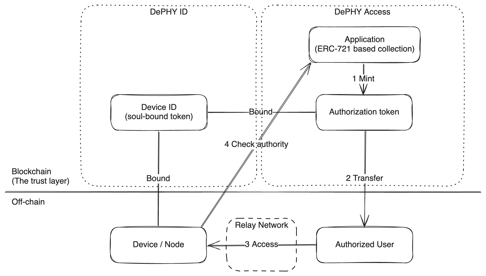

Conduits
====

## Introduction

Conduits is a solution that helping for accessing decentralized resources.

In short, Conduits builds Web3-based Zero Trust Network.

### Decentralized resources

Decentralized resources are discrete and asymmetric off-chain nodes.

- Discrete: Nodes are deployed by people independently and spread across the world.
- Asymmetric: Unlike blockchain, each node has its state and may not be shared.

### Use cases

- Decentralized computing (GPU, CPU, TEE, etc.)
- Web3 game
- DePIN

## Components

#### Conduits parachain

A parachain that serves necessary functions for decentralized accessing.

It's Frontier-based for now, and we would switch to `pallet_revive` when it’s mature for more Polkadot native.

#### DePHY ID

> This is our previous work

DePHY ID is a smart contract for identifying, verifying, and connecting physical devices and decentralized software to the Web3 world.

Each DePHY ID device (based on ERC-721) represents the state of a physical device or decentralized software.

#### DePHY Access

DePHY Access is an extension of DePHY ID that tokenizes access rights and serves as a token gate for off-chain decentralized software.

#### DePHY Tunnel

DePHY Tunnel is a LibP2P-based L4 proxy for end-to-end encrypted tunnel between the resource and end-user(s).

It relies on DePHY Access for ACL (Access Control List) and avoids decentralized attack vectors such as Sybil Attack.

#### DePHY Relay Network

DePHY Relay Network is a decentralized network traffic relay network.
It will help to find the best route for users to access resources, and it also helps mitigate DDoS flood or abnormal access.
It’s not a VPN or Deep Web.

## Features planned for the Hackathon

- DePHY Access smart contract
  - [Source code](src/dephy-id-evm/extensions/access/)
- DePHY Tunnel
  - [Source code](src/tunnel/)
  - DePHY Access token gate integration
- Conduits parachain
  - [Source code](src/conduits-parachain/)
- Demo: GPU marketplace smart contract
  - [Source code: smart contract](src/marketplace/)
  - [Source code: dapp](src/marketplace-dapp/)
  - [Source code: GPU sandbox](src/jupyter-container/)

## Architect

- Device ID (DID) is a representation of an off-chain device or node
- The application is an ERC-721-based smart contract deployed by developers, we provide a standard implementation, but developers can customize it
- Authorization token represents who can access the device
- A device in an application may have several Authorization tokens
- The authorization token can trade
- How to check authority: Find an NFT from the collection which bound by the device and the user own it

## Team info

- [Jun Jiang](https://github.com/jasl): Team leader, product manager
- [Canvas Lee](https://github.com/CanvasL): Solidity Developer
- [Magine Lee](https://github.com/Ma233): Rust Developer
- [Miko Gao](https://github.com/gaowhen): Frontend Developer

## Material for Demo

See [doc/README.doc](./doc/README.md)
