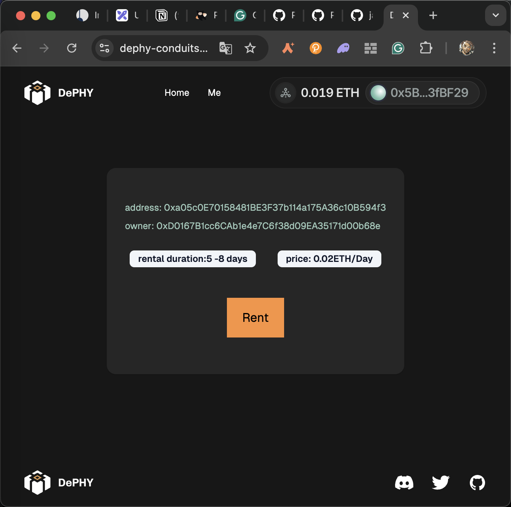
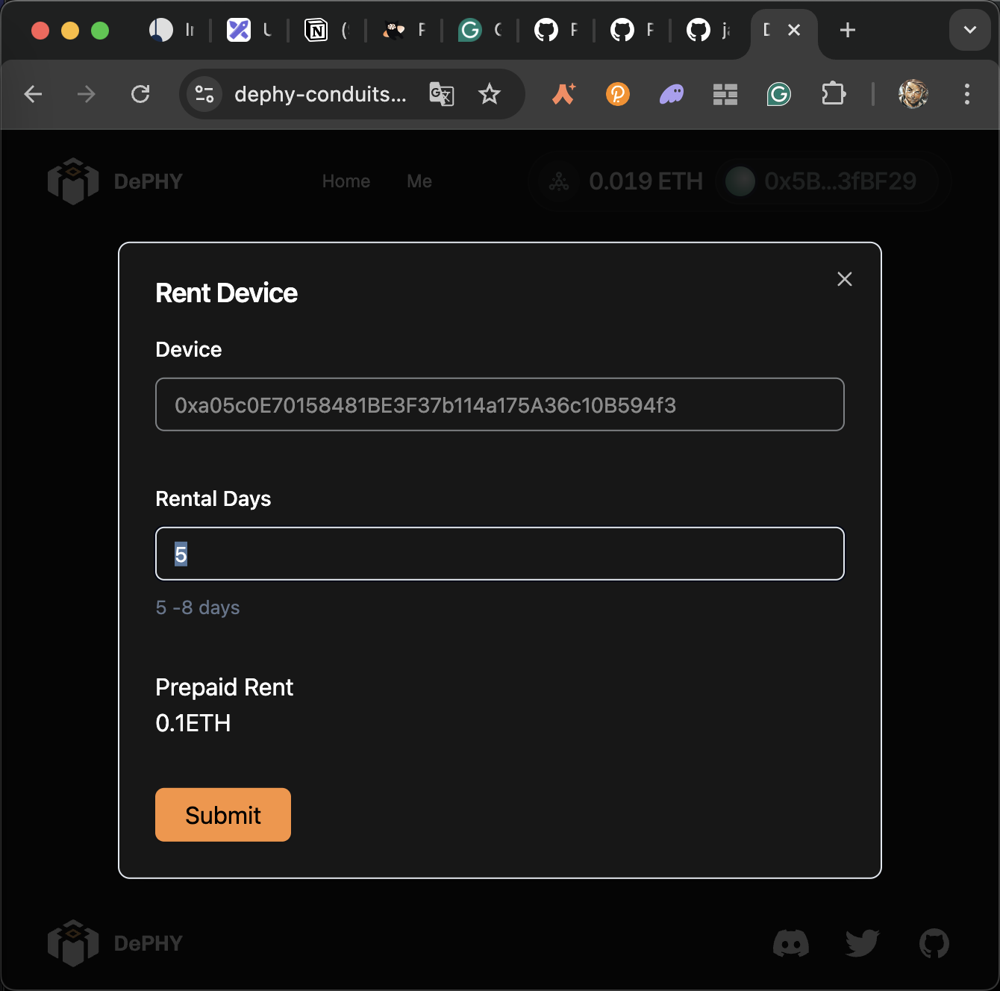
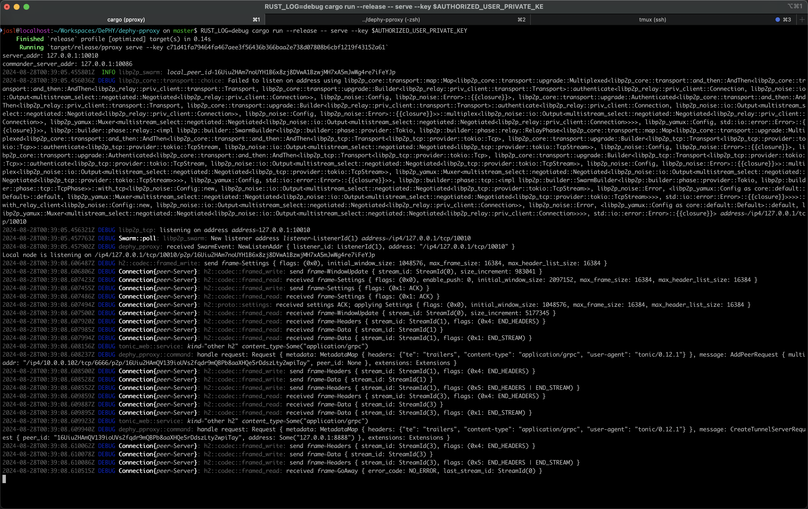
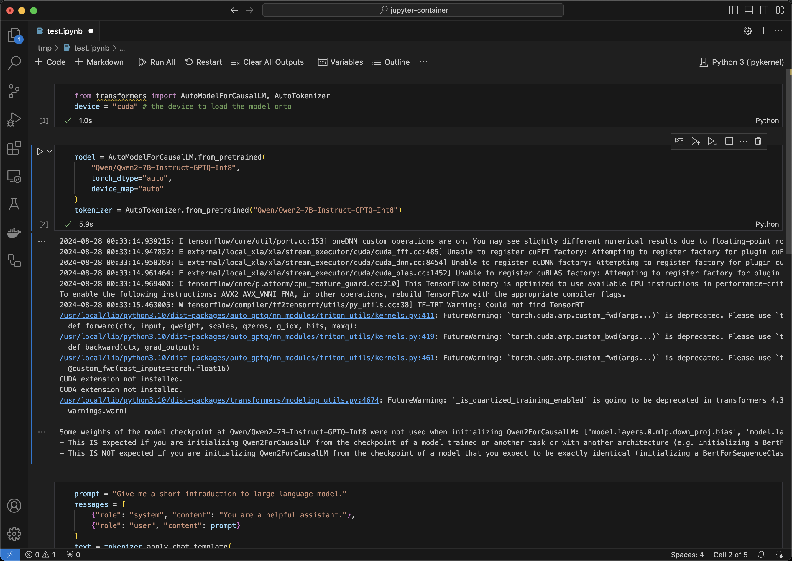

Conduits workflow
====

The doc shows the workflow of Conduits

> Because of the time, we have to quick and dirty hacked our previous works to make the demo works.

## Demo screenshots

The demo shows renting a remote GPU and access it

### Rent a GPU

Show listed GPU



Rent a GPU



### Run DePHY Tunnel client and connect to the remote resource

> It's not friendly now, we can improve it in the future (making a browser extension, an app, or SDK)



### Access the resource



## Reproduce instructions

### Keys for testing

> These keys are only test purpose

```bash
export EVM_RPC_URL=
export OWNER_PRIVATE_KEY=8075991ce870b93a8870eca0c0f91913d12f47948ca0fd25b49c6fa7cdbeee8b
export OWNER_ADDRESS0x3Cd0A705a2DC65e5b1E1205896BaA2be8A07c6e0
export DEVICE_PRIVATE_KEY=6abe1b6425c3346eb8a645dbf0636a7f7298a79fc29740cbd5d2ec1df9a4ea9c
export DEVICE_ADDRESS=0xfC87632091567522AD75e1C99c0a8b8E6A578972
export AUTHORIZED_USER_PRIVATE_KEY=0b6e18cafb6ed99687ec547bd28139cafdd2bffe70e6b688025de6b445aa5c5b
export AUTHORIZED_USER_ADDRESS=0x798d4Ba9baf0064Ec19eB4F0a1a45785ae9D6DFc
export WRONG_USER_PRIVATE_KEY=415ac5b1b9c3742f85f2536b1eb60a03bf64a590ea896b087182f9c92f41ea12
```

## Preparation

### Deploy contracts

Skip

### Create a testing DePHY ID device for the node

```bash
cd dephy-id-evm/examples/public-vendor
```

```bash
pnpm run cli create-activated-device \
--rpc $EVM_RPC_URL \
--privatekey $OWNER_PRIVATE_KEY \
--vendor 0xc1F4465a717e3694993d89ecbDBE52bB608FE155 \
--device $DEVICE_ADDRESS \
--receiver $OWNER_ADDRESS
```

### Grant access permission to a user

```bash
cd dephy-conduits-contracts
```

```bash
forge script script/AccessIdentities/AddIdentity.s.sol --rpc-url $EVM_RPC_URL --broadcast
```

```bash
forge script script/Marketplace/List.s.sol --rpc-url $EVM_RPC_URL --broadcast
```

```bash
forge script script/Marketplace/Rent.s.sol --rpc-url $EVM_RPC_URL --broadcast
```

## Demo

### Run Ollama

For the demo show, we run a [Ollama](https://github.com/ollama/ollama) as the DePIN resource

### Run DePHY Access auth server

```bash
cd marketplace/tools/auth-server
```

```bash
DEVICE=$DEVICE_ADDRESS pnpm run server
```

### Run DePHY Tunnel server side

```bash
cd tunnel
```

```bash
RUST_LOG=debug cargo run --release -- serve --key $DEVICE_PRIVATE_KEY --server-addr 127.0.0.1:6666 --commander-server-addr 127.0.0.1:7777 --proxy-addr 127.0.0.1:11434 --access-server-endpoint http://127.0.0.1:3155
```

### Run DePHY Tunnel client side with unauthorized user

> Expect failed because the user is unauthorized!

```bash
cd tunnel
```

```bash
RUST_LOG=debug cargo run --release -- serve --key $WRONG_USER_PRIVATE_KEY
```

```bash
cargo run --release -- create_tunnel_server --tunnel-server-addr 127.0.0.1:8889 --peer-multiaddr /ip4/127.0.0.1/tcp/6666/p2p/16Uiu2HAmQV139ioUVs2fqdr9mQBPb8aaXHQe5rDdszLty2wpiTay
```

```bash
curl http://127.0.0.1:8889
```

Access Ollama will fail

### Run DePHY Tunnel client side with authorized user

```bash
cd tunnel
```

```bash
RUST_LOG=debug cargo run --release -- serve --key $AUTHORIZED_USER_PRIVATE_KEY
```

```bash
cargo run --release -- create_tunnel_server --tunnel-server-addr 127.0.0.1:8889 --peer-multiaddr /ip4/127.0.0.1/tcp/6666/p2p/16Uiu2HAmQV139ioUVs2fqdr9mQBPb8aaXHQe5rDdszLty2wpiTay
```

```bash
curl http://127.0.0.1:8889
```

Access Ollama will sucess
