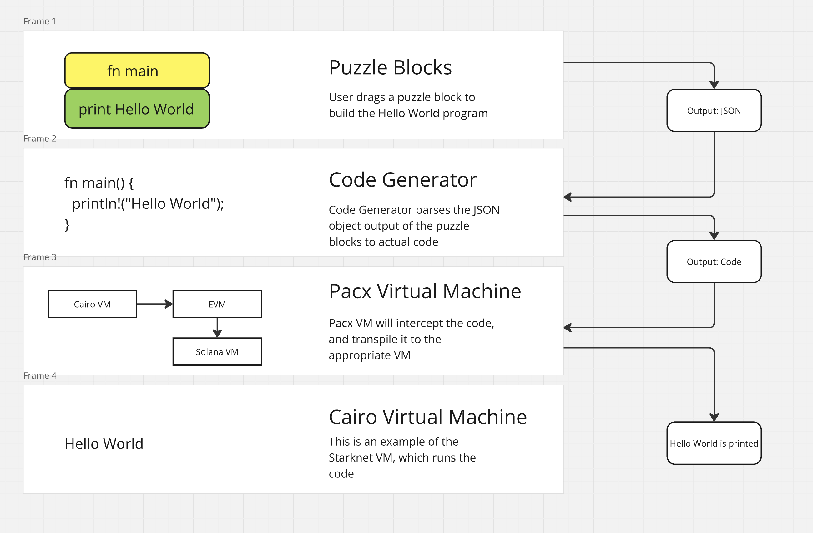

# Pacx
## Introduction
> Check development build [here](https://polkablocks.onrender.com/)

PolkaBlocks is Scratch for Smart Contracts, designed for the Polkadot Ecosystem :)

It serves as an educational platform that empowers developers to learn and create [ink!](https://use.ink/) smart contracts using a visual, block-based programming interface.

# How It Works
PolkaBlocks uses [Blockly](https://developers.google.com/blockly/guides/create-custom-blocks/extensions), an open-source library from Google, to provide a drag-and-drop interface for creating smart contracts. Here’s a high-level overview of how the system works:

- **Puzzle Blocks:** Each puzzle block represents a piece of the ink! programming language, such as a function, variable, or control structure. Users drag these blocks onto the workspace to create a visual representation of their smart contract.
  
- **Block Customization:** Users can define custom blocks or modify existing blocks to better suit the specific needs of their smart contract. This flexibility ensures that PolkaBlocks can grow with the user's increasing proficiency.
  
- **Code Generation:** Once the blocks are arranged, PolkaBlocks converts the visual blocks into ink! code through a code generator. The generator is designed to parse the structure and relationships between blocks, producing syntactically correct and ready-to-deploy ink! smart contracts.
  
- **Execution and Testing:** The generated code can be tested and deployed within the Polkadot ecosystem. Future iterations of PolkaBlocks aim to integrate directly with Polkadot's architecture, allowing users to run and deploy their contracts seamlessly.

## Architecture

## Team info

| name         | role         | GitHub |
| ----------- | ----------- | -----------  |
| Ibrahim      | Full-stack engineer  | princeibs  |
| Victor | Front-end Engineer     |   vibenedict  |
| Cyndie    | Backend engineer   |    CyndieKamau    |
| Andrew   | Systems engineer   |    koolamusic   |

## Material for Demo
1. Demo Video [https://youtu.be/AUOq6a0cdyc]
2. Code Repository [https://github.com/pacxlab/cairoblocks/tree/cyn/polkadot-scratch?tab=readme-ov-file]
3. Live Demo Link [https://polkablocks.onrender.com/]