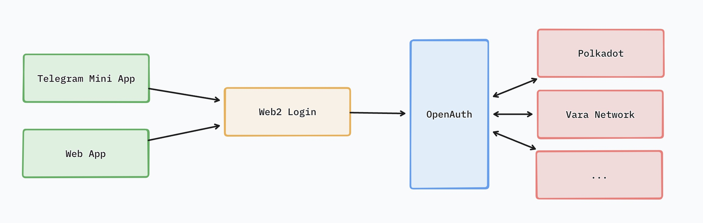

OpenAuth
====

## Introduction
OpenAuth is a free and open-source solution for adding Web2 authentication and Polkadot custodial wallets to your applications.
It's time to seamlessly connect Polkadot to the entire internet!

## Features planned for the Hackathon
1. Supports multiple web2 login methods such as Twitter, Google, and TikTok.
2. Integrated the Polkadot custodial wallet, supporting functions like private key generation, signing, and obtaining addresses of custodial wallets.
3. Implemented a Telegram Mini App based on OpenAuth, which enables users to collect points through clicking and bind them to the Vara Network wallet.

## Architect
In OpenAuth, users can log in through any method they are familiar with, including web2 and web3, such as Google or Twitter, either in the Telegram mini-app or app. After logging in, OpenAuth will handle the auth token and custodial wallet, allowing users to directly interact with the blockchain.

## Team info

Ocean
Founder
Senior Engineer at Microsoft AI & Big Data Platform.
Serial entrepreneur on Solana and EVM.

## Material for Demo
1. Homepage: https://openauth.tech
2. PPT: https://docsend.com/view/d3f3gtgqx52g7bi6
3. Telegram Mini App: https://t.me/vara_click_bot/app

