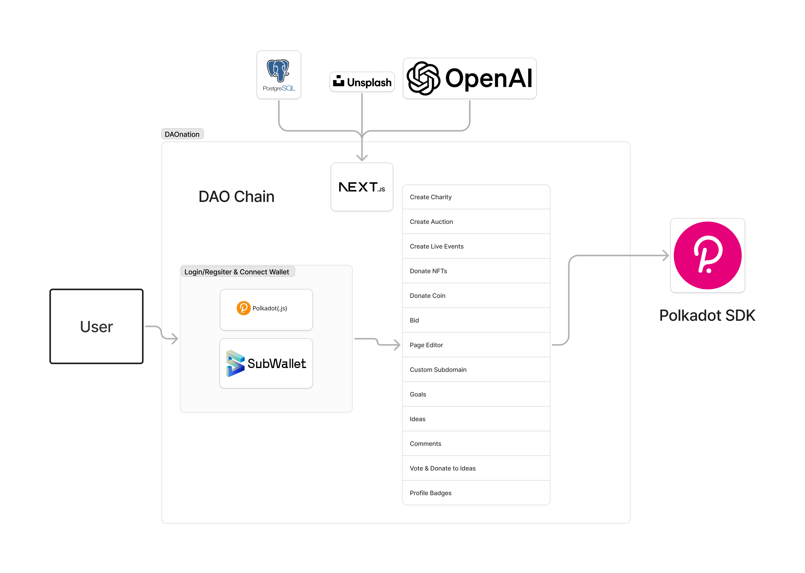

  

# DAOnation

## Category
Category 3: (Chain) Building a blockchain based on Polkadot SDK

## Selected Bounty
Blockchain for Good - Reducing Inequality

## Introduction

**DAOnation:** DAOnation is a platform for charities to maximize their impact through decentralized innovation powered by the Polkadot SDK. Charities empower their mission with DAOs, personalized pages through AI, community goals, crypto-NFT events, and live-streaming charity events. It’s the best way to unlock the unparalleled value of decentralized giving!

### Problem to be solved - solution
See the presentation we made for the project: [DAOnation Presentation](https://www.canva.com/design/DAGPEayZOWA/-KtnDcXvSUu5qLrxzahSoQ/edit?utm_content=DAGPEayZOWA&utm_campaign=designshare&utm_medium=link2&utm_source=sharebutton)

In 2016, there were more than 43 million Americans living in poverty. Charity organizations create a better environment, solve societal problems, and conduct important research. They help people thrive and become self-sufficient through love, motivation, and opportunities. Donations are essential to support these charities.

Supporting communities, initiatives, and charities is vital to our society. Steve Thijssen, a member of the DAOnation team, is involved in the [Heart for Women Foundation](https://www.hartvoorvrouwen.nl/), which is dedicated to research into cardiovascular disease for women. Last November, we organized a charity event to raise money for this research. Additionally, Inner Wheel, a large community organization, supported the foundation with various activities. 

However, scaling a foundation is difficult. This led us to research how we can help charities. Based on interviews, we identified four main challenges:
1. The donation process lacks transparency and involves a lot of administration.
2. Generating revenue to achieve goals as a charity (peer-to-peer transaction).
3. Engaging members (collaborative investment).
4. Onboarding and acquiring new users (scaling).

With our team of four enthusiastic people, knowledgeable and passionate about helping society, solving problems, FinTech, and digital art, we created DAOnation to maximize charity impact through decentralized innovation.

## Integrations during the hackathon period (everything is working):
1. **Integration of SubWallet with Polkadot SDK:** Enabling user-friendly login and seamless interactions with the Polkadot network, allowing users to manage digital assets, execute transactions, and interact with decentralized applications directly from their SubWallet interface.
2. **NFT Auction Events:** Organizing and managing NFT auction events where users can list their NFTs for bidding. This includes setting up auction parameters, tracking bids in real-time, and ensuring secure transfer of ownership once the auction concludes.
3. **Live Stream Events:** Hosting live stream events where participants can engage in real-time with content, interact with hosts or other participants, and potentially participate in live auctions or discussions.
4. **NFT Bidding and Transferring:** Facilitating the process of placing bids on NFTs, managing bid histories, and executing the secure transfer of NFT ownership upon successful bids. Smart contracts ensure trustless transactions between parties.
5. **Donation of NFTs to Events:** Allowing users to donate their NFTs as part of fundraising events or charity auctions. These NFTs can then be auctioned with proceeds going to the designated cause.
6. **Donation of Coins to Events:** Enabling the donation of cryptocurrencies to support events, charities, or specific causes. This includes setting up donation mechanisms, tracking contributions, and ensuring transparent distribution of funds.
7. **Web3 Ticket Purchase System:** Developing a Web3-based ticket purchase system where users can buy tickets for live-stream events using Polkadot SDK.
8. **DAO Homepage Generation with AI:** Utilizing AI to automatically generate a homepage for users to kickstart their community by integrating this with our website builder.
9. **Goals Generation with AI:** Implementing AI-driven tools to help communities define their goals and add relevant images.
10. **Smart Image Suggestions with AI and Unsplash API:** Integrating AI with the Unsplash API to provide smart image suggestions based on context, content, or user preferences. This enhances content creation by offering relevant, high-quality images from Unsplash.
11. **Idea Suggestions with AI:** Leveraging AI to suggest ideas and images based on the existing DAO and Goal description.
12. **Comments on Ideas:** Implementing a system where users can leave feedback or comments on proposed ideas.
13. **Branded and Personalized Subdomains:** Offering the ability to create branded and personalized subdomains for projects, DAOs, or events, enhancing recognition and user engagement.

## Architecture
Polkadot SDK, Rust, Cargo, Ink, Typescript, Next.js, Parachain, Subwallet, Polkadot JS, OpenAI API, PostgreSQL, Unplash API

## Team info
1. **Arjen van Gaal:** Senior Product Designer at Kahoot! and previously Bloobirds and Goin
2. **Thomas Goethals:** Blockchain and Web3 expert, senior full-stack developer at Kahoot! and previously Renault
3. **Zakir Hossain:** Senior Web3 developer, blockchain expert
4. **Steve Thijssen:** Business/design/strategy. Founder of Wavy Health Inc. & FamilyPay, board member nonprofit Conscious Nona. Raised over 4 million Euros in grants.

## Demo materials

### Pitch Video Link
[Watch the Pitch Video](https://vimeo.com/1003311660?share=copy)

### Presentation
For more information, please see the presentation: [DAOnation Presentation](https://www.canva.com/design/DAGPEayZOWA/-KtnDcXvSUu5qLrxzahSoQ/edit?utm_content=DAGPEayZOWA&utm_campaign=designshare&utm_medium=link2&utm_source=sharebutton)

### Demo Link (product is live)
[Visit DAOnation](https://daonation.org/)

### Test users
Password: 12345678
1. **Ariel Amir:** arielamir2013@yahoo.com
2. **Adrian Kobus:** akobus923@gmail.com
3. **Aleksey Petrov:** petrov4003@gmail.com
4. **Elia Zia:** zialia5405@gmail.com
5. **Sofia Dippel:** sd.kr402@outlook.com

# Integrated Pallets/Frame for Parachain
1. [Daos/Charity](./src/daonation-parachain/frame/daos)
2. [Events](./src/daonation-parachain/frame/events)
3. [Feeds](./src/daonation-parachain/frame/feeds)
4. [Goals](./src/daonation-parachain/frame/goals)
5. [Ideas](./src/daonation-parachain/frame/ideas)
6. [Users](./src/daonation-parachain/frame/users)

