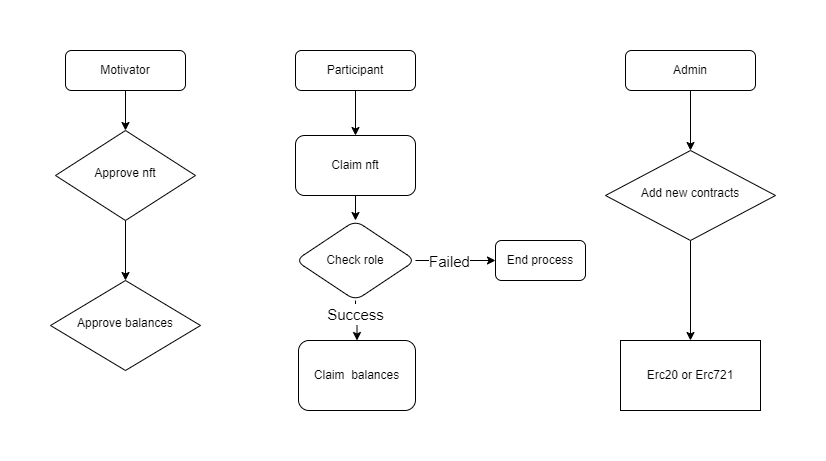

## Basic Info

Project Name: L2E.TOP

## Project Details

### Introduction
L2E.TOP is a decentralized "Learn to Earn" multi chain Dapp platform.

### Background
Generally speaking, introductory practical courses on public blockchain only focus on the course content itself and rewards. Compared to focusing on developer stickiness and technology dissemination.

### Insights
The goal of L2E.TOP is to cultivate developers' stickiness to the technology community and reward providers, especially novice developers, through dispersed evidence and interaction. Strengthen interaction between personnel from different technical fields and promote communication among cross chain developers.

### Architecture
Motivator can choose a public chain, create related NFTs, allow participant to claim the NFT, and claim certain tokens.

Participant can claim authorized NFTs or tokens upon verification of their identity. They can only claim tokens for the next stage after completing a certain stage of token collection.

## Plan to do during hackathon

**Blockchain**
- [×] Role Authorization
- [×] Multi Contract Call
- [×] Claim Token Process
- [×] Custom Additional Contract

## Done during hackathon

Release the learn to earn platform, streamline the process, and complete PoC.

Project structure:

## Team members

- Pursue: Technical Development Engineer, engaged in fields related to Blockchain, Cloud Computing Virtualization, Web backend, etc. GitHub: @aiqubits

## Apply Bounties
Vara Network & Gear

Blockchain for good
