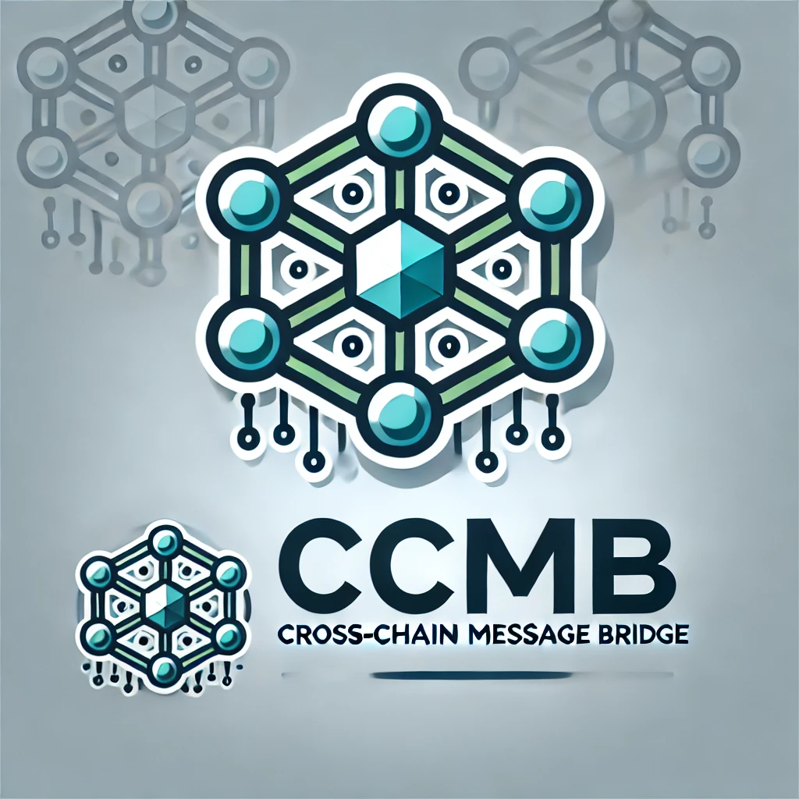

### Cross-Chain Message Bridge(CCMB)

### **Objective**:

To develop a Cross-Chain Message Bridge (CCMB) that enables seamless communication between different blockchain networks within the Polkadot ecosystem and beyond. The goal is to enhance interoperability and reduce the complexity of cross-chain operations, facilitating the transfer of data and assets across multiple chains.

### **Project Description**:

The CCMB will serve as a middleware layer that allows smart contracts and decentralized applications (dApps) on different blockchains to interact with each other. It will provide a standardized protocol for message passing, ensuring that data transferred between chains maintains integrity, security, and consistency.

**Key Features**:

1. **Universal Message Format**: A standardized format for cross-chain messages to ensure compatibility between various blockchain platforms.
2. **Multi-Chain Support**: Initial support for Polkadot parachains, with extensibility to other major blockchains like Ethereum, Binance Smart Chain, and Cosmos.
3. **Security Mechanisms**: Implement cryptographic proofs and consensus mechanisms to ensure that cross-chain transactions are secure and trustless.
4. **Scalability**: Design the bridge to handle high transaction volumes without compromising on speed or security.
5. **Developer SDK**: Provide a software development kit (SDK) to make it easy for developers to integrate the CCMB into their dApps.

**Technical Stack**:

- **Blockchain**: Substrate (for Polkadot integration), Ethereum
- **Programming Languages**: Rust (for core development), JavaScript/TypeScript (for SDK and frontend)
- **Smart Contracts**: Ink! for Polkadot, Solidity for Ethereum
- **Consensus Mechanism**: Use of Polkadot's relay chain consensus combined with other blockchain-specific mechanisms for cross-chain validation.

### **Use Cases**:

1. **DeFi Protocols**: Facilitate the transfer of assets between different DeFi platforms across chains.
2. **Cross-Chain NFTs**: Enable NFT transfers and trades across multiple blockchains.
3. **Decentralized Identity**: Allow identities to be verified and used across different chains without duplication.
4. **Interoperable dApps**: Support the creation of dApps that can operate on multiple blockchains simultaneously.

### **Development Plan**:

1. **Phase 1 - Research & Design**:

   - Conduct research on existing cross-chain solutions.
   - Design the architecture of the CCMB and define the message protocol.

2. **Phase 2 - Core Development**:

   - Implement the core message passing protocol.
   - Develop the initial version of the bridge with support for Polkadot parachains.

3. **Phase 3 - Integration & Testing**:

   - Integrate with selected blockchains (e.g., Ethereum).
   - Perform extensive testing to ensure security and reliability.

4. **Phase 4 - SDK & Documentation**:

   - Develop the SDK for developers.
   - Create comprehensive documentation and tutorials.

5. **Phase 5 - Launch & Support**:
   - Launch the CCMB on mainnet.
   - Provide ongoing support and updates.

### Project Creation Date

Early August 2024

### Architecture

### Logo

### Team

- Rosendo
  Rust & Contract dev [github]()
- Steven zhang
  Full stack dev [github](https://github.com/neptune0xf)
- Tang tom
  Products & Operations [github](https://github.com/txl123333)

### Selected Bounty

Blockchain for good

### Planned Code Deliverables during the Hackathon

- `Phase 2`
- `Phase 3`

### Project Completed During the Hackathon

- `Phase 2`
