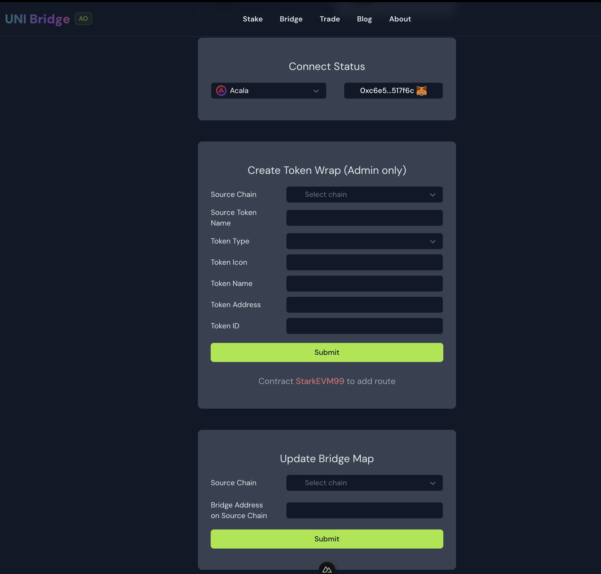
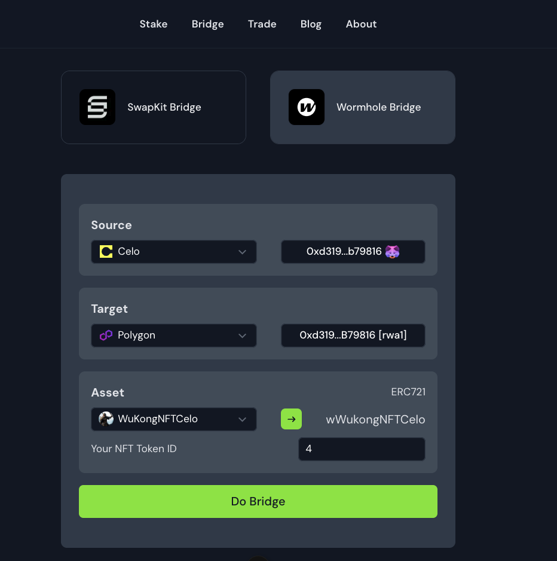

# UNI Bridge

## Project Description

UNI Bridge is a decentralized bridge for connecting different blockchains.

It includes stake, bridge, trade modules.

Currently only the bridge module is available, which is built during the hackathon.

Our mission is to aggregate as much decentralized bridges for connecting different blockchains and take over the centralized exchange platforms.

## Key Features

1. **Multi-chain Liquidity Aggregation**:  Aggregates liquidity from various decentralized exchanges across multiple blockchains.
2. **Optimize trading experience**: Provide users with real-time quotes and trading opportunities.
3. **User-friendly interface**: Intuitive interface for seamless bridge and liquidity management.

## Technical Stack

* Frontend: Vue.js, Nuxt.js, NuxtUI, NuxtUI-Pro, Tailwindcss
* Backend: Supabase.js, Node.js, Nitro.js(build-in Nuxt.js)
* Blockchain Integration: Acala, Wormhole
* Deployment: Vercel

## All the code build during the hackathon

* [Product link](https://ub.rwa-wallet.com)
* [PR code link](https://github.com/HelloRWA/uni-bridge/pull/1)
* [Video link (check on the PR page)](https://github.com/HelloRWA/uni-bridge/pull/1)
* Smart contract deployment:
  * [Acala Deploy](https://blockscout.acala.network/address/0x0c7274b6a23C8B257868cab80B991370ca6b06D7)
  * [Moonbeam deploy](https://moonbase.moonscan.io/address/0xa3770576dbc489f421216eff43e39120d69e5f65)

## Track && Bountry

* Track: Open topic
* Bountry: Acala, Bifrost, Moonbeam

### Features built during the hackathon

* integreation with Acala and Wormhole
* implement the bridge smart contract with native token, ERC20, ERC721, ERC1155 bridge features
* fix wallet connect bug
* implement the bridge admin page: 1. update bridge map 2. create token wrap

# explanation for the bridge smart contract

## Inherit ERC1155, IERC1155Receiver, ERC721Holder, IWormholeReceiver

* A `ERC1155` standard contract

* Because it inherits `ERC721Holder` and implements the `IERC1155Receiver` interface, the contract itself can also hold NFT (ERC1155, ERC721)

* Implements the `IWormholeReceiver` interface, so it is a receiving contract that can be called by the standard relayer of the wormhole bridge

## Administrator method

* `updateBridgeAddressMap`: Update the cross-chain bridge mapping. When using `burnAndBridgeBack`, `updateBridgeAddressMap` needs to have a corresponding mapping relationship

* `createTokenWrap`: Create a token package for the asset on the chain, so after the asset crosses the chain, it is wrapped in this `ERC1155` standard contract

## Cross-chain method

* `depositAndBridgeTo` users select assets in the whitelist on the front end, and then call `depositAndBridgeTo` to cross the chain
* `receiveWormholeMessages` wormhole helps send cross-chain information to the target chain, and calls `receiveWormholeMessages` on the target chain to receive cross-chain information. This method protects the logic to process data according to different assets and send the packaged assets to the corresponding receiving wallet address
* `burnAndBridgeBack` users call `burnAndBridgeBack` on the target chain to cross the chain back to the source chain

## Special methods

* `ownerOf721` Because it is an `ERC1155` contract, for the `ERC721` assets coming across the chain, `ownerOf721` needs to be called to obtain the owner of `ERC721`
* `transfer721` For the `ERC721` assets coming across the chain, `transfer721` needs to be called to transfer the ownership to the target address, also because it is `ERC1155` contract

