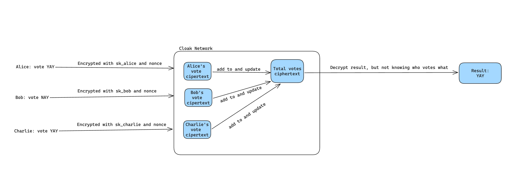

# Cloak

## Introduction

Cloak is the first blockchain network built on Substrate that leverages Fully Homomorphic Encryption (FHE) to revolutionize data privacy and security in decentralized environments. As the first of its kind, Cloak allows users to perform computations on encrypted data without ever exposing the underlying information, ensuring unparalleled confidentiality. By integrating FHE directly into the blockchain infrastructure, Cloak empowers developers and enterprises to create privacy-preserving applications that can securely handle sensitive data, from financial transactions to personal health information. This innovative approach not only enhances user privacy but also opens new possibilities for secure data sharing and collaboration in a decentralized world, setting a new standard for blockchain networks.

## Problem Statement
As Fully Homomorphic Encryption (FHE) gains increasing attention for its critical role in privacy-preserving computation, more blockchain ecosystems are beginning to adopt this groundbreaking technology. However, despite its growing importance, there remains a significant gap in the Polkadot ecosystem: there are no FHE-focused projects or pallets specifically designed for this environment. Furthermore, there is a lack of an FHE Rust library with no-std support, which is essential for enabling FHE capabilities on Substrate-based blockchains.

Recognizing this unmet need, we see an immense opportunity to make a valuable contribution to the Polkadot ecosystem. By developing the first FHE-enabled Substrate network, we aim to fill this crucial gap, empowering developers to build privacy-preserving applications directly on Polkadot, and setting a new standard for secure and private computation in decentralized networks.

## Features Completed during the Hackathon
Cloak was teamed up in mid-August, and within just two weeks—despite what initially seemed like an impossible mission—we successfully completed our prototype. This rapid development was a significant achievement, especially considering the technical challenges we faced and overcame. Here are the key features we accomplished during the hackathon:

1. **fhe-no-std Rust Library**

	At the outset, we discovered that none of the existing Rust FHE libraries supported no-std, which is crucial for Substrate-based blockchains. We decided to take on the ambitious task of building our own no-std FHE library. The journey was fraught with unexpected challenges, including adapting standard Rust containers, hash maps, and the rand library to a no-std environment. After several sleepless nights and intense problem-solving, we successfully built the first version of [our fhe-no-std library](), based on the existing [fhe.rs](https://github.com/tlepoint/fhe.rs) library.

	- [x] remove all `std` usage and replace with core/alloc (e.g. Vec, Arc, Result, Error, cmp, etc.)
	- [x] use alternative libs for std containers like hashmap and hashset (we used `hashbrown`)
	- [x] adapt or replace all `std` dependencies like `rand`, `pulp`, `zerorize` etc.
	- [x] add `no_std` for all libs and build for `no-std` targets
	- [x] add serializing and deserializing for cipher texts

2. **FHE Math Pallet**

	Leveraging our newly created no-std FHE library, we developed an FHE Math pallet. This pallet allows users to perform FHE arithmetic operations directly on-chain, bringing powerful privacy-preserving computation capabilities to Substrate-based blockchains.

	- [x] generate random key pairs for users to use FHE 
	- [x] allow users to submit numbers in clear text and they are stored in cipher text
	- [x] enable users to do arithmetic operations with their encrypted input numbers
	- [x] enable decryption for results

3. **FHE Vote Pallet**

	To demonstrate a practical use case, we built the FHE Vote pallet, enabling an anonymous voting process on the blockchain. This feature is particularly valuable for various DAOs, where privacy and anonymity are critical.

	- [x] initiate a new vote
	- [x] vote anonymously for an existing vote
	- [x] finalize a vote and reveal the result

4. **Blockchain Integration**

	We integrated our FHE Math and FHE Vote pallets into a solo Substrate blockchain, which we then deployed for testing. This integration marks a significant step toward a fully functional FHE-enabled blockchain.

	- [x] integrate fhe-math and fhe-vote in a solo chain
	- [x] use polkadot `insecure-randomness-collective-flip` pallet to generate random seeds for fhe pallets

5. **Frontend UI**

	To ensure our FHE features were accessible and user-friendly, we developed a frontend web application. This web app provides users with a straightforward interface to utilize our FHE capabilities, complete with verbose explanations for each step, making the process easy to understand even for those unfamiliar with FHE.

	- [x] integrate polkadot js API and send extrinsics to the testnet
	- [x] demonstrate results after result is finalized
	- [x] intuitive steps to guide users to use our products
	- [x] descriptions for our product and FHE

## Architect

## Demo and Testnet
1. Demo Video: https://youtu.be/q3UpOFLfBNQ
2. Cloak Testnet: https://polkadot.js.org/apps/?rpc=wss%3A%2F%2Ftestnet.admeta.network#/explorer
3. Cloak App: https://main.d2knk68rh47uek.amplifyapp.com/
