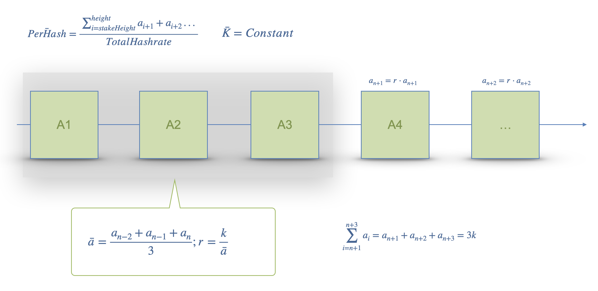

# 6Sigmaverse
https://miner.game.6sig.io/

## Introduction
6Sigmaverse 是一款高度仿真的数字货币挖矿生态游戏，背景设定在一个未来的宇宙大航海时代，比特币已成为宇宙通用货币。在这个基于比特币架构的宇宙世界中，玩家可以通过NFT化的矿机、模拟现实的难度调整周期和电力供应等方式，体验到无需投资重资产即可进行比特币挖矿的乐趣。我们的游戏不仅让玩家轻松赚取收益，还能享受到格斗、打怪、升级等特色玩法。游戏资产包括游戏积分、Cybor（ERC721）、Imprint（ERC721）、Miner（ERC1155）和 游戏道具（ERC721）。玩家可以通过不同的资产组合来增加收益和提升游戏体验。我们采用中心化方式部署“遗迹探索”模块，以半去中心化方式部署“财富积累”模块，我们更强调用户财富积累的体验，而非单纯的游戏性。

6Sigmaverse is a highly realistic cryptocurrency mining ecosystem game set in a future era of cosmic voyages, where Bitcoin has become the universal currency of the universe. In this world built on Bitcoin's architecture, players can experience Bitcoin mining without the need to invest in heavy assets through the NFTization of mining rigs, simulation of real-world mining difficulty adjustments, and power supply management. Our game not only allows players to earn profits with ease but also to enjoy distinctive gameplay elements such as combat, monster hunting, and leveling up. The game assets include the game point, Cybor (ERC721), Imprint (ERC721), Miner (ERC1155), and game props (ERC721). Players can earn profits and enhance their gaming experience through various combinations of these assets. We deploy the "Relic Exploration" module in a centralized manner and the "Wealth Accumulation" module in a semi-decentralized manner, emphasizing the experience of wealth accumulation for users over pure gameplay.

## Features planned for the Hackathon
1. **打通游戏与Vara网络**: 
    1. *采用 Gear Sails 架构部署 `CyborNFT`、 `ImprintNFT`* 
    2. *研发自主 `WebGLChannel` 协议, 以支持 Unity 引擎 <-> ReactJS 互通*
    3. *创建 `scale DLL` 动态链接库使得 Unity 引擎可以直接通过 `jsonRPC` 获取 `VARA` 网络数据并解析*
    4. *`NFT`动态属性, 用户在`mint NFT`即可随机获得不同属性, 并且动态属性将存储于 `State`*
    5. *`NFT Stake`合约, 通过 Gear 实现`质押挖矿`*
2.  **游戏性能**: 
    1. *创建游戏内的 `NFT` 商城, 并且可以从游戏内商城中直接 `mint NFT`*
    2. *对部分`游戏UI`进行竖版设计及重构, 为将来移植`Ton`做准备*
    3. *结合`弹壳特攻队`,设计并研发`游戏生存模式 v0.0.1`版本*
   
1. **Integrating the Game with the Vara Network**:
    1. *Deploy `CyborNFT` and `ImprintNFT` using the Gear Sails architecture.*
    2. *Develop a proprietary `WebGLChannel` protocol to support communication between Unity Engine and ReactJS.*
    3. *Create a `scale DLL` dynamic link library to enable the Unity engine to directly fetch and parse VARA network data through `jsonRPC`.*
    4. *Implement dynamic NFT attributes, allowing users to randomly receive different attributes when minting NFTs, with dynamic properties stored in State.*
    5. *Develop an NFT Stake contract for staking and mining, implemented through Gear.*
2. **Game Performance:**
    1. *Create an in-game NFT marketplace, allowing NFTs to be minted directly from the in-game store.*
    2. *Redesign and restructure some game UI elements for a vertical layout, preparing for future migration to Ton.*
    3.*Design and develop `version 0.0.1 of the game's survival mode`, integrating elements from [Survivor~io](https://play.google.com/store/apps/details?id=com.dxx.firenow&hl=en_US).*

## Technology Architecture

## Schedule

## Team info
* [Lueey](https://t.me/turtlebig)
* [Ansen](https://t.me/turtlebig)
* ZZS

## Material for Demo
1. Demo Video [[link to Notion](https://file.notion.so/f/f/a00e22d0-998c-4538-81cb-ec0e2e58de5f/61ae4f6f-d058-4cef-a209-8742b9095457/Sigmaverse.mp4?table=block&id=324a7948-9ea6-4aaa-a85a-79ca6309108b&spaceId=a00e22d0-998c-4538-81cb-ec0e2e58de5f&expirationTimestamp=1724371200000&signature=4M-OtQAvicv7M54Kd4IXXnDBOFhrjjO5Xq0IiY7B19w&downloadName=Sigmaverse.mp4)]
2. PPT [-]
