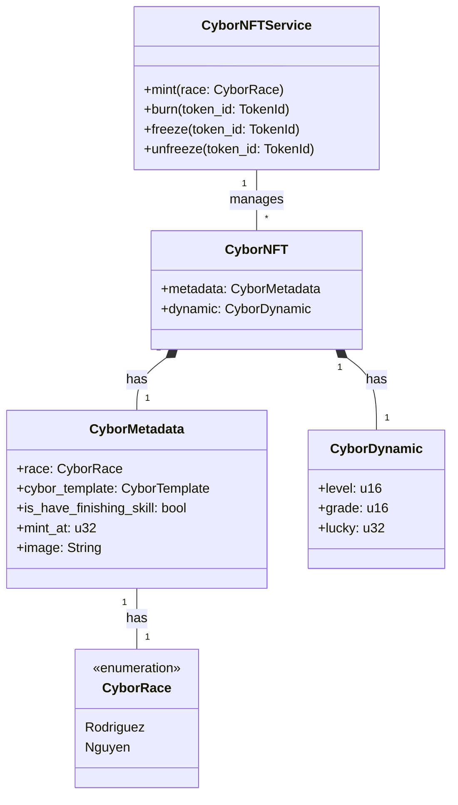

# CyborNFT: Dynamic NFTs for Blockchain Gaming

# Introduction to CyborNFT

CyborNFT is a dynamic Non-Fungible Token (NFT) system designed for blockchain gaming. It represents unique characters called Cybors in a futuristic game world. Each Cybor is an ERC-721 compliant token with both static and dynamic properties, making them ideal for complex gaming ecosystems.

## Key Features of CyborNFT

- ERC-721 compliant, ensuring uniqueness and interoperability
- Dynamic properties that can change based on in-game actions
- Multiple races with distinct characteristics (e.g., Rodriguez, Nguyen)
- Ability to freeze and unfreeze NFTs
- Upgradable levels and grades

## CyborNFT Structure

The CyborNFT system is built using Rust and consists of several key components:

### CyborRace

```rust
pub enum CyborRace {
    Rodriguez,
    Nguyen,
}
```

This enum defines the different races available for Cybors, each with unique traits and abilities.

### CyborMetadata

```rust
pub struct CyborMetadata {
    pub race: CyborRace,
    pub cybor_template: CyborTemplate,
    pub is_have_finishing_skill: bool,
    pub mint_at: u32,
    pub image: String,
}
```

CyborMetadata stores the static properties of a Cybor, including its race, template, special skills, minting time, and image.

### CyborDynamic

```rust
struct CyborDynamic {
    level: u16,
    grade: u16,
    lucky: u32,
}
```

This struct holds the dynamic properties of a Cybor that can change during gameplay, such as level, grade, and luck.

## CyborNFTService

The CyborNFTService manages the lifecycle and operations of CyborNFTs. Key functions include:

### Minting

```rust
pub fn mint(&mut self, race: CyborRace) {
    // Minting logic
}
```

This function creates a new CyborNFT, assigning it unique properties based on the chosen race.

### Burning

```rust
pub fn burn(&mut self, token_id: TokenId) {
    // Burning logic
}
```

Allows for the destruction of a CyborNFT, removing it from circulation.

### Freezing and Unfreezing

```rust
pub fn freeze(&mut self, token_id: TokenId) {
    // Freezing logic
}

pub fn unfreeze(&mut self, token_id: TokenId) {
    // Unfreezing logic
}
```

These functions allow for temporarily locking and unlocking CyborNFTs, useful for game mechanics or security purposes.

## Conclusion

CyborNFT represents a sophisticated implementation of dynamic NFTs for blockchain gaming. By combining static metadata with mutable properties, it offers a flexible and engaging system for representing in-game assets. As the project evolves, it has the potential to create a rich, interactive gaming experience on the blockchain.



This diagram represents the composite structure of the CyborNFT system. It shows:

- The CyborNFTService class, which manages multiple CyborNFTs and includes methods for minting, burning, freezing, and unfreezing.
- The CyborNFT class, which is composed of CyborMetadata and CyborDynamic.
- The CyborMetadata class, containing static properties of a Cybor.
- The CyborDynamic class, representing the mutable properties of a Cybor.
- The CyborRace enumeration, showing the available races (Rodriguez and Nguyen).