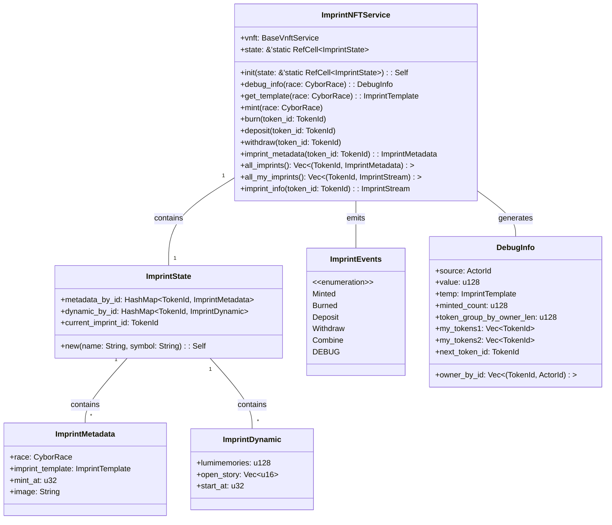

# ImprintNFT: Dynamic NFTs for Blockchain Gaming

ImprintNFT is a dynamic NFT system designed for blockchain gaming, particularly for the 6Sigmaverse game. This documentation provides an overview of the ImprintNFT structure and functionality.

## Key Structures

### ImprintMetadata

```rust
pub struct ImprintMetadata {
    pub race: CyborRace,
    pub imprint_template: ImprintTemplate,
    pub mint_at: u32,
    pub image: String,
}
```

ImprintMetadata stores static information about an Imprint NFT, including its race, template, minting time, and image.

### ImprintDynamic

```rust
struct ImprintDynamic {
    lumimemories: u128,
    open_story: Vec<u16>,
    start_at: u32,
}
```

ImprintDynamic stores the changeable attributes of an Imprint NFT, such as lumimemories (a form of in-game currency or points), open story elements, and the start time of certain actions.

### ImprintState

```rust
pub struct ImprintState {
    metadata_by_id: HashMap<TokenId, ImprintMetadata>,
    dynamic_by_id: HashMap<TokenId, ImprintDynamic>,
    current_imprint_id: TokenId,
}
```

ImprintState manages the overall state of all Imprint NFTs, including their metadata, dynamic attributes, and the current token ID counter.

## ImprintNFTService

### deposit and withdraw

These methods handle the depositing and withdrawing of Imprint NFTs, updating the start_at time and lumimemories accordingly.

## Events

The system emits various events (ImprintEvents) to track important actions:

- Deposit: When an Imprint NFT is deposited
- Withdraw: When an Imprint NFT is withdrawn
- Combine: (Implementation not shown in the provided code)

## Conclusion

ImprintNFT provides a robust system for managing dynamic NFTs in a blockchain gaming context. It allows for the creation, destruction, and modification of NFTs with both static and dynamic attributes, making it suitable for complex game mechanics and player interactions.

## Lumimemories Algorithm

The lumimemories algorithm calculates the accumulated in-game currency or points for an Imprint NFT. It takes into account the time difference between the current block height and the NFT's start time, multiplying this by a rate of lumimemories earned per block. This value is then added to the NFT's existing lumimemories. The algorithm can be summarized as follows:

```rust
let time_diff = current_block_height - start_at;
let lumimemories_earned = time_diff * lumimemories_per_block;
total_lumimemories = existing_lumimemories + lumimemories_earned;
```

This dynamic calculation allows for continuous accumulation of lumimemories based on the time an NFT has been active in the game.

Here's structure graph for the ImprintNFT system based on the provided code:



This Mermaid diagram illustrates the main structures and their relationships in the ImprintNFT system. The ImprintNFTService is the central component, containing an ImprintState and emitting ImprintEvents. The ImprintState manages collections of ImprintMetadata and ImprintDynamic, which represent the static and dynamic attributes of Imprint NFTs, respectively.